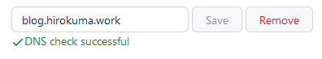

# github.ioのカスタムドメイン設定

<i>2024/04/06</i>

github.ioのページは、まず[GitHub Pages](https://pages.github.com/)の説明通りに行った。  
この通りにやると、index.html に文字を書いただけの白いページができあがる。  
よく覚えていないが、以前はGitHub Pagesを作ると設定画面からデフォルトでにあるテーマを選択できたような気がするが、今は自分で[_config.yml](https://docs.github.com/en/pages/setting-up-a-github-pages-site-with-jekyll/about-github-pages-and-jekyll)を置くようだ。
そのページに書いてある内容を貼っても白いページなので、[サポートされたテーマ](https://pages.github.com/themes/)の設定を追加するとテーマが変わってくれる。
私は midnight テーマを選んで[追加](https://github.com/hirokuma/hirokuma.github.io/blob/afba836e9d8152a4d1ac2f01952ed47b3ad1c0ed/_config.yml#L11-L13)した。

URLはオリジナルの[hirokuma.github.io](https://hirokuma.github.io)だけでもよかったのだが、
お名前.comで登録していて解除し忘れたドメイン名が年間更新されてしまったので、それを割り当てておく。いいんだ、自由にできるドメイン名は必要経費なんだ。。。  
GitHub Pagesはカスタムドメインが設定できる。[サポート](https://docs.github.com/en/pages/configuring-a-custom-domain-for-your-github-pages-site/about-custom-domains-and-github-pages#supported-custom-domains)しているのはこれら。

* `www` subdomain
* Custom subdomain
* Apex domain

今回は`blog.hirokuma.work`という名前にするので "Custom subdomain" にあたる。
サブドメインでの設定は[こちら](https://docs.github.com/en/pages/configuring-a-custom-domain-for-your-github-pages-site/managing-a-custom-domain-for-your-github-pages-site#configuring-a-subdomain)。

1. GitHubのリポジトリ --> Settings --> Pages
2. "Custom domain"に登録する予定のカスタムドメイン名を入れる(未チェックになるはず)
3. そうすると`CNAME`ファイルがcommitされる
4. ドメインプロバイダーの設定で CNAME を`hirokuma.github.io`で設定する
5. 反映に時間がかかると思うので待つ
6. よさそうだったら GitHub > Settings > Pages 画面を開いて確認する。一度テキストボックスをフォーカスして抜けたときにチェックしているのかもしれない。

これで[blog.hirokuma.work](https://blog.hirokuma.work/)でも開くようになっただろう。
