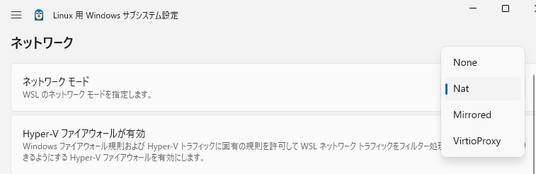

WSL2のネットワークモードをmirroredにして、WSL2でサーバを立てて外部からアクセスできるようになった。  
外部といってもLANの中でしか試していないのだが、今のところそれで良いのだ。  

気になったのは、オープンしているポートがホスト側、つまりWindows側からわからないことだ。
`netstat -nat`としてもLISTENしているポートが出てこない。  
そういえばファイアウォールの通知も出ていなかった。どうなってるのだろう？

[ASCII.jp：Windows Subsytem for Linux（WSL）が昨年9月のアップデートでファイアウォール対応になった](https://ascii.jp/elem/000/004/179/4179292/)

* 今はデフォルトで有効になっている
* Hyper-Vファイアウォールという別設定になっている

ということだが、今回何もせずに動いている。

[WSL を使用したネットワーク アプリケーションへのアクセス - Microsoft Learn](https://learn.microsoft.com/ja-jp/windows/wsl/networking#mirrored-mode-networking)

「注意」のところに書いてある。

* `Set-NetFirewallHyperVVMSetting`で`Allow`する
* `NetFirewallHyperVRule`でルールを追加する

「または」と書いてあるので前者だけ設定していた。後者は`80`とあるのでポート番号ごとにやらんといかんように思えたからだ。
これをやっているのでアクセスできたのだろう。  
WSL2でサーバを立ててそれを外部に公開することはほぼないだろうから、それなら今のままで良いな。

## 2026/02/28追記

最近はWSL2の設定もWindows側のGUIアプリが追加されて設定しやすくなった。



[Windows Firewall Control](https://www.binisoft.org/wfc.php)を使ってプロファイルを「レベル - 中」にしていると
未設定の送信ポートは遮断されるようでWSL2でいろいろ失敗するようになる。  
WSL2のネットワーク設定で Nat だの Mirrored が影響している気がする。
今までMirroredだったのだが、作っているアプリで通信が遅くなることがあり、Geminiが予想の1つで「Mirroredで通信が詰まりやすくなる」みたいなことを言っていたので変更したのだ。
効果があったのか別の原因かわからないがそのときは動いたので、今はNatのままにしている。

Windows側のファイアウォール設定をリセットしたところ、GitHubへの `pull` ができなくなった。
SSHが遮断されているようで、アプリ名なしで22番の送信を許可すると動いた。  
`apt update` なども通らない。

[Hyper-V ファイアウォール - Microsoft Learn](https://learn.microsoft.com/ja-jp/windows/security/operating-system-security/network-security/windows-firewall/hyper-v-firewall)
  * [New-NetFirewallHyperVRule (NetSecurity) - Microsoft Learn](https://learn.microsoft.com/en-us/powershell/module/netsecurity/new-netfirewallhypervrule?view=windowsserver2025-ps)
  * [Get-NetFirewallHyperVRule (NetSecurity) - Microsoft Learn](https://learn.microsoft.com/en-us/powershell/module/netsecurity/get-netfirewallhypervrule?view=windowsserver2025-ps)
  * [Remove-NetFirewallHyperVRule (NetSecurity) - Microsoft Learn](https://learn.microsoft.com/en-us/powershell/module/netsecurity/remove-netfirewallhypervrule?view=windowsserver2025-ps)


```powershell
> New-NetFirewallHyperVRule -Name HTTPS443 -DisplayName "HTTPS443" -Direction Outbound -VMCreatorId '{40E0AC32-46A5-438A-A0B2-2B479E8F2E90}' -Protocol TCP -RemotePorts 443


Name                  : HTTPS443
DisplayName           : HTTPS443
RulePriority          : 0
Direction             : Outbound
VMCreatorId           : {40E0AC32-46A5-438A-A0B2-2B479E8F2E90}
Protocol              : TCP
LocalAddresses        : Any
LocalPorts            : Any
RemoteAddresses       : Any
RemotePorts           : 443
Action                : Allow
Enabled               : True
EnforcementStatus     : OK
PolicyStoreSourceType : Local
Profiles              : Any
PortStatuses          : {
                        SwitchName: 790E58B4-7939-4434-9358-89AE7DDBE87E
                        PortName: 6446EC64-5886-411C-AF31-414979A09357
                        Profile: Public
                        NetworkType: NAT
                        InterfaceGuid: {00000000-0000-0000-0000-000000000000}
                        PartitionGuid: {74BA0C65-9DEC-4133-AB35-F6A62D4E3FE4}
                        VMCreatorId: {40E0AC32-46A5-438A-A0B2-2B479E8F2E90}
                        EnforcementStatus: OK
                        }


> Get-NetFirewallHyperVRule HTTPS443


Name                  : HTTPS443
DisplayName           : HTTPS443
RulePriority          : 0
Direction             : Outbound
VMCreatorId           : {40E0AC32-46A5-438A-A0B2-2B479E8F2E90}
Protocol              : TCP
LocalAddresses        : Any
LocalPorts            : Any
RemoteAddresses       : Any
RemotePorts           : 443
Action                : Allow
Enabled               : True
EnforcementStatus     : OK
PolicyStoreSourceType : Local
Profiles              : Any
PortStatuses          : {
                        SwitchName: 790E58B4-7939-4434-9358-89AE7DDBE87E
                        PortName: 6446EC64-5886-411C-AF31-414979A09357
                        Profile: Public
                        NetworkType: NAT
                        InterfaceGuid: {00000000-0000-0000-0000-000000000000}
                        PartitionGuid: {74BA0C65-9DEC-4133-AB35-F6A62D4E3FE4}
                        VMCreatorId: {40E0AC32-46A5-438A-A0B2-2B479E8F2E90}
                        EnforcementStatus: OK
                        }


> Remove-NetFirewallHyperVRule HTTPS443
```

`git pull`、`sudo apt update` だけなら 22番、80番、443番のOutboundを開けておけばよいかな。

```powershell
> New-NetFirewallHyperVRule -Name "MySettings" -DisplayName "MySettings" -Direction Outbound -VMCreatorId '{40E0AC32-46A5-438A-A0B2-2B479E8F2E90}' -Protocol TCP -RemotePorts 443,80,22


Name                  : MySettings
DisplayName           : MySettings
RulePriority          : 0
Direction             : Outbound
VMCreatorId           : {40E0AC32-46A5-438A-A0B2-2B479E8F2E90}
Protocol              : TCP
LocalAddresses        : Any
LocalPorts            : Any
RemoteAddresses       : Any
RemotePorts           : {443, 80, 22}
Action                : Allow
Enabled               : True
EnforcementStatus     : OK
PolicyStoreSourceType : Local
Profiles              : Any
PortStatuses          : {
                        SwitchName: 790E58B4-7939-4434-9358-89AE7DDBE87E
                        PortName: 6446EC64-5886-411C-AF31-414979A09357
                        Profile: Public
                        NetworkType: NAT
                        InterfaceGuid: {00000000-0000-0000-0000-000000000000}
                        PartitionGuid: {74BA0C65-9DEC-4133-AB35-F6A62D4E3FE4}
                        VMCreatorId: {40E0AC32-46A5-438A-A0B2-2B479E8F2E90}
                        EnforcementStatus: OK
                        }
```

