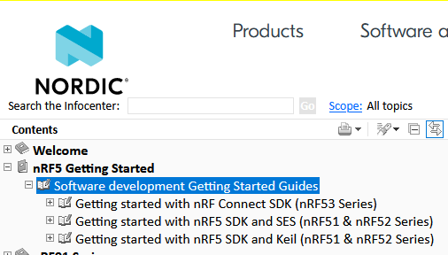

# 2024/05/22

## nordic: nRF53はnRF Connect SDKだけなのか

nRFシリーズのソフトウェア開発環境を引き続き調べている。

nRF51 & nRF52 と nRF53 で分けられている。  
そして nRF53 は nRF Connect SDKだけしかない。SoftDeviceは使わなくなったか、少なくとも表立って使わなくなったということなのか？  

### nRF5 SDK

nRF51 & nRF52 は nRF5 SDKを使うことになる。つまりSoftDeviceを使った開発だ。  

[Keil](https://www.keil.arm.com/)は商用で使うことも考えると、無料版は使いづらい。
有料で購入するのは個人だとちょっときついし、SESで十分な気がする。  
それに単にビルドして焼くだけなら、コマンドラインツールでもできたはずだ。

SESこと[Segger Embedded Studio](https://www.segger.com/products/development-tools/embedded-studio/)は、[Nordic開発ならfree](https://www.segger.com/news/segger-embedded-studio-ide-now-free-for-nordic-sdk-users/)ということである。  
ダウンロードは[こちら](https://www.nordicsemi.com/Products/Development-tools/Segger-Embedded-Studio)。

### nRF Connect SDK

nRF53シリーズと目次に書いてあるが、[nRF52のページ](https://developer.nordicsemi.com/nRF_Connect_SDK/doc/latest/nrf/gsg_guides/nrf52_gs.html)もあった。  
RTOSのZephyrなんかも使えるらしいし、nRF52だときついのかな？

### おわりに

日記形式だと書きづらいな！  
ブログページとまとめたページをそれぞれ作った方が良い気がしてきた。
