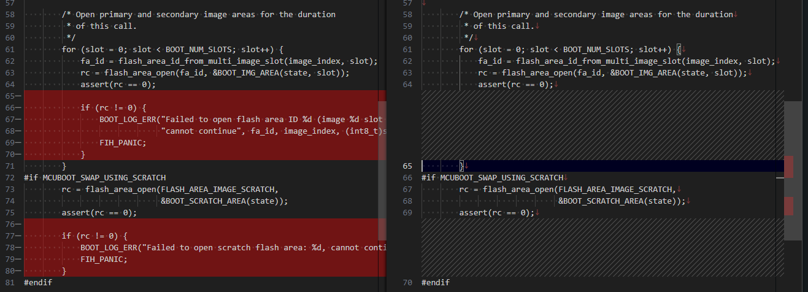
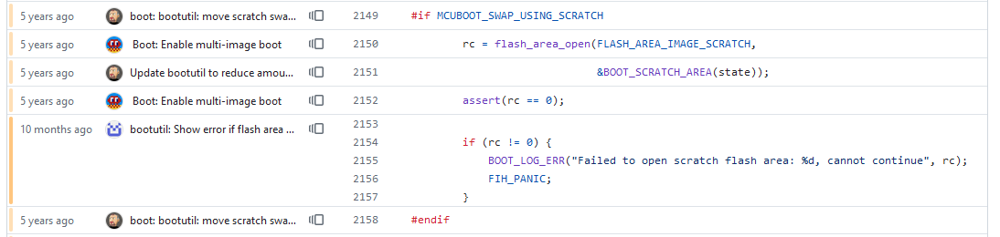

前回([1](20240704-mdbt.md), [2](20240704-ncs.md))に引き続き、ncs v2.6で評価ボード[nRF5340 MDBT53-1Mモジュールピッチ変換基板](https://www.switch-science.com/products/8658)を自分でビルドすると立ち上がらない件の調査である。

今のところ分かっていること：

* ncs v2.4.0 と v2.5.3 では動作したが v2.6.0 と v2.6.1 では動作していない
  * ncs v2.6.0 から MCUboot リポジトリを fork したらしい
* ブートローダの途中で止まっている

### loader.c の比較

v2.5.3もv2.6.0も`ncs/vX.Y.Z/bootloader/mcuboot/boot/bootutil/src/loader.c`というファイルは同じだったので、HALTしている付近を比較した。左がv2.6.0、右がv2.5.3である。

v2.5.3では`assert()`でしか`flash_area_open()`の戻り値をチェックしていなかったのを v2.6.0 では`if`文でチェックするようになっただけ？  
ncs だか zepher だかの`assert()`の挙動はわからんが、[`NDEBUG`マクロが定義されていたら何もしない](https://www.jpcert.or.jp/sc-rules/c-exp31-c.html)。
そして`assert()`を通り越して`if`文の中まで進んでいることを考えると`NDEBUG`ありでビルドされているのではなかろうか。
v2.5.3までは`if`文でのチェックがないのでスルーして進んでいるだけ？

#### if文をコメントアウト

ならば、v2.6.0 で`if`文をコメントアウトしてスルーしたらどうなるだろうか？  
・・・動いた。動いてしまったよ。

では、v2.5.3 に`if`文を追加してみる。  
・・・動かなかった。デバッガで見ると`FIH_PANIC`で止まっていたので、現象は同じだ。

もしかしたら v2.4.0 では動いていたのかも、と`if`文を追加したが、やはり止まる。  
ということは、昔からエラーが出たけどスルーして動いているだけなのか。

### 感想

これはどう考えると良いのだろうか。。。  
`assert()`だけで済ませるのはあまりよろしくないと思う。`NDEBUG`で`#ifdef`しておくのがよいだろう。

しかし問題はそこではない。
`flash_area_open()`がエラーになるのが問題なのか、そもそも`flash_area_open()`を通るのが問題なのか。
そこら辺を把握するには[MCUboot](https://docs.nordicsemi.com/bundle/ncs-latest/page/mcuboot/wrapper.html)を深く知らないと無理な気がする。

MCUbootは[ここ](https://www.trustedfirmware.org/projects/mcuboot/index.html)が本家のようだ。
こういう時代なので、アップデートしやすくしておくのと同時に不正なファームウェアを焼かれるのを防がないとダメなのだろう。

MCUboot自体はzepher用とかARM用とかいうものではなさそうだ。
[zepherのMCUboot](https://docs.mcuboot.com/readme-zephyr.html)のドキュメントはあるので、そこら辺からつかんでいくのがよいか。

### if文はいつ追加されたのか

本家MCUbootのリポジトリを見ると、`if`文が追加されたのは[2023年9月](https://github.com/mcu-tools/mcuboot/commit/2929a975c75745480e220446a06ed6c6f30627d4)くらいのようだ。

[今のloader.c](https://github.com/mcu-tools/mcuboot/blame/1d79ef35ee560e24da981d13c9414de9947b07a2/boot/bootutil/src/loader.c)

ncs v2.5.3 だとリポジトリは[nrfconnect/sdk-mcuboot](https://github.com/nrfconnect/sdk-mcuboot)で、使われているのは[このcommit](https://github.com/nrfconnect/sdk-mcuboot/pull/287)だった。  
`if`文が追加されたcommitは[これ](https://github.com/nrfconnect/sdk-mcuboot/commit/2929a975c75745480e220446a06ed6c6f30627d4)。

v2.6.0 は fork したとか書いてあったがリポジトリは`nrfconnect/sdk-mcuboot`のままだ。本家からforkしたのではなく、v2.5までで使われていたブランチから枝分かれしたという意味なのかな？  
使われているのは[このcommit](https://github.com/nrfconnect/sdk-mcuboot/commit/916a9dcb137df96c435cc1b63b20ba265957ae51)。

`README.md`を見たが、ncs v2.5.3 の MCUbootは "version 1.11.0-dev"ベース、v2.6.0 は "version 2.1.0-dev"ベースだった。  
メジャーバージョンが違うから、いろいろ挙動も違うのかもしれん。

### 関係ないけど

Toolchain がアップデートされていた。ncs v2.7 の準備なのかな？ ncs v2.7 はまだ experimental な感じがする。

アップデートしたが、ncs の動作に関係があるわけではない。

### ncs v2.7.0

と思ったら ncs v2.7.0 は正式リリースだった。7月11日にwebinarがあるそうだ。

* [X/Nordic Semiconductor](https://x.com/NordicTweets/status/1809122540792786959)
* [Exciting new features in nRF Connect SDK v2.7.0 - nordicsemi.com](https://www.nordicsemi.com/Events/2024/Webinar-Exciting-new-features-in-nRF-Connect-SDK-v270?utm_campaign=2024%20Webinars&utm_source=twitter&utm_medium=social&utm_content=Exciting%20new%20features%20in%20nRF%20Connect%20SDK%20v2.7.0)

試しに v2.7.0 で blinky を動かしましたがダメでした。  
ブートローダに関する設定が何かあるんだろうなと思いつつ、まだ全然分かっていないのであった。
