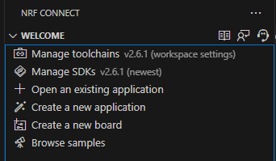
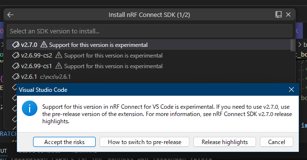
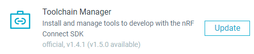
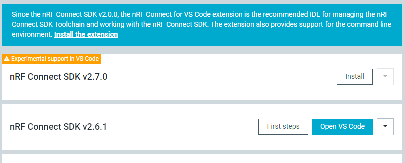
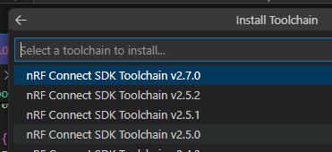
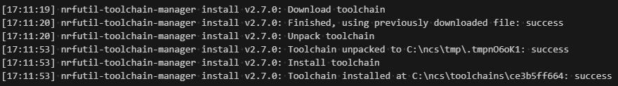

vscodeのnRF Connect extensionをサイドパネルで開くとこうなっている。

最初に設定がいるのは上2つの「Toolchains」と「SDKs」だ。
同じバージョンをインストールしておくのが普通のようだが、違いを把握しておきたい。というのも、いま ncs v2.7.0 がリリースされたばかりなのだが、Toolchain v2.7.0 は普通にインストールできるものの SDK v2.7.0 は確認を求められるのだ。
vscodeだからメッセージが出ているようだが気になるところだ。

nRF Connect SDKの[Installation](https://docs.nordicsemi.com/bundle/ncs-latest/page/nrf/installation/install_ncs.html#install_the_nrf_connect_sdk_toolchain)

## Toolchain Manager

nRF Connect for Desktopでインストールできるのは Toolchain ではなく「Toolchain Manager」である。

v1.5.0がリリースされたばかりなのだが[説明](https://github.com/NordicSemiconductor/pc-nrfconnect-toolchain-manager/releases/tag/v1.5.0)に vscode だと ncs 2.7 で警告を出すようになったということが書いてある。

なお、nRF Connect SDK v2.0.0以降は単体のToolchain Managerではなくvscodeのextensionを使うことを推奨している。  
単体でもexperimentalと表示されているので、v1.5.0のリリースノートに書かれているのは「vsccodeでも警告を出す」くらいに思っておけば良いだろう。

## Toolchain

ではvscodeのextensionからToolchainだけインストールしてみよう。一度 v2.7.0 はインストールしていたのだが、アンインストールしてディレクトリ(`c:/ncs/v2.7.0`)ごと削除している。

変な感じがするが、Toolchain v2.7.0のインストールについては警告は出ない。

一度インストールしたことがあると、このようにダウンロード済みのファイルを使うようだ。

Toolchainは`c:/ncs/v2.7.0`にインストールされるのではなく`c:/ncs/toolchains/`以下にインストールされている。  
普通、toolchainというとコンパイラとかリンカとかを指すと思う。[インストールの説明](https://docs.nordicsemi.com/bundle/ncs-latest/page/nrf/installation/install_ncs.html#install_the_nrf_connect_sdk_toolchain)でも「The toolchain version should match the nRF Connect SDK version you are going to work with」と書いてあるので、このSDKはこのToolchainで動かすことしか想定していませんよ、ということなのだろう。
Toolchainのインストールで警告が出ないのも納得だ。

## SDK

これは警告が出るだけで、特段かわりはない。
最初に保存するディレクトリ(今回は`c:\ncs\v2.7.0`)を聞かれるだけである。

ダウンロードしてインストールするのだが、[west](https://docs.zephyrproject.org/latest/develop/west/index.html)というツールが使われている。Zephyr OSのツールなのか。
複数の`git`リポジトリから`clone`しているようなのでそういうツールかと思ったのだが、ページには「swiss-army knife command line tool」と力強く書いてあった。
`west`はvscodeのextensionがうまいこと使ってくれているようだから、あまり気にしなくてもよさそうだ。

`west`のログに出ている`git clone`していそうなリポジトリはこれらだ。多い！

* https://github.com/nrfconnect/sdk-zephyr
* https://github.com/BabbleSim/bsim_west
* https://github.com/nrfconnect/sdk-hostap
* https://github.com/nrfconnect/sdk-wi-fiquicktrack-controlappc
* https://github.com/nrfconnect/sdk-mcuboot
* https://github.com/laurencelundblade/QCBOR
* https://github.com/nrfconnect/sdk-mbedtls
* https://github.com/nrfconnect/sdk-oberon-psa-crypto
* https://github.com/nrfconnect/sdk-nrfxlib
* https://github.com/nrfconnect/sdk-trusted-firmware-m
* https://github.com/nrfconnect/sdk-psa-arch-tests
* https://github.com/nrfconnect/sdk-connectedhomeip
  * Submodule 'nlio' (https://github.com/nestlabs/nlio.git) registered for path 'third_party/nlio/repo'
  * Submodule 'nlassert' (https://github.com/nestlabs/nlassert.git) registered for path 'third_party/nlassert/repo'
  * Submodule 'nlunit-test' (https://github.com/nestlabs/nlunit-test.git) registered for path 'third_party/nlunit-test/repo'
  * Submodule 'pigweed' (https://github.com/google/pigweed.git) registered for path 'third_party/pigweed/repo'
  * Submodule 'third_party/jsoncpp/repo' (https://github.com/open-source-parsers/jsoncpp.git) registered for path 'third_party/jsoncpp/repo'
* https://github.com/nrfconnect/sdk-soc-hwmv1
* https://github.com/nrfconnect/sdk-cjson
* https://github.com/nrfconnect/azure-sdk-for-c
* https://github.com/nrfconnect/sdk-mcu-drivers
* https://github.com/nrfconnect/sdk-openthread
* https://github.com/nrfconnect/suit-generator
* https://github.com/nrfconnect/suit-processor
* https://github.com/ThrowTheSwitch/cmock
  * Submodule 'vendor/c_exception' (https://github.com/throwtheswitch/cexception.git) registered for path 'vendor/c_exception'
  * Submodule 'vendor/unity' (https://github.com/throwtheswitch/unity.git) registered for path 'vendor/unity'
* https://github.com/memfault/memfault-firmware-sdk
* https://github.com/eembc/coremark
* https://github.com/zephyrproject-rtos/canopennode
* https://github.com/zephyrproject-rtos/chre
* https://github.com/zephyrproject-rtos/lz4
* https://github.com/zephyrproject-rtos/nanopb
* https://github.com/zephyrproject-rtos/tf-m-tests
* https://github.com/zephyrproject-rtos/zscilib
* https://github.com/zephyrproject-rtos/cmsis
* https://github.com/zephyrproject-rtos/cmsis-dsp
* https://github.com/zephyrproject-rtos/cmsis-nn
* https://github.com/zephyrproject-rtos/edtt
* https://github.com/zephyrproject-rtos/fatfs
* https://github.com/zephyrproject-rtos/hal_nordic
* https://github.com/zephyrproject-rtos/hal_st
* https://github.com/zephyrproject-rtos/hal_wurthelektronik
* https://github.com/zephyrproject-rtos/libmetal
* https://github.com/zephyrproject-rtos/liblc3
* https://github.com/zephyrproject-rtos/littlefs
* https://github.com/zephyrproject-rtos/loramac-node
* https://github.com/zephyrproject-rtos/lvgl
* https://github.com/zephyrproject-rtos/mipi-sys-t
* https://github.com/zephyrproject-rtos/net-tools
* https://github.com/zephyrproject-rtos/nrf_hw_models
* https://github.com/zephyrproject-rtos/open-amp
* https://github.com/zephyrproject-rtos/picolibc
* https://github.com/zephyrproject-rtos/segger
* https://github.com/zephyrproject-rtos/tinycrypt
* https://github.com/zephyrproject-rtos/uoscore-uedhoc
* https://github.com/zephyrproject-rtos/zcbor
