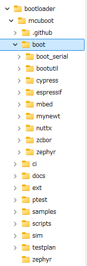

# MCUboot (1)

<i>2024/07/08</i>

nRF Connect SDK(ncs)のブートローダである[sdk-mcuboot](https://github.com/nrfconnect/sdk-mcuboot)は[MCUboot](https://docs.mcuboot.com/)がベースである。
Zephyrのブートローダ[mcuboot](https://github.com/zephyrproject-rtos/mcuboot)がそうだからかもしれないが、まあそこはどうでもよかろう。

## 構成

[design](https://docs.mcuboot.com/design.html)

MCUbootはライブラリとアプリという2パッケージ構成になっている。  
`boot/bootutil`がライブラリで、それ以外の`boot/`にあるものはアプリのようだ。RIOTのディレクトリが無いが`boot_serial`なのだろうか？

大半はbootutilがやって、最後にmain処理を呼び出したりするところがアプリと呼ぶ部分で行うようになっている。

[Image format](https://docs.mcuboot.com/design.html#image-format)に書かれているマクロ定義は[boot/bootutil/include/bootutil/image.h](https://github.com/nrfconnect/sdk-mcuboot/blob/v2.1.0-ncs1-branch/boot/bootutil/include/bootutil/image.h)にあった。
特にいうことはない。

`FLASH_AREA_IMAGE_PRIMARY`などのflash mapに関する定義はアプリに属するようでOSごとに違う定義になっていた。
`sysflash.h`のような名前がついているが、OSで違う名前になっていたりする。
たとえばZephyrは[boot/zephyr/include/sysflash/sysflash.h](https://github.com/nrfconnect/sdk-mcuboot/blob/v2.1.0-ncs1-branch/boot/zephyr/include/sysflash/sysflash.h)だ。

デザインの章は説明が長いので、ここら辺で一度止めよう。

## HALTしていた箇所

評価ボード[nRF5340 MDBT53-1Mモジュールピッチ変換基板](https://www.switch-science.com/products/8658)で起動せず止まったのはこの箇所。

* [flash_area_openのエラー](https://github.com/nrfconnect/sdk-mcuboot/blob/v2.1.0-ncs1-branch/boot/bootutil/src/loader.c#L2417-L2421)
  * Open primary and secondary image areas for the duration of this call.
  * Failed to open flash area ID `<fa_id>` (image `<image_index>` slot `<slot>`): `<rc>`, cannot continue

ループする[BOOT_NUM_SLOTS](https://github.com/nrfconnect/sdk-mcuboot/blob/v2.1.0-ncs1-branch/boot/bootutil/src/bootutil_priv.h#L55)は2。
`image_index`は0。`slot`は0だろう。mix表示にする方法が分からずどのレジスタを見ればよいのかわからんのだ([関数ごと逆アセンブルした表示はできる](https://devzone.nordicsemi.com/f/nordic-q-a/99249/disassembly-mixed-view-in-vs-code-with-nrf-connect))。
同様に`fa_id`も不明。`state`は構造体。  
うーん。。。よくわからない。

## flash_area_open()

元はといえば`flash_area_open()`がエラーを返しているのだから`flash_area_open()`を確認するのがよいとは思う。
Zephyr以外のOSはそれぞれ`int flash_area_open()`を実装しているのだがZephyrはそれっぽいのが見つからない。  
[docs/PORT.md](https://github.com/nrfconnect/sdk-mcuboot/blob/v2.1.0-ncs1-branch/docs/PORTING.md#flash-map)に出てくるのでカスタマイズがいるような関数、自分で実装しなさいということなんだろう。

mapファイルなどからたどり着いたのが、sdk-mcubootではなくsdk-zephyrの[subsys/storage/flash_map/flash_map.c](https://github.com/nrfconnect/sdk-zephyr/blob/v2.6.99-ncs1-branch/subsys/storage/flash_map/flash_map.c#L58-L73)。
戻り値が`-19`なので`-ENOENT`だろう。
が、ブレークポイントが設定できなくてよくわからんかった。
