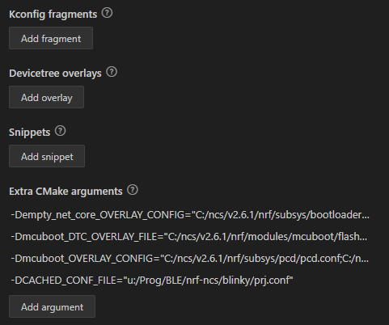

評価ボード[nRF5340 MDBT53-1Mモジュールピッチ変換基板](https://www.switch-science.com/products/8658)が自分でビルドしたアプリを焼くと動かない件の調査である。

* [MCUboot (1)](20240708-boot.md)

## MCUbootのカスタマイズ

なんにせよ、MCUbootのカスタマイズは必要になるはずだ。
ビルドするパラメータの変更で済むのか、あるいはボードごとにコードの追加もあるのかわからないが、本体を変更せずにカスタマイズできるようにはなっているだろう。

[Customizing the bootloader](https://docs.nordicsemi.com/bundle/ncs-latest/page/nrf/config_and_build/bootloaders/bootloader_config.html)によると、デフォルトでのMCUbootの設定は`bootloader/mcuboot/boot/zephyr`にある。
私の環境でいえば`C:\ncs\v2.6.1\bootloader\mcuboot\boot\zephyr\prj.conf`だ。  
このファイルには`CONFIG_xxx`が列挙してある。

カスタマイズするとしたら`CONFIG_xxx`を変更していくことになりそうだが、
[使い方ガイド](https://144lab.kibe.la/shared/entries/467b2482-2346-4c3e-8e0f-28d7403de2b9)の手順を見る限りでは
Build Configurationで"Board"の種類を選ぶところだけだ。

一度ビルドすると"Extra CMake arguments"が更新されるが、"Board"とは関係ないようだ。
なおアプリはシンプルな`blinky`を使っている。



Build Configurationで設定しないとなると、"Board"で選択するところで既に決まっているのだろう。

## Boardのカスタマイズ

[使い方ガイドの設定](https://144lab.kibe.la/shared/entries/467b2482-2346-4c3e-8e0f-28d7403de2b9#sdk%E3%81%AE%E3%82%A4%E3%83%B3%E3%82%B9%E3%83%88%E3%83%BC%E3%83%AB%E3%81%A8vscode%E3%81%AE%E8%A8%AD%E5%AE%9A)では`ssci_mdbt53_dev_board`ディレクトリと`ssci_mdbt53_dev_board_cpuapp.conf`ファイルの場所が指定されている。

`ssci_mdbt53_dev_board_cpuapp.conf`には`CONFIG_xxx`が列挙されていた。
このファイルはおそらく各ncsバージョンのディレクトリ内に配置するしかなさそうだったが、`bootloader/mcuboot/boot/zephyr/boards/ssci_mdbt53_dev_board_cpuapp.conf`に配置するのでMCUboot関連だろう。
ちなみに、ファイルがあるときのログはこんな感じで、

```log
Parsing C:/ncs/v2.6.1/bootloader/mcuboot/boot/zephyr/Kconfig
Loaded configuration 'C:/ncs/custom_boards/boards/arm/ssci_mdbt53_dev_board/ssci_mdbt53_dev_board_cpuapp_defconfig'
Merged configuration 'C:/ncs/v2.6.1/bootloader/mcuboot/boot/zephyr/prj.conf'
Merged configuration 'C:/ncs/v2.6.1/bootloader/mcuboot/boot/zephyr/boards/ssci_mdbt53_dev_board_cpuapp.conf'
Merged configuration 'C:/ncs/v2.6.1/nrf/subsys/pcd/pcd.conf'
Merged configuration 'C:/ncs/v2.6.1/nrf/subsys/partition_manager/ext_flash_mcuboot_secondary.conf'
Merged configuration 'C:/ncs/v2.6.1/nrf/subsys/partition_manager/partition_manager_enabled.conf'
Merged configuration 'U:/Prog/BLE/nrf-ncs/blinky/build/mcuboot/zephyr/misc/generated/extra_kconfig_options.conf'
Configuration saved to 'U:/Prog/BLE/nrf-ncs/blinky/build/mcuboot/zephyr/.config'
```

ファイルがないときはこんな感じ。"Merged configuration"が減っている。  
エラーになるのは`syscalls/kernel.h`などに宣言がある関数がundefined referenceになるからのようだ。

```log
Parsing C:/ncs/v2.6.1/bootloader/mcuboot/boot/zephyr/Kconfig
Loaded configuration 'C:/ncs/custom_boards/boards/arm/ssci_mdbt53_dev_board/ssci_mdbt53_dev_board_cpuapp_defconfig'
Merged configuration 'C:/ncs/v2.6.1/bootloader/mcuboot/boot/zephyr/prj.conf'
Merged configuration 'C:/ncs/v2.6.1/nrf/subsys/pcd/pcd.conf'
Merged configuration 'C:/ncs/v2.6.1/nrf/subsys/partition_manager/ext_flash_mcuboot_secondary.conf'
Merged configuration 'C:/ncs/v2.6.1/nrf/subsys/partition_manager/partition_manager_enabled.conf'
Merged configuration 'U:/Prog/BLE/nrf-ncs/blinky/build/mcuboot/zephyr/misc/generated/extra_kconfig_options.conf'
Configuration saved to 'U:/Prog/BLE/nrf-ncs/blinky/build/mcuboot/zephyr/.config'
```

アプリプロジェクトの`proj.conf`は読み込んでいないようなので、変更するなら`ssci_mdbt53_dev_board_cpuapp.conf`なのだろうか。

[Configuration and building](https://docs.nordicsemi.com/bundle/ncs-latest/page/nrf/config_and_build.html#configuration-and-build)
と[Overview of build and configuration system](https://docs.nordicsemi.com/bundle/ncs-latest/page/nrf/config_and_build/config_and_build_system.html)
を見るとなんとなく設定の概要が見えてくる気がする。

* 全体としては`cmake`によるビルド
  * ファイル: `CMakeLists.txt`, `*.cmake`
* パラメータは3ブロックある
  * Kconfig: `CONFIG_xxx`などからconfigureファイルを生成
    * `Kconfig`, `proj.conf`, `*.config`
  * Devicetree: ハードウェアの記述
    * `*.dts`, `*.dtsi`, `*.overlay`
  * Partition Manager: メモリレイアウト
    * `pm.yml`, `pm_static.yml`

この3つの中から選ぶなら、今回エラーを返しているのは`flash_area_open()`なので[Partition Manager](https://docs.nordicsemi.com/bundle/ncs-latest/page/nrf/scripts/partition_manager/partition_manager.html)か。
しかし、正解が分からないのに調査していくのは大変そうだ・・・。
