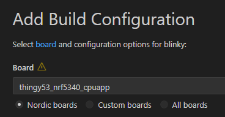
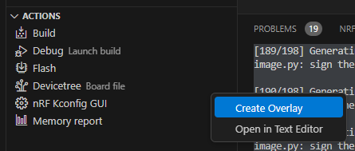
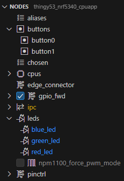
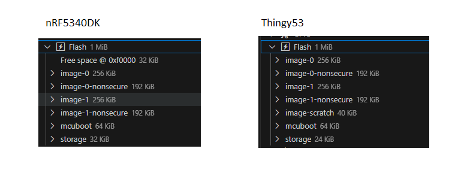

疲れたのでネットで検索していると、最近同じボードを動かしている人がいた。

[Nordic社製BLEの開発環境構築と動作確認（nRF Connect SDK） #BLE - Qiita](https://qiita.com/Kosuke_Matsui/items/4b797ba5db309914263f)

> ただし、私の環境では、用意されていたボード設定が期待通りに動作しなかったので、今回は別のボード設定を流用しました。

あー、やっぱり同じなのね。
そして、自分でボード設定を用意すれば良かったのか！と衝撃を受ける。

### Thingy53の設定

提供されていた設定はThingy53を流用していたようだったので`thingy53_nrf5340_cpuapp`を選んだ。
デバッグすると思うので"Optimization level"は"Optimize for debugging"にして Build Configuration ボタンをクリック。

ACTIONS > Devicetree のメニューから"Create Overlay"をクリック。
ダイアログが出てくるが、デフォルトボタンをクリック。

ビルドが終わったら ACTIONS > Devicetree をクリック。
そうすると、ブロック図？に切り替わる。

* `blue_led`, `green_led`, `button1`を削除
* `red_led`の設定を`P1.11`にする。active lowにする。
* `button0`の設定を`P1.10`にする。active lowにする。
* "alias"がエラーになっているので、テキストエディタで開いて修正する。
  * 私は画面から削除してもうまくいかなかった

vscodeをnRF Connectに戻して ACTIONS > Debug。

あれ！ また`FIH_PANIC`になってる。
なんでだ。。。

### nRF5340DKの設定

記事の人はnRF5340DKの設定を使っていたので、私も`nrf5340dk_nrf5340_cpuapp`を使ってみる。
同じ要領で設定して ACTIONS > Debug。

あ、`main()`の先頭でデバッガが停止した！
なるほど、ちゃんと動作する場合はこういう挙動なんだ。

そのままContinueすると・・・LEDが点滅した！！

ということは、提供された設定ファイルはThingy53をベースにしているから動かないということなのかな？

Thingy53とnRF5340DKでDevicetree Visual Editorの OVERVIEW > Flash を見比べたが、ちょっと違うくらいだ。これが影響しているのか？

