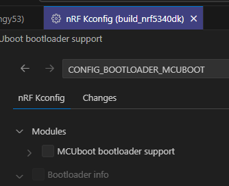
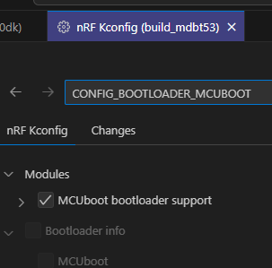

# nRF5340DK版はMCUboot未使用か

<i>2024/07/12</i>

[前回](20240711-boot.md)、評価ボード[nRF5340 MDBT53-1Mモジュールピッチ変換基板](https://www.switch-science.com/products/8658)のボード定義ファイルではなくnRF5340DKの定義ファイルをベースにすると動いた。
ではその2つを比べてみればわかるかとビルドしたフォルダを比較したのだが、nRF5340DKベースの方が生成されたファイルが少ないことに気付いた。
ビルドディレクトリの直下に`mcuboot/`が無い。

まさか。。。

vscodeのnRF Connect Extensionに ACTIONS > nRF Kconfig GUI という項目がある。
ビルド済みのKconfig設定が見えるようだ。

MCUbootを使うかどうかは[CONFIG_BOOTLOADER_MCUBOOT](https://docs.nordicsemi.com/bundle/ncs-latest/page/mcuboot/readme-ncs.html)なのでフィルタする。  
チェックが無い。

念のため、評価ボードで提供されている定義ファイルでビルドした方で確認。  
チェックされている。

ということは、nRF5340DK版はMCUbootを使っていないのだろう。

## nRF5340DKでMCUbootを有効にする

nRF5340DK設定の方で`CONFIG_BOOTLOADER_MCUBOOT`にチェックすると、これはこれでビルドされない。
と思ったら、チェックした後に「Save To File」でプロジェクトの`prj.conf`に保存してからビルドすると`mcuboot/`ができた。  
そして ACTIONS > Flash で焼くと、動いた。

本当にMCUbootを使っているのかが、あまり自信を持てない。
MCUbootの方の`main()`にブレークポイントを設定すると止まったのだが、Continueしても動いてくれなかった。
止まる以上は通っていると思いたいのだが、どうなんだろう。

ボタンを押したまま起動するとDFUモード?になるのだが、あれは[元から](https://github.com/nrfconnect/sdk-mcuboot/blob/v2.0.99-ncs1-branch/boot/zephyr/main.c#L478-L489)コードがあるようだ。
devicetree の alias で `mcuboot_button0` が定義されていたら使えそうなのだが、押したまま起動しても普通にLED点滅になる。  
うーむ。

## MDBT53でMCUbootを無効にする

逆のパターンで、提供された定義ファイルの方でMCUbootを使わないようにした。
こちらは、ビルドは通るのだが ACTIONS > Flash でエラーになってしまう。
エラーログにも出ていないのでよくわからない。MCUbootを使わなくなったのでFlashに焼き込むファイルが変わったせいとか？
