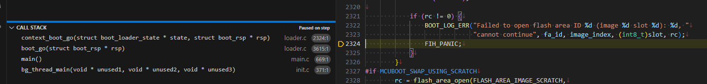

# MCUboot (3)

<i>2024/07/13</i>

評価ボード[nRF5340 MDBT53-1Mモジュールピッチ変換基板](https://www.switch-science.com/products/8658)が自分でビルドしたアプリを焼くと動かない件の調査である。

* [MCUboot (1)](20240708-boot.md)
* [MCUboot (2)](20240711-boot.md)

今日は今までの状況を整理する回です。

## ここまででわかったようなこと

* ncs v2.6.0以降から動かないようになった。
  * v2.4.0とv2.5.3では動いた(それ以外は試していない)。
  * v2.6.0からブートローダMCUbootのコードで`flash_area_open()`の戻り値をチェックするようになり、そこで止まるようになった。
  * 
  * チェックしている部分をコメントアウトすると進むので、以前からエラーを返していたのだろう。
* 提供されたボード定義ファイルを使わず、nRF5340DKをベースに作ると起動した。
  * nRF5340DKの定義ファイルはMCUbootを使っていなかった。
  * 使うように設定したつもりだが、動いているように見える。ただブレークポイントで止まってくれないしボタンを押したまま起動しても復旧モードになってくれなかったので自信がない。
* 提供されたボード定義ファイルの場合はアプリの`main()`には届かないものの、ボタンを押したまま起動すると復旧モードで起動している。これはProgrammerアプリがUSB接続したMDBT53を認識しているので間違いないだろう。

あまり進展はしていないと見るか、進んではいるとみるか。

### デバッグがうまくいっていない

ブレークポイントでのデバッグがうまくいかない。
こちらもわかっていることを書いておく。

* `FIH_PANIC`では停止する。
* アプリの`main()`では止まってくれる。
* MCUbootの`main()`でも止まるようだが、ステップ実行などができない。
  * STOPボタンは使えるようだ。
  * RESTARTボタンだと`reset.S`で止まってしまうのもよくわからない。
* vscodeでは`#ifdef`の有効/無効でエディタのコード表示が薄い色になったりするのだが、正しく反映されていないように見える。
  * ボタンを押したまま通常起動させた後、ACTIONS > Debug から "Attach Debugger to Target"すると`boot_serial_read_console()`にいるところだったが、コードをたどっていくと`main.c`に到達したもののエディタの表示は薄くなっていた。
  * `#include`がいくつかエラーになっているのでインクルードパスの設定がいるのか？
  * ncsのディレクトリを直接vscodeで開いたときは`.vscode/c_cpp_properties.json`の"includePath"に`"${workspaceFolder}/bootloader/mcuboot/boot/zephyr/include"`を追加すると参照するのだが、vscodeのworkspaceとしてncsのディレクトリを追加すると参照してくれないようだ。
  * Kconfigの設定はヘッダファイルとして`build_mdbt53/mcuboot/zephyr/include/generated/autoconf.h`のようなファイルに

### その他

今までの調査では ncs は v2.6.1を使っている。
が、v2.7.0 が解禁され experimental の警告も出なくなったようだから、今回から v2.7.0 にする。  
v2.7.0 になっても`FIH_PANIC`で止まるのは同じである。

## Serial Recovery Mode

MCUbootには[Serial Recovery Mode](https://docs.mcuboot.com/serial_recovery.html)というモードがある。
上に書いたボタンを押しながら起動するのがそれで、今回であればUSBを使っているので[DFU over USB](https://academy.nordicsemi.com/courses/nrf-connect-sdk-intermediate/lessons/lesson-8-bootloaders-and-dfu-fota/topic/exercise-2-dfu-over-usb-adding-external-flash/)なのかもしれない。

