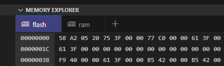

評価ボード[nRF5340 MDBT53-1Mモジュールピッチ変換基板](https://www.switch-science.com/products/8658)が自分でビルドしたアプリを焼くと動かない件の調査である。

* [MCUboot (1)](20240708-boot.md)
* [MCUboot (2)](20240711-boot.md)
* [MCUboot (3)](20240713-boot.md)

## DevAcademy

DevAcademyに[Bootloader basics](https://academy.nordicsemi.com/courses/nrf-connect-sdk-intermediate/lessons/lesson-8-bootloaders-and-dfu-fota/topic/bootloader-basics/)があったので眺めた。

実行コードが0x0000_0000からと書いてあるけど、ARM(not Cortex-M)はそうだったが Cortex-M は 0x0000_0000 が SP(スタックポインタレジスタ)の初期値で 0x0000_0004 がリセットベクタのはずである。
Cortex-M3はそうだったし[Cortex-M33](https://developer.arm.com/documentation/100235/0002/sqf1486724325622)にもそう書いてある。

念のため、今デバッグしているMDBT53のメモリを見た。



RAMは 0x2000_0000 から始まっているので、先頭4byteの 0x2005a258 はスタックメモリの開始アドレスだろう。  
そして続く 0x0000_3f75 はリセットベクタである。Thumbなので LSB に 1 が立っているため実際のアドレスは 0x0000_3f74である。
ビルドした blinkyアプリの `./build_mdbt53/mcuboot/zephyr/zephyr_final.map` を検索するとこうなっていた。
起動直後に実行されるプログラムは`reset.S`なのか。

```
 .text._reset_section
                0x0000000000003f74       0x60 zephyr/arch/arch/arm/core/cortex_m/libarch__arm__core__cortex_m.a(reset.S.obj)
                0x0000000000003f74                __start
                0x0000000000003f74                z_arm_reset
```

DevAcademyには[MCUboot](https://academy.nordicsemi.com/courses/nrf-connect-sdk-intermediate/lessons/lesson-8-bootloaders-and-dfu-fota/topic/mcuboot-mcumgr-and-dfu-target/)もあった。
プロジェクトに`CONFIG_BOOTLOADER_MCUBOOT=y`を設定するだけで有効になる、と書いてあるのでやり方は間違ってない。

### Serial Recovery Mode

MCUbootには[Serial Recovery Mode](https://docs.mcuboot.com/serial_recovery.html)というモードがある。
上に書いたボタンを押しながら起動するのがそれで、今回であればUSBを使っているので[DFU over USB](https://academy.nordicsemi.com/courses/nrf-connect-sdk-intermediate/lessons/lesson-8-bootloaders-and-dfu-fota/topic/exercise-2-dfu-over-usb-adding-external-flash/)なのかもしれない。

DevAcademyの[MCUboot](https://academy.nordicsemi.com/courses/nrf-connect-sdk-intermediate/lessons/lesson-8-bootloaders-and-dfu-fota/topic/mcuboot-mcumgr-and-dfu-target/)にはこうある。

> This does not add any DFU functionality.

追加しただけではDFU機能は付いていないということは、nRF5340DKの定義ファイルに`CONFIG_BOOTLOADER_MCUBOOT=y`を設定しただけでは DFU over USB が組み込まれずボタンを押したまま起動しても何も起こらないということだろうか。
それなら今の動作も納得できる。

そしてもう1つ知らなかったことが。  
vscodeでMCUbootのKconfigを設定する場合は APPLICATIONS で`mcuboot`を選択してから ACTIONS の nRF Kconfig GUI をクリックするそうだ。

チュートリアル(正確には Lesson)を進めると、UARTでのDFU、USBでのDFUなどができるようになっていく。
もしかするとnRF5340DKのボード定義がMCUboot未対応になっているのはチュートリアルをするためなのか？

### inter_less8_exer2_solution

細かい過程はさておき、お手本がほしいので [DevAcademy の Lesson 8](https://github.com/NordicDeveloperAcademy/ncs-inter/tree/main/lesson8)、その中の DFU over USB を行っている Execise 2 をやってみる。
幸いなことにディレクトリに`_solution`とついている方が正解というか結果になるようなので、`inter_less8_exer2_solution`を試せば良かろう。

しかし動かない。。。
Debugがうまくできなかったのでattachしたらブートローダで止まっていた。

```
fih_panic_loop () at C:/ncs/v2.7.0/bootloader/mcuboot/boot/bootutil/src/fault_injection_hardening.c:68
68	    __asm volatile ("b fih_panic_loop");
```

例の止まる現象ならよいのだが、ボタンを押して起動しても同じ。

`prj.conf`の`CONFIG_BOOTLOADER_MCUBOOT=y`より後ろをコメントアウトしても同じ。
`CONFIG_BOOTLOADER_MCUBOOT=y`もコメントアウトしたら動いた。
`child_image/`を削除すると動いたような感触。

今回はいろいろ当てが外れた実験であった。進まんなぁ。
