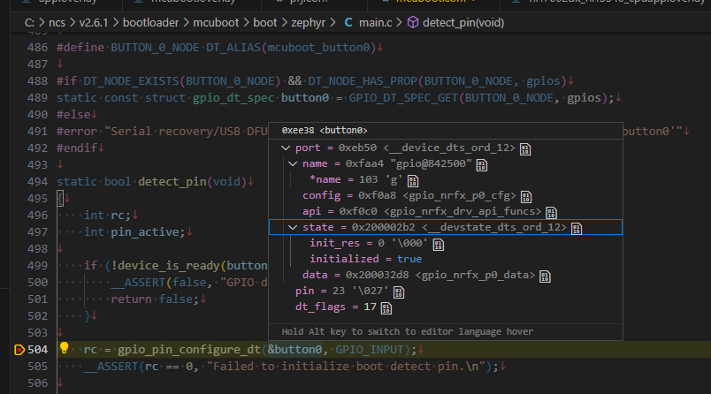
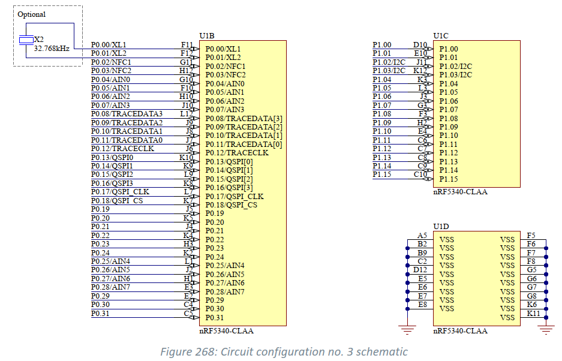
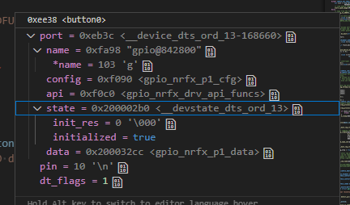

# MCUboot (6)

<i>2024/07/16</i>

評価ボード[nRF5340 MDBT53-1Mモジュールピッチ変換基板](https://www.switch-science.com/products/8658)が自分でビルドしたアプリを焼くと動かない件の調査である。

* [MCUboot (1)](20240708-boot.md)
* [MCUboot (2)](20240711-boot.md)
* [MCUboot (3)](20240713-boot.md)
* [MCUboot (4)](20240714-boot.md)
* [MCUboot (5)](20240715-boot.md)

簡易まとめ

* DevAcademy Lesson 8-2 を MDBT53 用に書き換えて`main()`は起動するようになったが Serial Recoveryモードにならない
* ncs は v2.6.1 に変更した
  * なぜか v2.7.0 で APPLICATIONS から mcuboot を選択するとおかしくなるのでやむなく。

MCUbootというタイトルだが、[Serial Recovery](https://docs.mcuboot.com/serial_recovery.html)に入れない件を調べているだけである。

## DevAcademyの続き

引き続き[inter_less8_exer2_solution](https://github.com/NordicDeveloperAcademy/ncs-inter/tree/main/lesson8/inter_less8_exer2_solution)を見ていく。

MCUbootでボタンを押す押さないにかかわらず[detect_pin()](https://github.com/nrfconnect/sdk-mcuboot/blob/v2.0.99-ncs1/boot/zephyr/main.c#L494)に入っていることは分かった。



`gpio_pin_get_dt()`が呼ばれているのだが、戻り値`rc`は最適化されていてデバッガで見えない。
[AAPCS](https://github.com/ARM-software/abi-aa/blob/main/aapcs32/aapcs32.rst#611core-registers)によるとレジスタ`r0`が戻り値と思っていて良いだろう。
そして`r0=0`。

となると`button0`がGPIO `P1.10`になっていないのだろうか？

`button0`の値は上の画像に見えるとおりなのだが、値を見てもよくわからない。
前回 GPIO をたたくだけなのに関数でいろいろ処理があるというようなことを書いたが、GPIO の設定が既に大変だ。
ああいう形にしないと間違った設定のチェックはできない気がする。

[GPIO](https://docs.nordicsemi.com/bundle/ps_nrf5340/page/gpio.html)の説明を読む。  
GPIOは32本あるが、物理的なピンとしては`P0.00`-`P0.31`、`P1.00`-`P1.15`までで他の機能との兼用になっている。
ボタンは`P1.10`に割り当てられているが、これは物理的なピンである。これがGPIOのどれに相当するかはどうやって決まっているのだろうか？ 
Devicetree Visual Editorでも物理的なピンの設定をしただけでGPIOの割り当ては行っていないので、何か決まりがあるはずだ。

P0やP1が出てくるのは[Registers](https://docs.nordicsemi.com/bundle/ps_nrf5340/page/gpio.html#ariaid-title6)か。
nsかどうかでP0かP1かが決まってくるのか。。。



* [PINの割り当て](https://docs.nordicsemi.com/bundle/ps_nrf5340/page/gpio.html#ariaid-title2)は以下に対して可能
  * Application core
  * Network core
  Peripheral with dedicated pins
  * Trace and debug(TaD) subsystem
* デフォルトはApplication core
  `PIN_CNF[n]`の`MCUSEL`ビットフィールド

これは深く考えず、例えば`P1.10`をGPIOとして使用したら`P0.10`はGPIOとして使用できない、ということでよいのかな。
ならばデバッグで取得した`pin=23`、つまり`P0.23`を見ているということだろうか(`P1.23`は存在しないので)。

確かに、nRF5340DKの`button0`は`P0.23`だった。
つまり、MCUbootの中ではまだnRF5340DKの設定を見ているということか。
`main()`ではボタンが有効だったので、`app.overlay`以外となると[child_image/mcuboot.overlay](https://github.com/NordicDeveloperAcademy/ncs-inter/blob/main/lesson8/inter_less8_exer2_solution/child_image/mcuboot.overlay)くらいしかない。

`child_image/mcuboot.overlay`に以下を追加して Pristine Build。
Flashして焼き、ボタンを押したまま起動すると LEDが点灯したままになった。
Serial Recoveryモードになったと考えて良かろう。

```
&button0 {
	gpios = <&gpio1 10 GPIO_ACTIVE_LOW>;
};

&led0 {
	gpios = <&gpio1 11 GPIO_ACTIVE_LOW>;
};
```

長かったー。
設定し直したときの`pin`はちゃんと`10`になっていた。実際にどうなっているかは`PIN_CNF[10]`を見ないと分からないのかな。
`config`が`<gpio_nrfx_p0_cfg>`から`<gpio_nrfx_p1_cfg>`になっているので、そこで判定して良いのか



とはいえ、ようやくスタートに立ったくらいのところである。先は長い。
