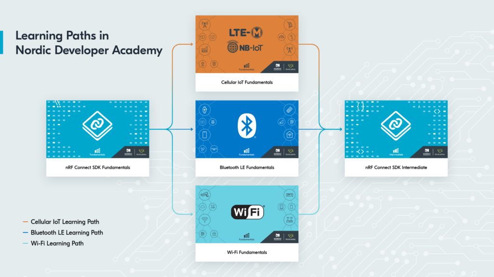
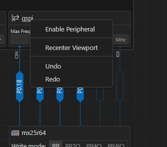
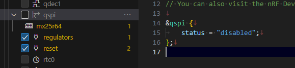
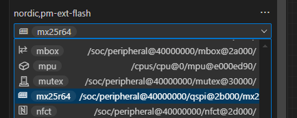
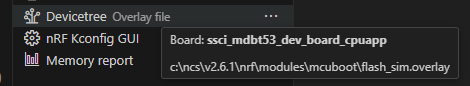
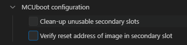
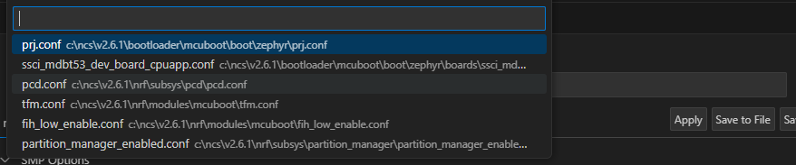

# DevAcademy

<i>2024/07/17</i>

いまさらだが、nRF Connect SDKの[DevAcademy](https://academy.nordicsemi.com/)を最初からやった方がいいんじゃないかという気がしている。
あまりにも知識が足りないので、途中からやるものではないと気がついたのだ。

nRF Connect SDKに関しては2つコースがある(2024/07/17現在)。

* [nRF Connect SDK Fundamentals](https://academy.nordicsemi.com/courses/nrf-connect-sdk-fundamentals/)
  * Lesson 1 - nRF Connect SDK Introduction
  * Lesson 2 - Reading buttons and controlling LEDs
  * Lesson 3 - Elements of an nRF Connect SDK application
  * Lesson 4 - Printing messages to console and logging
  * Lesson 5 - Serial communication(UART)
  * Lesson 6 - Serial communication(I2C)
  * Lesson 7 - Multithreaded applications
  * Lesson 8 - Thread synchronization
* [nRF Connect SDK Intermediate](https://academy.nordicsemi.com/courses/nrf-connect-sdk-intermediate/)
  * Lesson 1 - Zephyr RTOS: Beyond the basics
  * Lesson 2 - Debugging and troubleshooting
  * Lesson 3 - Adding custom board support
  * Lesson 4 - Pulse Width Mudulation(PWM)
  * Lesson 5 - Serial Peripheral Interface(SPI)
  * Lesson 6 - Analog-to-digital converter(ADC)
  * Lesson 7 - Device driver model
  * Lesson 8 - Bootloaders and DFU/FOTA

いままでMCUbootで見ていたのは"Intermediate"の方だ。"Learning Paths"によると、最初は "nRF Connect SDK Fundamentals"をやったあと、自分がやりたいことによってどれかの Fundamentals をやり、最後に"nRF Connect SDK Intermediate"をやるものらしい。

タイトルを見る限り、`main()`まで到達できるボードがないとつらそうだ。
そのために nRF5340DK のような標準開発ボードを用意しているのだろうが、[nRF5340 MDBT53-1Mモジュールピッチ変換基板](https://www.switch-science.com/products/8658)を買ったのでわざわざ買い足したくない。

しかしMDBT53ボードで提供された定義ファイルを使うと ncs v2.6 からはサンプルアプリが起動しないので MCUboot のことを調べているという次第である。
ブートローダの途中でFlash Areaの取得に失敗をしているのか、エラーになっているためだった。

nRF5340DKの定義ファイルを使うと`main()`まで起動するのだがGPIOの割り当てが違うのでLEDやボタンが作動しない。使えるようにするにはDTSファイルの上書きがいる。
MDBT53ボードの定義ファイルは[Thingy53](https://www.nordicsemi.com/Products/Development-hardware/Nordic-Thingy-53)をベースにしているが、これもMDBT53とはGPIOのアサインが違う。
nRF5340DKは[64MB外部Flash](https://docs.nordicsemi.com/bundle/ug_nrf5340_dk/page/UG/dk/hw_external_memory.html)があるし、Thingy53も[同様](https://docs.nordicsemi.com/bundle/ug_thingy53/page/UG/thingy53/hw_description/external_memory.html)だ。

----

ならば QSPI を無効にして `chosen` からも削除すればよいのでは？

Visual DeviceTree EditorのQSPIを右クリックすると「Enable Peripheral」と出てくるから現在はDisableになっているように見えるのだが、どれを見ても同じなのであまり関係ないのか。

サイドバーの方で"qspi"を検索すると、ツリー表示の方にはチェックが入っていたので外した。
そうすると overlay ファイルの方には "disable" が追加された。

`chosen`からも削除。

問題はMCUbootの方で、こちらは`flash_sim.overlay`というファイルを参照している。
Build Configurationの編集画面では"Extra CMake arguments"で`-Dmcuboot_DTC_OVERLAY_FILE="C:/ncs/v2.6.1/nrf/modules/mcuboot/flash_sim.overlay"`のように設定されていた。

では別のoverlayファイルを作ってBuild Configurationを書き換えれば良いかというとそうでもないようで、変更してビルドするとまた書き換えたパスが元に戻っているのだ。
これはどうも、初回の Build Configuration 作成時に設定したものが使われるようだ。ということはプロジェクトではなくビルドした設定の中にしか入っていないのか。

ビルドするとbootloaderのところで`error: 'PM_MCUBOOT_SECONDARY_ID' undeclared`のようなエラーが出てしまう。
Kconfigで検索するとこれらにチェックが入っていたので外す。

これを保存しようとすると ncs の下のファイルに保存しようとしてしまうので、プロジェクトに `child_image/mcuboot.conf` を作る。
`-Dmcuboot_OVERLAY_CONFIG`を追加。
なお元々`mcuboot_OVERLAY_CONFIG`は複数のconfが設定されていたのだが、初回の追加は自分のconfファイルだけ追加しておけば良い。ビルドしたら自動で他のconfも追加されていた。

が、これでもエラーになる。

よくソースコードを見ると、エラーになっているのは[ここ](https://github.com/nrfconnect/sdk-mcuboot/blob/v2.0.99-ncs1/boot/zephyr/include/sysflash/pm_sysflash.h#L47)なのだが、`PM_MCUBOOT_SECONDARY_ID`を使っているのは`#ifdef`も`#else`も同じなのでもっと前の方で無効にしないといけない。
となると[CONFIG_SINGLE_APPLICATION_SLOT](https://github.com/nrfconnect/sdk-mcuboot/blob/v2.0.99-ncs1/boot/zephyr/include/sysflash/pm_sysflash.h#L16C9-L16C39)を定義すればよいということになる。

これで Pristine Build すると `error: Aborting due to Kconfig warnings` が出ていた。
以前からwarningはいくつも出力されていたが、abortまではいわれてなかったと思う。
だいたい、ビルドもerrorになった時点で止めてくれれば良いのに

* `MCUBOOT_SERIAL_DIRECT_IMAGE_UPLOAD`
* `UPDATEABLE_IMAGE_NUMBER`
* `FLASH_SIMULATOR`
* `FLASH_SIMULATOR_DOUBLE_WRITES`
* `LOG_DEFAULT_LEVEL`
* `BOOT_UPGRADE_ONLY`
* `MCUBOOT_LOG_LEVEL_INF`
* `LOG_MODE_MINIMAL`

`CONFIG_SINGLE_APPLICATION_SLOT=y`にしたけど、これは外部Flashとは関係ないな。
ブートローダのアップデートを元に戻せるように2セット(2スロット)にするだけだったのだと思う。

[DevAcademy - MCUboot, and relevant libraries](https://academy.nordicsemi.com/courses/nrf-connect-sdk-intermediate/lessons/lesson-8-bootloaders-and-dfu-fota/topic/mcuboot-mcumgr-and-dfu-target/)にmcubootのprimaryとsecondaryというスロット名が出てくる。
`CONFIG_BOOTLOADER_MCUBOOT=y`(追加するのはMCUbootのKconfig設定)を設定すると、1スロットだけが"child image"として追加される。
追加しただけではDFU機能はがない。デフォルトでは mcuboot_primary と mcuboot_secondary の dual slot になる。
図を見ると、"mcuboot"(青), "mcuboot_primary"(緑), "mcuboot_secondary"(赤) の3領域ある。
[次の項目](https://academy.nordicsemi.com/courses/nrf-connect-sdk-intermediate/lessons/lesson-8-bootloaders-and-dfu-fota/topic/dfu-for-the-nrf5340/)ではnRF53のためにnetwork coreと並んだ図があるが、"mcuboot_"とついているものの中にアプリコアを含んでいる。
なので"mcuboot_"というプレフィクスはあるが実際はアプリコアということだ。
[Simultaneous multi-image DFU with nRF5340 DK](https://docs.nordicsemi.com/bundle/ncs-latest/page/nrf/device_guides/nrf53/simultaneous_multi_image_dfu_nrf5340.html)によるとこうだ。

* "mcuboot_primary"と"mcuboot_secondary"はアプリコアイメージのスロット
* "mcuboot_primary_1"と"mcuboot_secondary_1"はネットコアイメージのスロット

dual slotと似たような感じがするのが[multi-image](https://academy.nordicsemi.com/courses/nrf-connect-sdk-intermediate/lessons/lesson-8-bootloaders-and-dfu-fota/topic/multi-image-builds-and-the-partition-manager/)だが、これはアプリとブートローダを1つのimageファイルにしている。
ブートローダの方が"child image"になる。  
child imageの種類は、`CONFIG_BOOTLOADER_MCUBOOT`にするとMCUbootになり、`CONFIG_SECURE_BOOT`にするとNSIB(Nordic Secure Immutable Bootloader)になる。

nRF53はアプリ用と通信用の2コア構成で、プログラムもそれぞれ別になっている。
それらのプログラムを同時に更新するのが"[simultaneous update](https://academy.nordicsemi.com/courses/nrf-connect-sdk-intermediate/lessons/lesson-8-bootloaders-and-dfu-fota/topic/dfu-for-the-nrf5340/)"だとか"simultaneous multi-image update"だとか呼ぶものである。
同時にアップデートするなら1つのイメージファイルにまとめるので必然的にmulti-imageになるのかな？
ネットコアの更新には PCDドライバがいるらしい。`CONFIG_PCD_APP`がそれか。

そして[この図](https://academy.nordicsemi.com/wp-content/uploads/2024/04/nrf53_update_both_cores_v2-1536x532.png)を見ると、同時に更新する場合は外部Flashが使われている。
MDBT53には外部Flashがないので同時アップデートはできないことになる。

* dual slot
  * ブートローダやアプリのFLASH領域が2つあること
  * swappingする/しないにかかわらず、2つあればそう呼んでいるようだ
  * "mcuboot_primary"と"mcuboot_secondary"はアプリコアイメージのスロット
  * "mcuboot_primary_1"と"mcuboot_secondary_1"はネットコアイメージのスロット
* multi-image build
  * アプリとブートローダを1つのイメージファイルにまとめたビルド
  * ブートローダを[NSIB](https://docs.nordicsemi.com/bundle/ncs-latest/page/nrf/samples/bootloader/README.html)にするかMCUbootにするかはKconfigで設定
    * NSIBのセカンダリブートローダとしてMCUbootを使うこともできるようだ(その場合は両方`y`にする)
* simultaneous multi-image
  * たぶんコアが2つあるnRF53
  * 外部Flashがいる
  * アプリコアからネットコアを直接触れないのでRAMを介することになる
    * `CONFIG_FLASH_SIMULATOR`はそのために使われるようだ

* MDBT53ではおそらく...
  * 外部Flashがないのでsimultaneous updateはできない
    * `CONFIG_FLASH_SIMULATOR`は不要
  * ネットコアのアップデートをしないならおそらく...
    * `CONFIG_PCD_APP`は不要

overlayで変更するのは面倒なので、提供された設定ファイル`ssci_mdbt53_dev_board_cpuapp.conf`を直接いじることにした。
DeviceTreeの設定も`ssci_mdbt53_dev_board/ssci_mdbt53_dev_board_common.dts`を直接編集する。
これで Build Configuration を作成し直すときも特に編集せずに済む。

あれこれやってKconfigのエラーはなくなった。設定が正しいのかどうかは分からん。
次は`Generating ../../zephyr/net_core_app_signed.hex`でこんなエラーが出る。

`FAILED: zephyr/net_core_app_update.bin xxxx/build/zephyr/net_core_app_update.bin`

これは[imgtool.py](https://docs.nordicsemi.com/bundle/ncs-latest/page/mcuboot/imgtool.html)というコマンドの`--slot-size`というオプションに値がないためだった。
たぶん変数か何かに入っているべき値がないのだろう、次のパラメータまでのスペースが2つ空いていた。
これは自動で指定ではないのか？

うーん。。。
