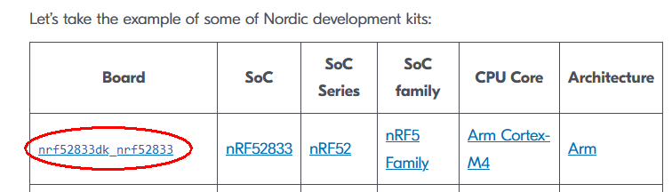
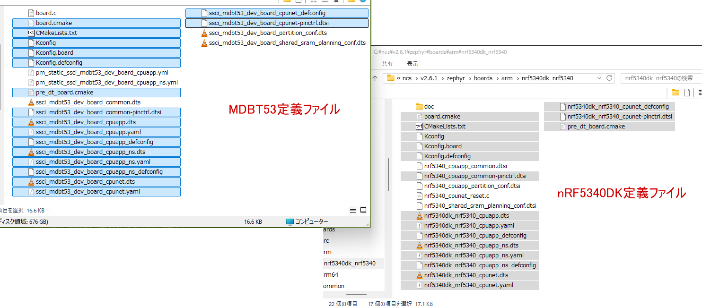

# DevAcademy "Adding custom board support" (1)

<i>2024/07/22</i>

[DevAcademy Fundamental](https://academy.nordicsemi.com/courses/nrf-connect-sdk-fundamentals/)で基礎を勉強して評価ボード[nRF5340 MDBT53-1Mモジュールピッチ変換基板](https://www.switch-science.com/products/8658)の設定ファイルを作ろうとしたのだが、さすがにその知識だけでは無理だ。
nRF5340DKの定義と見比べたりしたものの、差分が多すぎてどれが影響あるのか分からないし、まねして良いのかどうかも分からない。

まだ早いのかもしれないが DevAcademy Intermediateの[Adding custom board support](https://academy.nordicsemi.com/courses/nrf-connect-sdk-intermediate/lessons/lesson-3-adding-custom-board-support/)を見ていく。

----

* ncs/zephyr では「ボード定義」というのは特定の開発ボードやハードウェアプラットフォームでのハードウェアの特性や動作を定義したconfigurationやinitializationファイルを指す
* ncs はたくさんのボードをサポートしているし、devicetree overlay や Kconfig fragments を使ってカスタマイズもできる。
* Zephyrで"[Hardware Model V2](https://github.com/zephyrproject-rtos/zephyr/issues/69546)"という仕様変更が行われているが、ncs v2.6.0ではまだ入っていないようだ。

## [Board definition](https://academy.nordicsemi.com/courses/nrf-connect-sdk-intermediate/lessons/lesson-3-adding-custom-board-support/topic/board-definition/)

10分くらいの動画があるのだが・・・私は英語が、ね。。。
字幕があればまだ見てみようかと思ったのだが、ページに全部書かれていると期待したい。  
しかし飛ばして見ただけでも載っていない画面ばかりだったので、動画にしか載っていない or 動画の方が親切なのだろう。

YouTubeチャネルには[ウェビナー](https://view-su3.highspot.com/viewer/653a5c88991f1996435e1672)で使われた[Adding Custom Board Support in nRF Connect SDK](https://www.youtube.com/watch?v=V_dVKgWKILM)もあるので、そちらの方が扱いやすいかもしれない(字幕が使えるので)。
おそらく、DevAcademyの各ページの先頭にある動画はウェビナーを分割したものだと思う。

字幕は自動生成なので翻訳するとさらに混乱する。いっそのこと英語の字幕のままの方がよいのか。。。でも単語が。。。

例として[nRF52833DK](https://www.nordicsemi.com/Products/Development-hardware/nRF52833-DK)が出ている。
[Board列のリンク先](https://github.com/nrfconnect/sdk-zephyr/tree/v3.5.99-ncs1-1/boards/arm/nrf52833dk_nrf52833)が`v3.5.99-ncs1-1`となっているが、[ncs v2.6.0 のwest.yml](https://github.com/nrfconnect/sdk-nrf/blob/v2.6.0/west.yml#L63-L64)では`v3.5.99-ncs1`となっている。

[ncs v2.6.1のwest.yml](https://github.com/nrfconnect/sdk-nrf/blob/v2.6.1/west.yml#L63-L64)では`v3.5.99-ncs1-1`になっているので、これを書いている時点でのDevAcademyはv2.6.1を使っているということでよかろう。

[SoC列のリンク先](https://github.com/nrfconnect/sdk-zephyr/blob/main/dts/arm/nordic/nrf52833.dtsi)はDTSIファイル、つまりDeviceTreeのincludeファイルである。
列が右側に行くにつれてグループが大きくなっている(Arm > Cortex-M4 > nRF5 > nRF52 > nRF52833 > nRF52833DK)という見方で良いのかな？  
階層になっているので「Hardware Support Hierarchy」と呼ばれる。

呼ばれるといっても、自分のボードだと自分で階層の表を作ることになる。
CPUというかマイコンというか、表でいうところのSoC列はどのチップを使うかで決まるのでDTSIファイルの選択は困ることはない。

定義ファイルをMDBT53開発ボードとnRF5340DKをファイル名だけで比較するとこのくらいの一致度だった。

念のため拡張子がdts/dtsi違いは除外したが、使われ方としては include でしか使っていなかったので dtsi でよかろう。

まあ、これだけ見てもさっぱりわからんな。
学習を進めよう。
