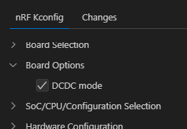
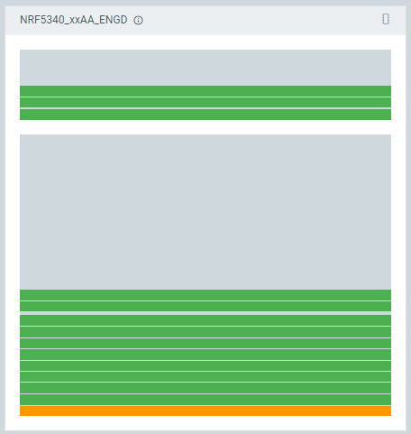

引き続き DevAcademy Intermediateの[Adding custom board support](https://academy.nordicsemi.com/courses/nrf-connect-sdk-intermediate/lessons/lesson-3-adding-custom-board-support/)を見ていく。

----

## [Exercise 1 – Custom board for single-core SoC](https://academy.nordicsemi.com/courses/nrf-connect-sdk-intermediate/lessons/lesson-3-adding-custom-board-support/topic/exercise-1/)

スルーしようかと思っていたが Exercise 2 は既にある board 定義をコピーして改造するようになっていたので、一から作るこちらも見ておくことにした。

Exercise 1 の最初に「Important」としてこんなことが書かれていた。

> This exercise assumes you have installed the latest nRF Connect for the VS Code extension pack (>= Version 2024.2.214).

いま(2024/07/23)の時点で[nRF Connect for VS Code Extension Pack](https://marketplace.visualstudio.com/items?itemName=nordic-semiconductor.nrf-connect-extension-pack)の最新版は 2023.11.3 になっている。
Extensionではない[nRF Connect for VS CodeのChangelog](https://marketplace.visualstudio.com/items/nordic-semiconductor.nrf-connect/changelog)には Version 2024.2.214 が載っていたので、たぶん誤記だろう。

* "Create a new board"で生成されたファイルは自分でやった場合と同じだった
  * "mandatory"といわれていたファイルが生成されていなかったので最近になって変わったのか気になっていたので
* defconfigファイルが2種類あるのに新たに`Kconfig`を追加しているのはなぜだ？
  * `Kconfig.defconfig`はデフォルト値、`<boardID>_defconfig`はKconfig fragmentファイルという説明
  * ただの`Kconfig`は board menu の作成とデフォルト値の設定などらしい
  * "nRF Kconfig GUI"では"Board Options"の中にあった
    * 
  * これはnRF52333DKの[Kconfig](https://github.com/nrfconnect/sdk-zephyr/blob/v3.5.99-ncs1-1/boards/arm/nrf52833dk_nrf52833/Kconfig)にも同じファイルがある
* LEDの追加
  * GPIOは`GPIOTE`もアクティブにしないとビルド時にエラーが起きた
  * 最初、ノード名`led_0`で追加する
  * ラベル名は`led0`にする
  * エイリアス名も`led0`にする
    * `led0 = &led0`となっていたので、左辺がエイリアス名、右辺がラベル名か
* `pinctrl.dtsi`は自分で作成して追加する
  * 単なるファイルなので`#include`も自分で追加する
    * いっそのことテンプレートで作成してほしいものだ。そのうちそうなるだろう。
  * UART, I2C, SPI, PWMのピン設定を追加しているが、MDBT53では今のところ使わない
    * LEDの追加で`&gpio0`などを追加したり`chosen`でピンのアサインを書いたりしたが、そういうのとはまた違いそうだ。
    * というか、これはGUIで設定できないのか？

やっていったところ、MDBT53で動かすことができた。

[ncs-blinky-sample/devacademy_nrf5340](https://github.com/hirokuma/ncs-blinky-sample/tree/main/boards/arm/devacademy_nrf5340)

MCUboot無しでnon-secure版もできるのだろうか？と思って`cpuspp_ns`を使ってみると動いた。

[ncs-blinky-sample/devacademy_nrf5340_ns](https://github.com/hirokuma/ncs-blinky-sample/tree/main/boards/arm/devacademy_nrf5340_ns)

名前の違い以外は`CONFIG_TRUSTED_EXECUTION_NONSECURE=y`があるくらいか？

nRF Connect for Desktop の Programmer で様子を見てみる。
えっ、こんなに細かく分かれてるの？？

と思って一度Eraseしてからやり直すときれいになりました。
Eraseせずに焼けるのは何でだろうと思っていたが、空いたところに焼いているのだろうか。
しかしブートローダはどうやって見分けてるのか？ Eraseして焼いても動いたので、実はnon-secureの方は動いてなかった、ということはなさそうだ。

オレンジ色の部分があるということは MCUboot も焼かれている？ あるいは immutable なブートローダなのだろうか。
`zephyr_final.map`には"mcuboot"が見つからないので載っていないのだろう。

まだまだ分からんことが多いな。
