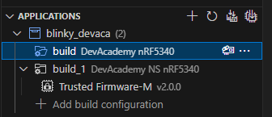
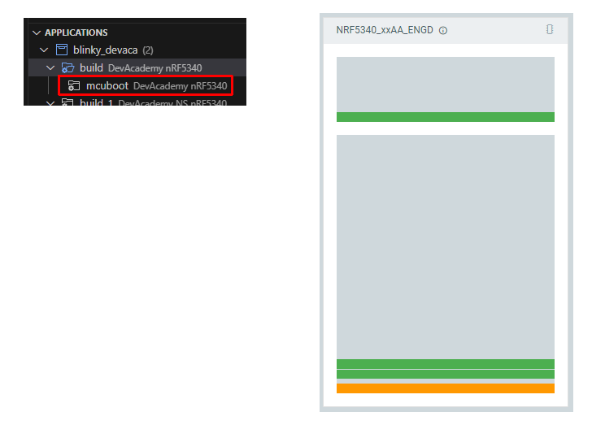
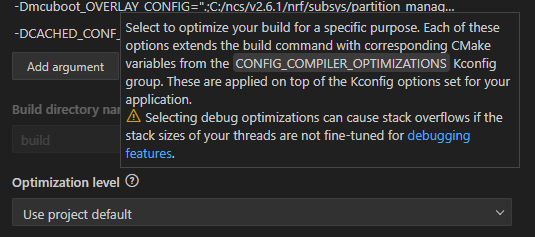
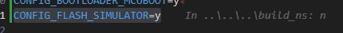
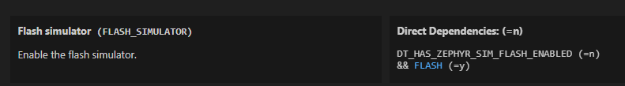
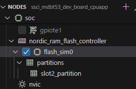
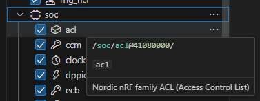

# DevAcademy "Adding custom board support" (4)

<i>2024/07/25</i>

引き続き DevAcademy Intermediateの[Adding custom board support](https://academy.nordicsemi.com/courses/nrf-connect-sdk-intermediate/lessons/lesson-3-adding-custom-board-support/)を見ていく。

Exercise 1 は動きはしたものの、nRF5340 はマルチコアなので Exercise 2 もやる。

----

## [Exercise 2 – Custom board for a multi-core & TF-M capable SoC/SiP](https://academy.nordicsemi.com/courses/nrf-connect-sdk-intermediate/lessons/lesson-3-adding-custom-board-support/topic/exercise-2-5/)

Exercise 2 だが、残念ながら私が持っている nRF5340 ではなく nRF9161DK ベースの課題だった。
`nrf9161dk_nrf9161`をコピーして、リネームしたり置換したりでExerciseの半分を使っている。。。
そしてビルドして動かしたら終わりっぽい。。。

TF-Mが有効な場合、作成した Build Configuration をビルドすると現れるフォルダの中に "Trusted Fimrware-M" が現れる。
これは Exercise 1 のビルド結果だが、NS が付いた方は TF-M があることがわかる。



MCUboot があると同じようにフォルダにぶら下がるので、これはどちらのビルド結果にも MCUboot は入っていないということになる。

----

#### 1core - CONFIG_BOOTLOADER_MCUBOOT=y

マルチコアやTF-Mを一から扱うのは難しいのでどれかをベースにせよ、ということなのだろうか？
実際、MDBT53で提供されたボード定義ファイルはThingy53をベースにしている。

ともかく、この Lesson では評価ボード[nRF5340 MDBT53-1Mモジュールピッチ変換基板](https://www.switch-science.com/products/8658)のボード定義ファイルでサンプルアプリが立ち上がらない直接の原因はわからなかったということになる。
これからどうしたものか。

MCUbootから`main()`までたどり着けていないので、MCUbootの設定だと思う。
今までは定義済みのボードをベースにしていたが、そういえば Exercise 1 で一から作ったボード定義ファイルで MCUboot を使うパターンは試していなかった。

[1core - CONFIG_BOOTLOADER_MCUBOOT=y](https://github.com/hirokuma/ncs-blinky-sample/commit/0b74ff06574bdf36bd3a351f6a285a97bdb57683)

やってみると、動いたではないか。



----

#### 再Build Configurationするとエラーになる

なんとなく、Build Configuration を削除せずに"Edit Build Configuration"を開いてボタンだけクリックすると`File not found: C:/ncs/v2.6.1/bootloader/mcuboot/boot/zephyr/.`でエラーになった。  
存在するのだが。。。いや、ディレクトリではなくファイルが見つからないだから`"."`をファイルとして扱っている？
よくわからない。。。

```
-- Including generated dts.cmake file: U:/Prog/BLE/nrf-ncs/blinky_devaca/build/mcuboot/zephyr/dts.cmake
CMake Error at C:/ncs/v2.6.1/zephyr/cmake/modules/kconfig.cmake:290 (message):
  File not found: C:/ncs/v2.6.1/bootloader/mcuboot/boot/zephyr/.
```

"Build after generating configuration"のチェックを外してボタンを押してもエラーが起きたので、Build Configuration を後から変更するのは難しい。
Clean してもエラーになる。これは単純にビルドに失敗していてファイルが作られなかったためだろう。

```
-- west build: running target clean
ninja: error: loading 'build.ninja': 指定されたファイルが見つかりません。
```

なお、Windows11 だと Clean で出力されたエラー文字列が文字化けしていたのだが、Windowsの設定からUTF-8に変更すると読めるようになった。ありがたや。
`cmd.exe`だったらいっそのこと英語出力の方がありがたいのだけどね。`west`が`cmd.exe`込みで実行するので永続化しないといけない。`AutoRun`で変更するやり方が使えるのかもしれない。

[【Windows11】CMDの文字コードをUTF-8に設定する方法 #備忘録 - Qiita](https://qiita.com/Ryokhu/items/37b79a48b625b77c7b39)

ビルドするコマンドはこうなっていた("Copy Build Command"でコピーできる)。
`u:/Prog/BLE/nrf-ncs/blinky_devaca`はアプリのプロジェクトディレクトリである。

```
west build \
  --build-dir u:/Prog/BLE/nrf-ncs/blinky_devaca/build \
    u:/Prog/BLE/nrf-ncs/blinky_devaca \
  --pristine \
  --board devacademy_nrf5340 \
  --no-sysbuild \
  -- \
    -DNCS_TOOLCHAIN_VERSION=NONE \
    -DBOARD_ROOT=c:/ncs/custom_boards;u:/prog/ble/nrf-ncs/blinky_devaca \
    -Dmcuboot_OVERLAY_CONFIG=.;C:/ncs/v2.6.1/nrf/subsys/partition_manager/partition_manager_enabled.conf \
    -DCACHED_CONF_FILE=u:/Prog/BLE/nrf-ncs/blinky_devaca/prj.conf
```

試しにこれをvscodeのTerminalに貼り付けて実行したが、やはりエラーになった。
貼り付けて実行するとエラーの箇所が赤文字になるのでわかりやすいが、違いはそれくらいか。

エラーになっている `kconfig.cmake:290` はこういう内容。

```cmake
foreach(root ${kconfig_soc_root})
  file(${OPERATION} ${KCONFIG_BINARY_DIR}/Kconfig.soc.defconfig
       "osource \"${root}/soc/$(ARCH)/*/Kconfig.defconfig\"\n"
  )
  file(${OPERATION} ${KCONFIG_BINARY_DIR}/Kconfig.soc
       "osource \"${root}/soc/$(ARCH)/*/Kconfig.soc\"\n"
  )
  file(${OPERATION} ${KCONFIG_BINARY_DIR}/Kconfig.soc.arch
       "osource \"${root}/soc/$(ARCH)/Kconfig\"\n"
       "osource \"${root}/soc/$(ARCH)/*/Kconfig\"\n"
  )
  set(OPERATION APPEND)
endforeach()
```

`${kconfig_soc_root}`は、たぶんSoCのKconfigファイルだかDTSファイルだかが入ったディレクトリ文字列の配列なんだろう。
うん、私では何もできないな。
Build Configurationを一度作った後は変更できないと思っておこう。削除して作り直せば済むだけだ。
いや、作り直さず新たに追加すれば良いだけか。悩むことはなかった。。。  
Build Configurationで変更できる項目はその場限りのものなので、変更したいなら`prj.conf`なりなんなりを変更しなさいということだ。

----

#### デフォルトのOptimization level

Build Configurationをやり直そうと思ったのは Optimization level を変更してデバッグできるようにしたかったからだ。



デフォルト値は何も設定しなかった場合はどうなっているのだろう？
GUIを名前で検索すると出てきたが2つ現れた。
上が"C Library"、下が"Build and Link Features > Compiler Options"だった。


デフォルトではサイズ優先で最適化されているようだ。
しかし、GUIではラジオボタンなのにKconfigでは`bool`なのは不思議だ。
[Kconfig searchの検索](https://docs.nordicsemi.com/bundle/ncs-latest/page/kconfig/index.html#CONFIG_COMPILER_OPTIMIZATIONS)によると

#### MCUbootあり(1core)

では 1コア(TF-M無し)でMCUbootを有効にした状態で最適化をデバッグありビルドにしてデバッグを行う。

* 1回目: reset.Sで止まった。再開させても動かなかった。
* 2回目: `src/main.c`の`main()`で止まった。

`reset.S`で止まるのがよくわからないが、`main()`で止まるのもよくわからない。
ブレークポイントを設定していなくてもアプリのエントリーポイントで止まるようになっているのだろうか。

では `C:\ncs\v2.6.1\bootloader\mcuboot\boot\zephyr\main.c` の `main()`先頭近くにブレークポイントを設定してデバッグ実行。
よくわからないが[FIH_CALL()](https://github.com/nrfconnect/sdk-mcuboot/blob/v2.0.99-ncs1-1/boot/zephyr/main.c#L669)の行で止まった。

`FIH`は[FIH_CALLの定義ファイル](https://github.com/nrfconnect/sdk-mcuboot/blob/v2.0.99-ncs1-1/boot/bootutil/include/bootutil/fault_injection_hardening.h#L301)からすると "Fault Injection Hardening" の略だろう。
`CFI`(Control Flow Integrity)みたいな略語がポンポン出てくるが、深入りしないようにする。
とにかくセキュリティ関連の何かだからデバッグなどはほとんどできないだろう。

ともかくMCUbootは通っていると思っていて良かろう。

### 1core - non-secure - CONFIG_BOOTLOADER_MCUBOOT=y

では、non-secure の方も試してみる。
まずは`devacademy_nrf5340_ns_defconfig`に`CONFIG_BOOTLOADER_MCUBOOT=y`だけを追加してビルドするのだがエラーになった。

```
CMake Warning at C:/ncs/v2.6.1/zephyr/cmake/modules/boards.cmake:112 (message):
  BOARD_DIR:
  U:/Prog/BLE/nrf-ncs/blinky_devaca/boards/arm/devacademy_nrf5340_ns has been
  moved or deleted.  Trying to find new location.
```

そのディレクトリもあるのだが。。。

念のため`CONFIG_BOOTLOADER_MCUBOOT`を無しにしたり`=n`にしたりしてビルドしてもエラーは出ない。
設定がないとか間違っているとかではなくディレクトリが無いという。  
`_ns`のディレクトリごと vscode の `BOARD_ROOT` のディレクトリに移動させたのだが、エラーはディレクトリ名が移動先になった上に出てくる。
パスが分かってるやん！

cmakeのスクリプトを確認。

```cmake
  if(BOARD_DIR AND NOT EXISTS ${BOARD_DIR}/${BOARD}_defconfig)
```

ああ、`${BOARD_DIR}`ではなく`${BOARD_DIR}/${BOARD}_defconfig`で確認しているのか。
そしてそちらの変数で出力すると`(略)/boards/arm/devacademy_nrf5340_ns/devacademy_nrf5340_defconfig`となっていた。
つまり`${BOARD}`の方が正しくないということになる。
`_ns`が抜けているが、そういえば Naming については制限があったのをルール違反していたのか。

`devacademy_nrf5340_ns`から`devacademyns_nrf5340`に変更して作り直した。  
これでビルドは進んだものの違う箇所でエラーになった。

```cmake
CMake Error at C:/ncs/v2.6.1/nrf/lib/fprotect/CMakeLists.txt:15 (message):
  No fprotect backend selected.
```

[CONFIG_FPROTECT](https://docs.nordicsemi.com/bundle/ncs-latest/page/kconfig/index.html#!fprotect)

> Enable the software library FPROTECT that may or may not be used by other systems to protect flash from writes and possibly also reads. Does not protect against execution. May use the HW peripherals BPROT, ACL, or SPU to achieve this.

[Hardware flash write protection](https://docs.nordicsemi.com/bundle/ncs-2.6.1/page/nrf/libraries/others/fprotect.html)というものらしい。

ソフトウェアレベルでFlash書込みの保護ができる？

"backend"と呼んでいるのは以下のいずれか。

* `CONFIG_HAS_HW_NRF_SPU`
* `CONFIG_HAS_HW_NRF_ACL`
* `CONFIG_HAS_HW_NRF_BPROT`

MDBT53のビルドを見たところ、cpunet は `CONFIG_HAS_HW_NRF_ACL=y`、MCUboot含む cpuapp は`CONFIG_HAS_HW_NRF_SPU=y`になっていた。
`ACL`は["Access Control List"](https://docs.nordicsemi.com/bundle/ncs-latest/page/nrfx/drivers/acl/hal.html)、`SPU`は["System Protection Unit"](https://docs.nordicsemi.com/bundle/ncs-latest/page/nrfx/drivers/spu/hal.html)。
`BPROT`はnRF5340には載っていないようだ。

#### SPU(System Protection Unit)とflash_sim

まずSPUだが、[nrf5340_cpuapp.dtsi](https://github.com/nrfconnect/sdk-zephyr/blob/v3.5.99-ncs1-1/dts/arm/nordic/nrf5340_cpuapp.dtsi#L71-L76)には設定があるのだが[nsの方](https://github.com/nrfconnect/sdk-zephyr/blob/v3.5.99-ncs1-1/dts/arm/nordic/nrf5340_cpuappns.dtsi)にない。
MDBT53では有効になっているのだが、これは[flash_sim.overlay](https://github.com/nrfconnect/sdk-nrf/blob/v2.6.1/modules/mcuboot/flash_sim.overlay)を参照していた。
flash_simについては[以前](./20240718-da.md)調べていて`-Dmcuboot_DTC_OVERLAY_FILE="C:/ncs/v2.6.1/nrf/modules/mcuboot/flash_sim.overlay"`のようになっていた。

"Extra CMake arguments"はビルドするとGUIに反映されるのだが、この値がどこからくるのかはわからないままだった。
少なくともMDBT53用に提供されたボード定義ファイルにはなかった。

もしかして`CONFIG_FLASH_SIMULATOR=y`か？
`CONFIG_HAS_HW_NRF_SPU=y`の代わりに`CONFIG_FLASH_SIMULATOR=y`を設定するとエラーが変わった。

```
warning: FLASH_SIMULATOR (defined at drivers/flash/Kconfig.simulator:6) was assigned the value 'y'
but got the value 'n'. Check these unsatisfied dependencies: DT_HAS_ZEPHYR_SIM_FLASH_ENABLED (=n),
FLASH (=n).
```

この手のwarningがしばしば出るのだが、"but got the value 'n'" はどこから得た値なのだろうか。
これか？



`<boardID>_defconfig`に`y`を書いたのだから、まあ上書きしようと思えばできるだろう。
MDBT53ボード定義ファイルはどうしていたかというと、`ssci_mdbt53_dev_board_cpuapp.conf`というファイルを ncs の MCUboot 以下にコピーしていた。
このファイルはKconfigのデフォルト値MCUboot版という位置づけなのだろうか。

だいたい[CONFIG_FLASH_SIMULATOR](https://docs.nordicsemi.com/bundle/ncs-latest/page/kconfig/index.html#!%5ECONFIG_FLASH_SIMULATOR$)のデフォルト値は`y`となっているのだが。
Kconfig GUIで見ると`DT_HAS_ZEPHYR_SIM_FLASH_ENABLED`のせいであることがわかった。
`DT_`ということはDeviceTreeか？ MDBT53では`flash_sim0`が有効になっていた。





overlay ファイルを作るなら、取りあえず`child_image/mcuboot.overlay`になるのかな、と思ったが、そういえば`flash_sim.overlay`を使いたいのが元々の話だった。
`flash_sim.overlay`を使うことができればよいのだが、そのために`CONFIG_FLASH_SIMULATOR=y`にしたい。
`CONFIG_FLASH_SIMULATOR=y`にするためには`DT_HAS_ZEPHYR_SIM_FLASH_ENABLED=y`になるようにするのだが、それには`flash_sim.overlay`がいる？？

なら`mcuboot_DTC_OVERLAY_FILE`を先に有効にすれば良いのか？
無理やり `board.cmake` に追加してみたが、読込はされたもののビルドはやはり失敗。

では逆に`ssci_mdbt53_dev_board_cpuapp.conf`を削除してMDBT53でビルドしたら`flash_sim`は使えなくなるのか？  
使えました。`flash_sim.overlay`も使われている。  
ということはこのconfファイルではなくボード定義ファイルに秘密があるはず。

MDBT53のボード定義ファイルから`flash_sim.overlay`を使わなくなるように削除してみたところ、external flash だの mx25r64 だのを削除するとうまくいった(ビルドは成功しないが)。  
つまり`flash_sim`は外部接続したflashにアクセスするためのものということで間違いなさそうだ。
では`DT_HAS_ZEPHYR_SIM_FLASH_ENABLED=n`のままにして`CONFIG_FLASH_SIMULATOR=n`のままでよいことになる。  
`flash_sim`のことは忘れよう。

では`CONFIG_HAS_HW_NRF_SPU=y`も`flash_sim`だからSPUを使うことになったのだろうか？  
[System Protection Unit](https://docs.nordicsemi.com/bundle/ps_nrf5340/page/spu.html)のページを見たが説明が長い。。。
ただ図の中に内部Flashは出てこず外部Flashしか描かれていない。
外部FlashについてはSPUで、内部FlashについてはACLということか。

#### ACL(Access Control List)

[ACL](https://docs.nordicsemi.com/bundle/ps_nrf5340/page/acl.html)の最初に "on-chip flash" と書いてあるので、そうなのだと思いたい。
設定が8つまでできるので、CPUNET専用ではないはずだ。。。

MDBT53の`cpunet`側devicetreeをGUIで見ると、soc の下に acl があった。



が、`acl`は`C:\ncs\v2.6.1\zephyr\dts\arm\nordic\nrf5340_cpunet.dtsi`にあるものの`cpuapp`には無い。
今までの様子からすると、これは`cpuapp`では扱えないと考えた方がよいだろう。
サンプルには[multi-image](https://docs.nordicsemi.com/bundle/ncs-latest/page/nrf/samples/nrf5340/netboot/README.html)なども書いてあるし。

うーん。。。
