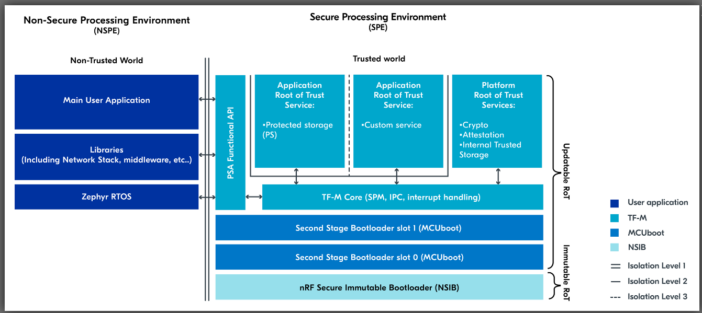

引き続き DevAcademy Intermediateの[Adding custom board support](https://academy.nordicsemi.com/courses/nrf-connect-sdk-intermediate/lessons/lesson-3-adding-custom-board-support/)を見ていく。

Lesson 3 を Exercise 2 まで見たが、nRF5340 + MCUboot はできたものの nRF5340 + MCUboot + TF-M がうまくいかないため試行錯誤中。

----

## CONFIG_FPROTECT=n

いっそのこと`CONFIG_FPROTECT=n`でもいいんじゃないか。
プロテクトしようとするから`ACL`や`SPU`が出てくるが、まだ私には早いのだ。
DFUするときにやり直そう。

`child_image/mcuboot.conf`を作って`CONFIG_FPROTECT=n`と書いたがwarningっぽい波線が表示された(vscode上で)。
`C:\ncs\v2.6.1\bootloader\mcuboot\boot\zephyr\prj.conf`で`CONFIG_FPROTECT=y`になっているという。確かになっていた。
いいのかな？
今度はビルドが進んだような気がするので、よかったと思おう。

## Partition Manager?

しかしエラーで止まった。

```cmake
Dropping partition 'nonsecure_storage' since it is empty.
Partition manager failed: partition tfm_secure (['mcuboot_pad', 'tfm']) does not span over consecutive parts. Solution: ['tfm', 'mcuboot', 'mcuboot_pad', 'app', 'mcuboot_secondary']
Failed to partition region flash_primary, size of region: 1048576
Partition Configuration:
mcuboot:
  placement:
    before:
    - mcuboot_primary
  size: 49152
mcuboot_pad:
  placement:
    before:
    - mcuboot_primary_app
  size: 512
tfm:
  placement:
    before:
    - app
  size: 32768

CMake Error at C:/ncs/v2.6.1/nrf/cmake/partition_manager.cmake:331 (message):
```

[Partition Manager](https://docs.nordicsemi.com/bundle/ncs-latest/page/nrf/scripts/partition_manager/partition_manager.html)のエラーである。

* Pythonスクリプト
* multi-imageビルドでのFlashとRAMパーティションの開始アドレスとサイズを設定するため

ちなみに 1048576 = 0x10_0000 = 1MByte で nRF5340 の Flash も 1MByte である。
なので内蔵Flash に "nonsecure_storage" のパーティションが割り当てられていないからエラーになったのだろう。

めんどくさそうな話だが評価ボード[nRF5340 MDBT53-1Mモジュールピッチ変換基板](https://www.switch-science.com/products/8658)のボード定義ファイルをまねしておけば良かろう。
・・・こちらも同じエラーが出ていた。
なるほど、non-secure とそうでないのとでパーティションの設定は共有できないのだな。

ncs を "nonsecure_storage" でgrepすると、TF-M関係らしきディレクトリで`PM_NONSECURE_STORAGE_ADDRESS`, `PM_NONSECURE_STORAGE_SIZE`が、`nrf/subsys/partition_manager/`以下で知らない拡張子のファイルがいくつか、ボード定義ファイルだとYMLファイルに名前があった。
[Thingy53のボード定義ファイル](https://github.com/nrfconnect/sdk-zephyr/tree/v3.5.99-ncs1-1/boards/arm/thingy53_nrf5340)に`pm_`で始まるYAMLファイルもそうである。

ビルドログの Partitoin Manager 関係のところを見ると warning が出ていた。

```cmake
CMake Warning at C:/ncs/v2.6.1/nrf/cmake/partition_manager.cmake:79 (message):
  

          ---------------------------------------------------------------------
          --- WARNING: Using a bootloader without pm_static.yml.            ---
          --- There are cases where a deployed product can consist of       ---
          --- multiple images, and only a subset of these images can be     ---
          --- upgraded through a firmware update mechanism. In such cases,  ---
          --- the upgradable images must have partitions that are static    ---
          --- and are matching the partition map used by the bootloader     ---
          --- programmed onto the device.                                   ---
          ---------------------------------------------------------------------
```

`pm_static.yml`というファイル名でないとダメなのだろうか。
念のためThingy53(ns)でビルドしたが同じwarningが出ていた。
なんだ、意味が無いwarning立ったのか。。。

warningとは別に"Found partition manager static configuration"というログが2箇所あった。
`cpuapp`と`cpuapp_ns`だ。
つまり、雰囲気からするとPartition Managerの設定ファイルは読み込んでいるのだろう。

ならば私もpmファイルを置けば良い。
それぞれ`pm_static_devacademy_nrf5340_cpuapp.yml`と`pm_static_devacademy_nrf5340_cpuapp_ns.yml`という名前にしてコピーし、外部Flashらしき設定を削除した。
PCDもいらないだろう。  
そうやって置いたものの"Found partition manager static configuration"というログが出ない。
ビルドのセクションとしては「child image mcuboot」という名前のようなので MCUboot 関連だろう。

```cmake
=== child image mcuboot -  begin ===
```

[child image](https://docs.nordicsemi.com/bundle/ncs-2.6.1/page/nrf/config_and_build/config_and_build_system.html#child_images)の例としてブートローダが上げられているし、"child_image == MCUboot"でよかろう。

Thingy53(ns)のビルドログと比較するとconfigurationの読み込みで[thingy53_nrf5340_cpuapp.conf](https://github.com/nrfconnect/sdk-mcuboot/blob/v2.0.99-ncs1-1/boot/zephyr/boards/thingy53_nrf5340_cpuapp.conf)を使っているところくらいか。
MDBT53ボード定義ファイルのときにも似たようなファイルをコピーしたので、中身をコピーして`child_image/mcuboot.conf`に貼り付けて加工する。

貼り付けただけでは失敗したので`CONFIG_FPROTECT=n`と`CONFIG_SECURE_BOOT=y`だけにすると child_image として `b0` のビルドが行われるようになってしまった。

```cmake
=== child image b0 -  begin ===
```

`CONFIG_SECURE_BOOT=y`を設定しないと "Dropping partition 'nonsecure_storage' since it is empty" になってしまうのだ。
ただ、`pm_`を読み込むログは出ていない。
なぜ`CONFIG_SECURE_BOOT`かというと、上の方に載せた`pm_static.yml`がないという[ログを出すところ](https://github.com/nrfconnect/sdk-nrf/blob/v2.6.1/cmake/partition_manager.cmake#L77-L91)の条件に入っていたからだ。
まあ、設定してもログは出なかったが。

もしかして`CONFIG_SECURE_BOOT=y`が`b0`のビルドをすることになった要因だろうか？
child_image の `cpuapp` は `BOOTLOADER_MCUBOOT` で `cpunet` が `SECURE_BOOT`とか。
いや、Thingy53では`empty_net_core`があり、これが`cpunet`のようだ。

```cmake
=== child image empty_net_core - CPUNET begin ===
```

それに`b0`ではなく`b0n`だった。

```cmake
=== child image b0n - CPUNET (inherited) begin ===
```

いかん、迷走している。。。

### 整理しよう

* TF-Mを有効にしていない場合はMCUbootありで起動した
* TF-Mを有効にしたらビルドに失敗する
  * ターゲット
    * Thingy53のボード定義ファイルはビルドが成功する
    * MDBT53で提供されたボード定義ファイルではビルドが失敗する
    * Lesson 3 Exercise 1 ベースで TF-M を有効にするとビルドが失敗する
  * ビルドの失敗
    * Partition Manager関係のエラー
      * "nonsecure_storage"パーティションが見つからない
    * Partition Managerの設定ファイルを読み込んでいないように見えるが、設定ファイルが無いというビルドログは無い

## Partition Manager!

[Partition Manager](https://docs.nordicsemi.com/bundle/ncs-2.6.1/page/nrf/scripts/partition_manager/partition_manager.html)に関する部分だと思うが自信はない。
が、手がかりもないのでここから攻めよう。

せっかく[Devicetree overlays, CMake, and multi-image builds](https://academy.nordicsemi.com/courses/nrf-connect-sdk-fundamentals/lessons/lesson-3-elements-of-an-nrf-connect-sdk-application/topic/configuration-files/)や[Multi-image builds and the Partition Manager](https://academy.nordicsemi.com/courses/nrf-connect-sdk-intermediate/lessons/lesson-8-bootloaders-and-dfu-fota/topic/multi-image-builds-and-the-partition-manager/)があるので見ていく。

### Devicetree overlays, CMake, and multi-image builds

[DevAcademy Fundamentals: Lesson 3 > Devicetree overlays, CMake, and multi-image builds](https://academy.nordicsemi.com/courses/nrf-connect-sdk-fundamentals/lessons/lesson-3-elements-of-an-nrf-connect-sdk-application/topic/configuration-files/)

multi-image buildsのところだけ

* multi-image buildは parent image と 1つ以上の child imageから構成され、child image は parent image に含まれる
* こういう場合に使われる
  * DFUが有効なアプリ(UART, USB-CDC, BLEなど)
  * マルチコア、あるいはマルチパーティションターゲット(nRF53とnRF9160)
* 上記に当てはまる場合、multi-image buildの作成はデフォルトで行われるので開発者は対応する必要がない(！！)
  * [詳細](https://docs.nordicsemi.com/bundle/ncs-latest/page/nrf/config_and_build/multi_image.html)
    * (↑のVersion選択にv2.7.0より前が無いのはなぜだろう？)
  * "second image"の方がSPEで動かす(TF-M)
  * secure domain と non-secure domain という呼び方をしている
* 例としてnRF9160DKを挙げている
  * `nrf9160dk_nrf9160`: secure domain用にビルドする。アプリはsingle-imageでビルドされ分離によるセキュリティ無し(TF-M無し)で動く
  * `nrf9160dk_nrf9160_ns`: non-secure domain用にmulti-imageでビルドされる。まずアプリがnon-secureイメージとしてビルドされ、次にTF-Mが自動的にsecureイメージとしてビルドされる。
* アプリをnon-secure domain用にビルドしてユーザデータをsecure domain(TF-M)管理にするとアプリからは直接secure domainのメモリは扱えないのでセキュリティが保ちやすい

「自動でmulti-mage buildになる」といってるのは、nRF9160DKみたいにすでにボード定義ファイルが準備されているならば、という言葉が省略されているのかな？
新規でボード定義ファイルを作る場合は`ns`も何もないし。


### Multi-image builds and the Partition Manager

[DevAcademy Intermediate: Lesson 8 > Multi-image builds and the Partition Manager](https://academy.nordicsemi.com/courses/nrf-connect-sdk-intermediate/lessons/lesson-8-bootloaders-and-dfu-fota/topic/multi-image-builds-and-the-partition-manager/)

この図は [Lesson 3](https://academy.nordicsemi.com/courses/nrf-connect-sdk-intermediate/lessons/lesson-3-adding-custom-board-support/topic/board-files-for-multi-core-hardware-tf-m/)のものだが、SPEとNSPEを考えやすくするのに良かった。

<a href="./20240726a-1.png"></a>

* child image
  * `CONFIG_SECURE_BOOT`: child imageにNSIBを追加
    * 変更できないので、MCUbootを載せる場合は1st bootloaderということになるか
    * MCUbootがない場合は直接NSPEの`main()`に飛ぶのだろうか
  * `CONFIG_BOOTLOADER_MCUBOOT`: child imageにMCUbootを追加
  * [nRF5340: Default build configuration](https://docs.nordicsemi.com/bundle/ncs-latest/page/nrf/device_guides/nrf53/multi_image_nrf5340.html#default-build-configuration)
    * リンクが切れていたのだが、たぶんここに飛ばしたかったんだと思う。が、見てもよくわからん。

### Board files for multi-core hardware & TF-M

前回眺めたときは nRF9160DK のことしか書かれていなさそうだったのでほとんどスルーしていたのだが、今見るといろいろ重要なことが書かれていた。

[DevAcademy Intermediate: Lesson 8 > Board files for multi-core hardware & TF-M](https://academy.nordicsemi.com/courses/nrf-connect-sdk-intermediate/lessons/lesson-3-adding-custom-board-support/topic/board-files-for-multi-core-hardware-tf-m/)

これをまねしつつ、Thingy53から設定をコピーしたりしていると[動いたような気がする](https://github.com/hirokuma/ncs-blinky-sample/tree/67c06199bbe0b57e84c363c493b15bc4bd6b64b0)。

弱気なのは、確認する方法がよくわからないからだ。
Build Configurationの下にはMCUbootとTF-Mがぶら下がっているし、LEDも点滅するのだが、それでも、ね。
Partition Managerは使われていないし "nonsecure_storage"パーティションも見つからないままなのだが、特にエラーにはならなかった。
使っていないからかもしれないし、DTSファイルにアドレスなどを書いているためかもしれない。
DFUするためのビルドではないので、特にPartition Managerで計算する必要がなかったのかもしれない。
あるいはそもそも期待通りに動いていないか。
