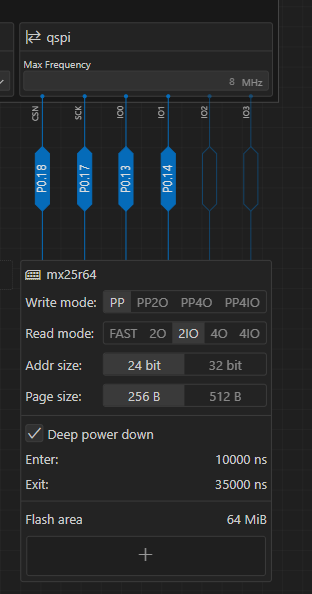

[前回](./20240726-da.md)、DevAcademyを見ながら新規で作っていたボード設定ファイルを変更するとビルドして動くところまで確認した。

気になっているのは Partition Manager の設定ファイルを置いていたのに読み込まれないままだったこと。
試しに評価ボード[nRF5340 MDBT53-1Mモジュールピッチ変換基板](https://www.switch-science.com/products/8658)のボード定義ファイルから`pm_`で始まるファイルを削除してビルドしたところ `'PM_storage_partition_ID' undeclared` のようなビルドエラーが起きていた。  
ファイルがあるから読み込むタイプではなく、設定ファイル読み込まないとうまくいかないけれどもファイル名に選択肢があるのでエラーにできないまま Cソースのコンパイルをしていてエラーになったということか。

[Partition Manager](https://docs.nordicsemi.com/bundle/ncs-2.6.1/page/nrf/scripts/partition_manager/partition_manager.html)をもう少し理解せねばなるまい。

----

[Developing with nRF53 Series](https://docs.nordicsemi.com/bundle/ncs-latest/page/nrf/device_guides/nrf53/index.html)の目次から見ていこう。

Partition Managerのことが書いてありそうなのは「Application guide for Thingy:53」の [Partition manager configuration](https://docs.nordicsemi.com/bundle/ncs-latest/page/nrf/device_guides/nrf53/thingy53_application_guide.html#partition-manager-configuration) と「External execute in place(XIP) configuration on the nRF5340 Soc」の[Setting up static partition manager](https://docs.nordicsemi.com/bundle/ncs-latest/page/nrf/device_guides/nrf53/qspi_xip_guide_nrf5340.html#setting-up-static-partition-manager)だ。
[Trusted Firmware-M(TF-M)](https://docs.nordicsemi.com/bundle/ncs-latest/page/nrf/device_guides/nrf53/features_nrf53.html#trusted_firmware-m_tf-m)に [Secure Partition Manager](https://docs.nordicsemi.com/bundle/ncs-latest/page/tfm/design_docs/services/secure_partition_manager.html) という言葉が書いてあるので、[Running applications with Trusted Firmware-M](https://docs.nordicsemi.com/bundle/ncs-latest/page/nrf/security/tfm.html)も怪しい。

"XIP"は"eXecution in Place"の略。
nRF5340にはQSPI(Quad SPI)メモリインターフェースが載っていて、QSPI flash をコードの実行に使うことができるそうだ。
普通はオンボードのNOR Flashみたいにバイト単位でアクセスできるFlashだけが対象だったり、外部メモリが使えてもデータバスとつながったメモリしか使えないと思っていたのだが、SPIでもそういうのができるのか。
データのフェッチに多少時間がかかるだろうから実行が遅くなるのかな？ あるいはコード用のRAMにある程度貯めたりできるんだろうか。

DeviceTree GUIだとこれだ。

Thingy:53では[MX25R6435F](https://docs.nordicsemi.com/bundle/ug_thingy53/page/UG/thingy53/hw_description/external_memory.html)という外部メモリを使っている。

こちらを見るとnRF9160DKも同じメモリのようだ。ファイルシステムとしても使えるのか。

[nRF9160DK 搭載の外部フラッシュメモリ(MX25R6435F)を使ってみる。 #nRFConnectSDK - Qiita](https://qiita.com/Akihiro-Sakaniwa/items/7571ac886e3603950828)

今回はMDBT53が外部メモリを積んでないこともあり、前者の「Application guide for Thingy:53」を見ていこう。
[Partition manager configuration](https://docs.nordicsemi.com/bundle/ncs-latest/page/nrf/device_guides/nrf53/thingy53_application_guide.html#partition_manager_configuration)によると、サンプルとアプリはデフォルトでPartition Managerを使うようになっているそうだ。
それだけではわからんなあ。

[Running applications with Trusted Firmware-M](https://docs.nordicsemi.com/bundle/ncs-latest/page/nrf/security/tfm.html)を見る。  
[TF-M partition alignment requirements](https://docs.nordicsemi.com/bundle/ncs-latest/page/nrf/security/tfm.html#tf-m_partition_alignment_requirements)には「Partition Managerが有効な場合」と書いてあるので、有効・無効にするなにかはあるのだろう。

あきらめて Partition Manager そのもののページを読むか。

[Configuration](https://docs.nordicsemi.com/bundle/ncs-2.6.1/page/nrf/scripts/partition_manager/partition_manager.html#configuration)には[CONFIG_SETTINGS_FCB](https://docs.nordicsemi.com/bundle/ncs-latest/page/kconfig/index.html#!%5ECONFIG_SETTINGS_FCB$)か[CONFIG_SETTINGS_NVS](https://docs.nordicsemi.com/bundle/ncs-latest/page/kconfig/index.html#!%5ECONFIG_SETTINGS_NVS$)と書いてあるが、これは subsystem どうのこうのらしい。
また新しい言葉が。。。
