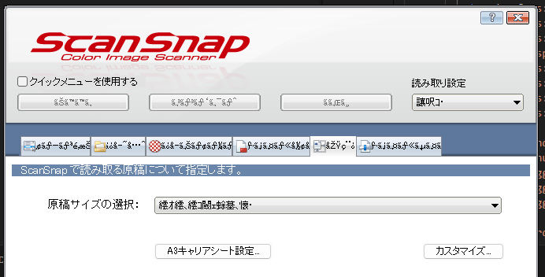

# Windows11でcmd.exeだけUTF-8にしたい

[以前](./20240725-da.md)、ncs でのビルド結果が一部文字化けするので Windowsの設定で文字コードをUTF-8に設定した。

それ自体は良かったのだが、あまり新しくないWindowsアプリが文字化けするようになった。
<b>アプリが悪いわけでは無い</b>。立ち上げたのが ScanSnap Organizer だったので例に出したが、他にもいろいろある。

アプリの言語設定で英語などにすれば回避できるのだが、そうでないアプリも多い。
それに、いちいち設定するのがめんどくさい。

やむなく、もう1つよく出てくるレジストリエディタで`AutoRun`にて`chcp 65001`を実行するようにするパターンに変更した。

[Using UTF-8 Encoding (CHCP 65001) in Command Prompt / Windows Powershell (Windows 10) - Stack Overflow](https://stackoverflow.com/questions/57131654/using-utf-8-encoding-chcp-65001-in-command-prompt-windows-powershell-window)

単に`chcp 65001`だと ncs のビルドでしょっちゅうCode Pageの切替をしたログが出力されていたのだが、リダイレクトで`> NUL`すると出なくなってよろしい。

ncs でビルドすると `cmd.exe` を含めて実行しているのでその場で設定できない。
vscodeでしか設定がいらないという気もするが、Android Studioでも文字化けしていたと思うのでこれで両方対応できると良いのだが。

残念ながら、ncs で文字化けしていたときの環境が残っていないし、何が原因だったか覚えてないので対応できているかよくわからん。

適当にバッチファイルを作ってSHIFT-JISで保存すると文字化けすることは確認できた。
あれ、これはこれでダメなんじゃないのか、という気もするのだが、もういいや。
