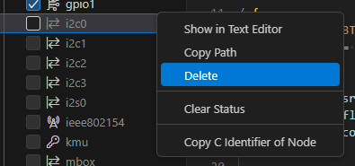

今までの簡単なまとめ

* 評価ボード[nRF5340 MDBT53-1Mモジュールピッチ変換基板](https://www.switch-science.com/products/8658)のボード定義を自作したら Partition Manager が使用されなかった
* nRF5340DK も Partition Manager が使われていないので Thingy:53 のボード定義をまねしたのだがビルドが通らない

[branch:rename_thingy53](https://github.com/hirokuma/ncs-blinky-sample/tree/d2f57a860e6536ba1934bca2d85a16ec7b9481fb/boards/arm/mdbt53a_nrf5340)

----

オリジナルのThingy:53ボード定義ファイルではビルドが成功するのでログを比較すると、作ったボード定義ファイルではこのログが無かった。

### NOT NS

```
Changed board to secure thingy53_nrf5340_cpuapp (NOT NS)
```

DevAcademy Lesson 3 Exercise 2 では MCUboot のボード定義ファイルを作成する手順が無い。
[thingy53_nrf5340_cpuapp.conf](https://github.com/nrfconnect/sdk-mcuboot/blob/v2.0.99-ncs1-1/boot/zephyr/boards/thingy53_nrf5340_cpuapp.conf)の中身を`child_image/mcuboot.conf`に貼り付ける。

これで上記のログは出力されるようになった。

[commit](https://github.com/hirokuma/ncs-blinky-sample/commit/2514518f61f6e001d1b34855195b5fddc7358ea9)

### zephyr_pre0.elf

オリジナルのログはこう。

```
-- west build: building application
[5/274] Generating include/generated/version.h
-- Zephyr version: 3.5.99 (C:/ncs/v2.6.1/zephyr), build: v3.5.99-ncs1-1
[3/317] Generating include/generated/version.h
-- Zephyr version: 3.5.99 (C:/ncs/v2.6.1/zephyr), build: v3.5.99-ncs1-1
[317/317] Linking C executable zephyr\zephyr.elf
```

自作ログはこうで`zephyr_pre0.elf`のリンクでエラーになっている。

```
-- west build: building application
[5/274] Generating include/generated/version.h
-- Zephyr version: 3.5.99 (C:/ncs/v2.6.1/zephyr), build: v3.5.99-ncs1-1
[3/317] Generating include/generated/version.h
-- Zephyr version: 3.5.99 (C:/ncs/v2.6.1/zephyr), build: v3.5.99-ncs1-1
[312/317] Linking C executable zephyr\zephyr_pre0.elf
FAILED: zephyr/zephyr_pre0.elf zephyr/zephyr_pre0.map U:/Prog/BLE/nrf-ncs/blinky_devaca/build/mcuboot/zephyr/zephyr_pre0.map 
cmd.exe /C "cd . && C:\ncs\toolchains\cf2149caf2\opt\zephyr-sdk\arm-zephyr-eabi\bin\arm-zephyr-eabi-gcc.exe  -gdwarf-4 zephyr/CMakeFiles/zephyr_pre0.dir/misc/empty_file.c.obj -o zephyr\zephyr_pre0.elf  zephyr/CMakeFiles/offsets.dir/./arch/arm/core/offsets/offsets.c.obj  -fuse-ld=bfd  -T  zephyr/linker_zephyr_pre0.cmd  -Wl,-Map=U:/Prog/BLE/nrf-ncs/blinky_devaca/build/mcuboot/zephyr/zephyr_pre0.map  -Wl,--whole-archive  app/libapp.a  zephyr/libzephyr.a  zephyr/arch/common/libarch__common.a  zephyr/arch/arch/arm/core/libarch__arm__core.a  zephyr/arch/arch/arm/core/cortex_m/libarch__arm__core__cortex_m.a  zephyr/arch/arch/arm/core/cortex_m/cmse/libarch__arm__core__cortex_m__cmse.a  zephyr/lib/libc/minimal/liblib__libc__minimal.a  zephyr/lib/libc/common/liblib__libc__common.a  zephyr/soc/soc/arm/nordic_nrf/libsoc__arm__nordic_nrf.a  zephyr/boards/boards/arm/mdbt53a_nrf5340_cpuapp/libU____Prog__BLE__nrf-ncs__blinky_devaca__boards__arm__mdbt53a_nrf5340.a  zephyr/drivers/usb/device/libdrivers__usb__device.a  zephyr/drivers/usb/common/nrf_usbd_common/libdrivers__usb__common__nrf_usbd_common.a  zephyr/drivers/clock_control/libdrivers__clock_control.a  zephyr/drivers/flash/libdrivers__flash.a  zephyr/drivers/gpio/libdrivers__gpio.a  zephyr/drivers/hwinfo/libdrivers__hwinfo.a  zephyr/drivers/pinctrl/libdrivers__pinctrl.a  zephyr/drivers/regulator/libdrivers__regulator.a  zephyr/drivers/serial/libdrivers__serial.a  zephyr/drivers/timer/libdrivers__timer.a  modules/nrf/lib/fprotect/lib..__nrf__lib__fprotect.a  modules/nrf/subsys/pcd/lib..__nrf__subsys__pcd.a  modules/nrf/modules/mcuboot/hooks/lib..__nrf__modules__mcuboot__hooks.a  modules/nrf/drivers/hw_cc3xx/lib..__nrf__drivers__hw_cc3xx.a  modules/mcuboot/boot/bootutil/zephyr/libmcuboot_util.a  modules/mbedtls/libmbedTLSBase.a  modules/mbedtls/libmbedTLSCrypto.a  modules/mbedtls/libmbedTLSX509.a  modules/mbedtls/libmodules__mbedtls.a  modules/hal_nordic/nrfx/libmodules__hal_nordic__nrfx.a  modules/zcbor/libmodules__zcbor.a  -Wl,--no-whole-archive  zephyr/kernel/libkernel.a  -L"c:/ncs/toolchains/cf2149caf2/opt/zephyr-sdk/arm-zephyr-eabi/bin/../lib/gcc/arm-zephyr-eabi/12.2.0/thumb/v8-m.main/nofp"  -LU:/Prog/BLE/nrf-ncs/blinky_devaca/build/mcuboot/zephyr  -lgcc  zephyr/arch/common/libisr_tables.a  modules/mbedtls/libmbedTLSBase.a  modules/mbedtls/libmbedTLSCrypto.a  modules/mbedtls/libmbedTLSX509.a  -mcpu=cortex-m33  -mthumb  -mabi=aapcs  -mfp16-format=ieee  -Wl,--gc-sections  -Wl,--build-id=none  -Wl,--sort-common=descending  -Wl,--sort-section=alignment  -Wl,-u,_OffsetAbsSyms  -Wl,-u,_ConfigAbsSyms  -nostdlib  -static  -Wl,-X  -Wl,-N  -Wl,--orphan-handling=warn  -Wl,-no-pie  C:/ncs/v2.6.1/nrfxlib/crypto/nrf_cc312_platform/lib/cortex-m33/soft-float/no-interrupts/libnrf_cc312_platform_0.9.19.a && cmd.exe /C "cd /D U:\Prog\BLE\nrf-ncs\blinky_devaca\build\mcuboot\zephyr && C:\ncs\toolchains\cf2149caf2\opt\bin\cmake.exe -E true""
c:/ncs/toolchains/cf2149caf2/opt/zephyr-sdk/arm-zephyr-eabi/bin/../lib/gcc/arm-zephyr-eabi/12.2.0/../../../../arm-zephyr-eabi/bin/ld.bfd.exe: zephyr\zephyr_pre0.elf section `bss' will not fit in region `RAM'
c:/ncs/toolchains/cf2149caf2/opt/zephyr-sdk/arm-zephyr-eabi/bin/../lib/gcc/arm-zephyr-eabi/12.2.0/../../../../arm-zephyr-eabi/bin/ld.bfd.exe: region `RAM' overflowed by 331864 bytes
collect2.exe: error: ld returned 1 exit status
ninja: build stopped: subcommand failed.
```

理由の箇所を抜粋。

```
ld.bfd.exe: zephyr\zephyr_pre0.elf section `bss' will not fit in region `RAM'
ld.bfd.exe: region `RAM' overflowed by 331864 bytes
```

これは[以前](./20240715-boot.md)にもあった[CONFIG_MCUBOOT_USE_ALL_AVAILABLE_RAM](https://docs.nordicsemi.com/bundle/ncs-latest/page/kconfig/index.html#!%5ECONFIG_MCUBOOT_USE_ALL_AVAILABLE_RAM$)だろう。
`=y`になる条件が`BOARD_THINGY53_NRF5340_CPUAPP_NS || BOARD_THINGY53_NRF5340_CPUAPP`となっているが[Kconfig](https://github.com/nrfconnect/sdk-nrf/blob/v2.6.1/modules/mcuboot/Kconfig#L136-L143)に書いてあるのでボード定義ファイルをコピーしても反映されない。

[commit](https://github.com/hirokuma/ncs-blinky-sample/commit/81c0c842c7b4219defcec9978da0ed997f1fd3e7)

これでビルドが通った。

[branch:rename_thingy53](https://github.com/hirokuma/ncs-blinky-sample/tree/81c0c842c7b4219defcec9978da0ed997f1fd3e7)

ボード定義ファイル以外の箇所でボード依存の設定があるのは想定外だった。
`BOARD_THINGY53_NRF5340_CPUAPP_NS`でgrepすると以下があった。

* [BME68X_IAQ_TEMPERATURE_OFFSET](https://github.com/nrfconnect/sdk-nrf/blob/v2.6.1/drivers/sensor/bme68x_iaq/Kconfig#L31-L42)
* [MCUBOOT_USE_ALL_AVAILABLE_RAM](https://github.com/nrfconnect/sdk-nrf/blob/v2.6.1/modules/mcuboot/Kconfig#L136-L143)
* [sample: UPDATEABLE_IMAGE_NUMBER, NRF53_UPGRADE_NETWORK_CORE](https://github.com/nrfconnect/sdk-nrf/blob/v2.6.1/samples/common/mcumgr_bt_ota_dfu/Kconfig#L87-L95)

### Devicetree

LEDとボタンのピンアサインが違うのでDTSファイルを編集する。

どうでもよいが、ボタンとスイッチの違いが分からないので調べた。
回路図では `SW` と書いていたのでスイッチと呼んでいたのだが、DTSファイルでは"Push button"と書いてある。  
スイッチは状態が変わって維持する、ボタンは押している間だけ状態を維持する、という感じか。
ただ「押しボタンスイッチ([MonotaRO](https://www.monotaro.com/k/store/%E6%8A%BC%E3%81%97%E3%83%9C%E3%82%BF%E3%83%B3%E3%82%B9%E3%82%A4%E3%83%83%E3%83%81/), [MiSUMi](https://jp.misumi-ec.com/vona2/ie_control/E1100000000/E1107000000/E1107010000/))というものもある。
説明文では「モーメンタリ動作：押したボタンを離すと初期状態に戻る」「オルタネイト動作：1回目の押し操作で動作状態を保持し、2回目の押し操作で動作状態を解除する」のように品物の名称ではなく挙動名で
[RS online](https://uk.rs-online.com/web/content/discovery/ideas-and-advice/push-button-switches-guide)でも"push button switch"といっているので電子部品のジャンルなのだろう("momentary push button"と"maintained push button"という挙動名)。

話を元に戻そう。  
DevAcademy Lesson 3 Exercise 1 で作った[DTSファイル](https://github.com/hirokuma/ncs-blinky-sample/blob/mcuboot/boards/arm/devacademy_nrf5340/devacademy_nrf5340_common.dtsi)はシンプルだ。
LEDだけしか設定しておらず、残りの部分はパーティションの定義くらいである。

Devicetree Visual Editorではチェックボックスをオフにすることもできるが、削除することもできる。



DTSファイルでは、オフにすると`status = "disabled"`、削除すると`/delete-node/ &egu0;`のようなコメントが付いた。
それよりなにより、Visual Editorを使うと `include` したファイルかどうかを区別しないので、図としては "common.dtsi" なども読み込んだ後の表示になるが GUI操作した結果は直接のDTSファイルにしか反映されない。  
きれいにファイルを分けたかったらテキストエディタで編集するしかないだろう。GUIは確認用だ。

ただその前に、ビルドできているうちに Partition Manager が何をしたら読み込まれなくなるのか確認する。

#### pm-ext-flash

外部Flashを有効にする作業は DevAcademy [Lesson 3 Exercise 2](https://academy.nordicsemi.com/courses/nrf-connect-sdk-intermediate/lessons/lesson-8-bootloaders-and-dfu-fota/topic/exercise-2-dfu-over-usb-adding-external-flash/)の8項から書かれていた。

* `nordic,pm-ext-flash = &mx25r64;`
  * これを設定すると自動で `mcuboot_seconary`パーティションのために外部Flashを使うようになるそうだ
  * それによって Partition Manager が有効になってるということ？

`pm-ext-flash`の行をコメントアウトしてビルドすると`PM_MCUBOOT_SECONDARY_ID`や`PM_MCUBOOT_SECONDARY_1_ID`がないなどでエラーになった。
PMファイルから`mcuboot_secondary`, `mcuboot_secondary_1`, `external_flash`を削除してもエラーになる。

[Using MCUboot in nRF Connect SDK](https://docs.nordicsemi.com/bundle/ncs-latest/page/mcuboot/readme-ncs.html)のNoteに、ファイル名のことではあるが direct-xipモードの場合は`mcuboot_secondary_`プレフィクスを付けるというようなことが書かれていた。
XIPの設定を見ると[CONFIG_NORDIC_QSPI_NOR_XIP](https://docs.nordicsemi.com/bundle/ncs-latest/page/kconfig/index.html#!%5ECONFIG_NORDIC_QSPI_NOR_XIP$)が当てはまりそうだったので`CONFIG_NORDIC_QSPI_NOR=n`にしておく。

それでもエラーになるのであきらめて[pm_sysflash.h](https://github.com/nrfconnect/sdk-mcuboot/blob/v2.0.99-ncs1-1/boot/zephyr/include/sysflash/pm_sysflash.h#L25)を見ると`MCUBOOT_IMAGE_NUMBER==2`という条件がある。
`child_image/mcuboot.conf`で`CONFIG_UPDATEABLE_IMAGE_NUMBER=1`に変更したが変わらず。

ログを「secondary」で検索すると`ext_flash_mcuboot_secondary.conf`を読み込んでいるところがあった。

```
Parsing C:/ncs/v2.6.1/bootloader/mcuboot/boot/zephyr/Kconfig
Loaded configuration 'U:/Prog/BLE/nrf-ncs/blinky_devaca/boards/arm/mdbt53a_nrf5340/mdbt53a_nrf5340_cpuapp_defconfig'
Merged configuration 'C:/ncs/v2.6.1/bootloader/mcuboot/boot/zephyr/prj.conf'
Merged configuration 'C:/ncs/v2.6.1/nrf/subsys/pcd/pcd.conf'
Merged configuration 'C:/ncs/v2.6.1/nrf/subsys/partition_manager/ext_flash_mcuboot_secondary.conf'
Merged configuration 'C:/ncs/v2.6.1/nrf/modules/mcuboot/tfm.conf'
Merged configuration 'C:/ncs/v2.6.1/nrf/modules/mcuboot/fih_low_enable.conf'
Merged configuration 'C:/ncs/v2.6.1/nrf/subsys/partition_manager/partition_manager_enabled.conf'
Merged configuration 'U:/Prog/BLE/nrf-ncs/blinky_devaca/child_image/mcuboot.conf'
Merged configuration 'U:/Prog/BLE/nrf-ncs/blinky_devaca/build/mcuboot/zephyr/misc/generated/extra_kconfig_options.conf'
Configuration saved to 'U:/Prog/BLE/nrf-ncs/blinky_devaca/build/mcuboot/zephyr/.config'
Kconfig header saved to 'U:/Prog/BLE/nrf-ncs/blinky_devaca/build/mcuboot/zephyr/include/generated/autoconf.h'
```

ncs を grep すると2箇所あった。

* [modules\mcuboot\CMakeLists.txt](https://github.com/nrfconnect/sdk-nrf/blob/v2.6.1/modules/mcuboot/CMakeLists.txt#L274-L282)
* [sysbuild\CMakeLists.txt](https://github.com/nrfconnect/sdk-nrf/blob/v2.6.1/sysbuild/CMakeLists.txt#L245-L261)

MCUboot だと思うので前者か。
確かに`CONFIG_PM_EXTERNAL_FLASH_MCUBOOT_SECONDARY`は`build/mcuboot/zephyr/include/generated/autoconf.h`に入っていた。
[Kconfig](https://docs.nordicsemi.com/bundle/ncs-latest/page/kconfig/index.html#!%5ECONFIG_PM_EXTERNAL_FLASH_MCUBOOT_SECONDARY)のデフォルト値としては`CONFIG_BOOTLOADER_MCUBOOT`があれば`y`らしい。  
`prj.conf`で`CONFIG_BOOTLOADER_MCUBOOT=y`を設定しているので`CONFIG_PM_EXTERNAL_FLASH_MCUBOOT_SECONDARY=n`も追加。

しかし・・・`autoconf.h`にはまだ定義が出てくる。
いろいろ設定を変更したのだが、どうやっても消えない。
外部Flashなんて付けるかどうかわからない部品だと思うのだが、なんでこんなに使わせようとしてくるのか。
[CONFIG_FLASH](https://docs.nordicsemi.com/bundle/ncs-latest/page/kconfig/index.html#!%5ECONFIG_FLASH$)が実は外部Flashのことを指しているかとも考えたが、[CONFIG_SOC_FLASH_NRF](https://docs.nordicsemi.com/bundle/ncs-latest/page/kconfig/index.html#!%5ECONFIG_SOC_FLASH_NRF$)が`CONFIG_FLASH`と依存関係があるのでそういうことではなかろう。

もう、イメージを2つ使うというのは覆すことができないと思おう。  
その上で外部Flashを使わないようにする。つまり PMファイルから`mcuboot_secondary`などを削除するのではなく、内蔵Flashを使うように割り当てる。
アドレスは適当だが、`external_flash`を使わないようにすることでビルドが通った。

[commit](https://github.com/hirokuma/ncs-blinky-sample/commit/8960541865e0a79d9a0ddd45b3cb51f2982f575b)

・・・と思ったのだが、リポジトリを整理して`main`ブランチにマージし、作業ディレクトリをきれいにして Build Configuration を作り直すと`PM_MCUBOOT_SECONDARY_ID`がないというビルドエラーが。。。  
ビルドするボード定義ファイルを間違えていたのでなければ、nRF Kconfig GUI での変更を「Apply」で反映させた設定が有効だった(やり直したので設定が消えた)ということだろう。

うわー、参ったなあ。
