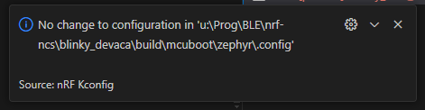
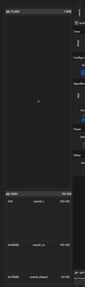
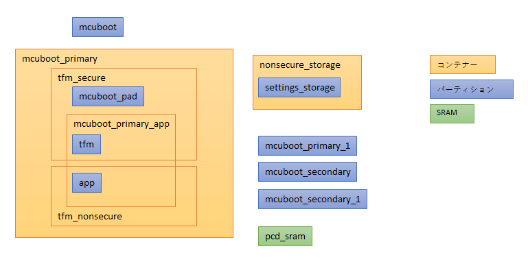
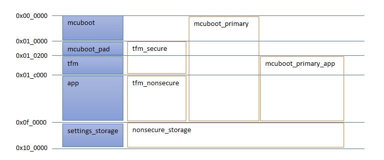

# Partition Manager (4)

<i>2024/08/01</i>

[前回](../07/20240731-ncs.md)の続き。  
non-secure で Partition Manager を有効にできた、と思ったらできていなかったのでやり直しているところ。

commit履歴を遡っていったが、[PMファイルからexternal_flashを削除](https://github.com/hirokuma/ncs-blinky-sample/commit/8960541865e0a79d9a0ddd45b3cb51f2982f575b)の手前まではビルドに成功していた。

## Pristine Build

Build Configurationはそのままにして Pristine Build だけで済ませていたので、"Extra CMake arguments" が更新されていなかったとかだろうか？
しかし[CMakeLists.txtを作り直す](https://docs.nordicsemi.com/bundle/nrf-connect-vscode/page/reference/ui_sidebar_actions.html)とあるので、関係ない気もするが CMakeの引数だから別扱いかもしれないし。。。

Pristine Build をすると、おそらくだが `build/` の中身は一度消されている。
とすると、nRF Kconfig GUI で「Apply」した設定は`build/`の下に保存されるので、Pristine Build すると意味がないということか。



よくわからないが、Build Configuration の設定はプロジェクトディレクトリの中ではなく ncs の設定がどこかにあってそこに保存されているのだろうか。
そうじゃないとボード設定ファイルの選択などもプロジェクトディレクトリには保存されていないので Pristine Build したら失われるはずだ。いや、`build/`を削除する前に設定を覚えているだけかもしれないから断言はできないか。

ただ、nRF Kconfig GUIで「Apply」したときに保存した設定ファイルは削除されたし、grep しても削除されていた。
説明文の「Reruns the build with the original parameters」は「Apply」したくらいのものも消してしまうということになるし、後から Edit Build Configuration で変更した内容も消えているかもしれない。

ともかく、今回懸念していた「Applyしたものが残っていたかも」を心配する必要はなくなった。

----

## CONFIG_PARTITION_MANAGER_ENABLED

Edit Build Configuration の中に MCUboot 用の conf ファイルを指定する箇所がある。
ビルドしないと反映されないので、自動で設定されるものだろう。

```
mcuboot_OVERLAY_CONFIG:UNINITIALIZED=
  C:/ncs/v2.6.1/nrf/subsys/pcd/pcd.conf;
  C:/ncs/v2.6.1/nrf/modules/mcuboot/tfm.conf;
  C:/ncs/v2.6.1/nrf/modules/mcuboot/fih_low_enable.conf;
  C:/ncs/v2.6.1/nrf/subsys/partition_manager/partition_manager_enabled.conf;
  U:/Prog/BLE/nrf-ncs/blinky_devaca/child_image/mcuboot.conf
```

`partition_manager_enabled.conf`があるのは Partition Manager が有効だからだろう。
[CONFIG_PARTITION_MANAGER_ENABLED](https://docs.nordicsemi.com/bundle/ncs-latest/page/kconfig/index.html#!%5ECONFIG_PARTITION_MANAGER_ENABLED$)は Read Only なので設定はできない。
`build/`を grepすると`empty_net_core/b0n`, `empty_net_core/zephyr`, `mcuboot/zephyr`, `zephyr`などのファイルに出てくるので、どの設定が影響しているのか分からないが有効になっているのだろう。
`CONFIG_PM_SINGLE_IMAGE`は設定していないのに`autoconf.h`を見ると出てくるし、よくわからん。

----

## Partition Manager

外部Flashを参照しないので[PMファイルからexternal_flashを削除](https://github.com/hirokuma/ncs-blinky-sample/commit/8960541865e0a79d9a0ddd45b3cb51f2982f575b#diff-80ce8b7513eda250da140321a06746df5cee9112bd5052241508cb55d3f7eb85)したものの、その置き換えが`ram_flash`などでよいのかは確認していなかった。
その前の`mcuboot_primary_1`が使っていたのでまねしただけである。  
書き換えるなら意味を知らねばなるまい。

[Partition Manager](https://docs.nordicsemi.com/bundle/ncs-2.6.1/page/nrf/scripts/partition_manager/partition_manager.html)

「Partition Managerを使って multi-imageアプリをビルドする場合、DevicetreeのFlashパーティションは無視される」と書いてある。
DevicetreeのFlashパーティションは[こういうの](https://github.com/hirokuma/ncs-blinky-sample/blob/8960541865e0a79d9a0ddd45b3cb51f2982f575b/boards/arm/mdbt53a_nrf5340/mdbt53a_nrf5340_common.dtsi#L278-L309)や[こういうの](https://github.com/hirokuma/ncs-blinky-sample/blob/8960541865e0a79d9a0ddd45b3cb51f2982f575b/boards/arm/mdbt53a_nrf5340/mdbt53a_nrf5340_cpuapp_ns.dts#L17-L18)だろう。
[これ](https://github.com/hirokuma/ncs-blinky-sample/blob/8960541865e0a79d9a0ddd45b3cb51f2982f575b/boards/arm/mdbt53a_nrf5340/mdbt53a_nrf5340_partition_conf.dtsi#L24-L38)もある。  
cpunet側も[これ](https://github.com/hirokuma/ncs-blinky-sample/blob/8960541865e0a79d9a0ddd45b3cb51f2982f575b/boards/arm/mdbt53a_nrf5340/mdbt53a_nrf5340_cpunet.dts#L114-L142)、[これ](https://github.com/hirokuma/ncs-blinky-sample/blob/8960541865e0a79d9a0ddd45b3cb51f2982f575b/boards/arm/mdbt53a_nrf5340/mdbt53a_nrf5340_cpunet.dts#L25-L26)など。  
削除したが`PM_MCUBOOT_SECONDARY_ID`が見つからないなどのエラーは変わらず。
Devicetree Visual Editor の FLASH 欄は空になってしまった。あれは Partition Manager の設定を見ているわけではないということだ。



Noteに「flash partition」と書いてあったが SRAMパーティションは内蔵だから反映されるのだろうか。
PMファイルに`pcd_sram`パーティションの設定があったのだが、これはたぶんcpuappとcpunetの共有RAMだろう。
まあ、そちらは後回しだ。

### [フォーマット](https://docs.nordicsemi.com/bundle/ncs-2.6.1/page/nrf/scripts/partition_manager/partition_manager.html#configuration_file_format)

YAMLファイルなので、このファイルに何を書いていくかという意味のフォーマットだ。

```yaml
partition_name:
   partition_property:
      property_value
```

そのまま例として持ってこよう。

#### static partition

[static partition](https://docs.nordicsemi.com/bundle/ncs-2.6.1/page/nrf/scripts/partition_manager/partition_manager.html#adding_a_static_partition)は`address`と`size`が必須。
[region](https://docs.nordicsemi.com/bundle/ncs-2.6.1/page/nrf/scripts/partition_manager/partition_manager.html#pm-regions)は書いてなければ`flash_primary`がデフォルト。

`region`はパーティションの配置に関するプロパティで、外部Flashや内蔵Flashなどもこれが関係する。
[nrf/cmake/partition_manager.cmake](https://github.com/nrfconnect/sdk-nrf/blob/v2.6.1/cmake/partition_manager.cmake)から`add_region()`で定義している箇所を探す。

* `sram_primary`
* if `CONFIG_SOC_SERIES_NRF91X` OR `CONFIG_SOC_NRF5340_CPUAPP`
  * `otp`
* `flash_primary`
* if `ext_flash_dev`
  * `external_flash`
* if `mcuboot_NRF53_MULTI_IMAGE_UPDATE` OR `mcuboot_NRF53_RECOVERY_NETWORK_CORE`
  * `ram_flash`

`ram_flash`は、きっと`CONFIG_FLASH_SIMULATOR`関係で、cpunet のアップデートは直接Flashを参照できないとかなんとかの部分だろう。

```yaml
mcuboot:
  address: 0x0
  region: flash_primary
  size: 0x10000
```

[span](https://docs.nordicsemi.com/bundle/ncs-2.6.1/page/nrf/scripts/partition_manager/partition_manager.html#partition-manager-spans)の値はリストか`span`。
縦に書くリストが`- `で、インラインで各リストが`[...]`か(YAMLに慣れてない)。

```yaml
tfm_secure:
  address: 0x10000
  size: 0xc000
  span: [mcuboot_pad, tfm]
```

コンテナーのパーティションということで、複数のパーティションを1つのまとまりのようにできるようだ。
1つのパーティションが複数のコンテナーに属することはできるようで、Thingy:53のPMファイルはこうなっていた。



わかりづらいので、`address`と`size`も



`orig_span`はなんだ？

```yaml
mcuboot_primary:
  address: 0x10000
  orig_span: &id001
  - mcuboot_pad
  - tfm
  - app
  region: flash_primary
  size: 0xe0000
  span: *id001
```

これをJSON変換するとこうなった。


```json
{
  "mcuboot_primary": {
    "address": "0x10000",
    "orig_span": [
      "mcuboot_pad",
      "tfm",
      "app"
    ],
    "region": "flash_primary",
    "size": "0xe0000",
    "span": [
      "mcuboot_pad",
      "tfm",
      "app"
    ]
  }
}
```

[3.2.2.2. Anchors and Aliases](https://yaml.org/spec/1.2.2/#anchors-and-aliases)によると `&`は「node's anchor property」、`*`は「alias node」となっていた。
なのでこれでもよいはずだ。

```yaml
mcuboot_primary:
  address: 0x10000
  region: flash_primary
  size: 0xe0000
  span: [mcuboot_pad, tfm, app]
```

なんでわざわざ`orig_span`にしたのかがよくわからない。
プロパティ名に載っていない名前を使えばこういうこともできますよ？とかか。
あまり悩ませないでほしいものだ。

### PMファイルの修正

前回適当に変更したPMファイルを考えながら修正しよう。
外部Flashに割り当てられていたパーティション `mcuboot_secondary`, `mcuboot_secondary_1`, `external_flash` をなんとかする。その1つ前のパーティション `mcuboot_primary_1` も Flash関係なので気に掛ける。

* [MCUboot’s serial recovery of the networking core image](https://docs.nordicsemi.com/bundle/ncs-latest/page/nrf/device_guides/nrf53/serial_recovery.html)
  * `mcuboot_primary`と`mcuboot_secondary`はアプリコアイメージのスロット
  * `mcuboot_primary_1`はネットコアイメージのスロット
    * MCUboot + `CONFIG_NRF53_RECOVERY_NETWORK_CORE=y`の場合、cpuapp は cpunet の Flashに直接アクセスできないので`mcuboot_primary_1`はRAMパーティションを中継するようにせんといかん
  * `pcd_sram`はアプリコアとネットコア間でコマンドを交換するためのパーティション

* [Simultaneous multi-image DFU with nRF5340 DK](https://docs.nordicsemi.com/bundle/ncs-latest/page/nrf/device_guides/nrf53/simultaneous_multi_image_dfu_nrf5340.html)
  * `mcuboot_primary`と`mcuboot_secondary`はアプリコアイメージのスロット
  * `mcuboot_primary_1`と`mcuboot_secondary_1`はネットコアイメージのスロット
    * `mcuboot_primary_1`は`ram_flash` regionに置いておかなくてはならない
  * `pcd_sram`はアプリコアとネットコア間でコマンドを交換するためのパーティション

なにが "simultaneous" かというと、アプリコアとネットコアの両アプリを同時にということだ。

[以前](../07/20240718-da.md)も調べたことだが、simultaneousの場合は外部Flashがいるので、今回は [non-simultaneous](https://academy.nordicsemi.com/wp-content/uploads/2024/01/nrf53_update_app_core-1536x718.png) の更新になる。

* PMファイル
  * `mcuboot_secondary_1`は削除
  * `external_flash`は削除
  * `mcuboot_primary_1`は`ram_flash`のまま
  * `mcuboot_secondary`の`region`は`flash_primary`にしておく
* mcuboot.conf
  * `CONFIG_UPDATEABLE_IMAGE_NUMBER=1`
  * `CONFIG_BOOT_UPGRADE_ONLY=n`

これでもダメでした。。。

[commit:ダメ1](https://github.com/hirokuma/ncs-blinky-sample/commit/e5f248979bc45da2c806cc1df9e90d8883daf9da)

前回の反省から、なるべく commit していくことにした。

ダメではあったが`PM_MCUBOOT_SECONDARY_ID`がないというエラーではなくなった。
ゼロ割エラーなので`CONFIG_FPROTECT_BLOCK_SIZE`が定義されていないとかだろうと思ったが[CONFIG_FPROTECT*](https://docs.nordicsemi.com/bundle/ncs-latest/page/kconfig/index.html#!%5ECONFIG_FPROTECT)の中に`BLOCK_SIZE`はない。

```
-- west build: building application
[5/240] Generating include/generated/version.h
-- Zephyr version: 3.5.99 (C:/ncs/v2.6.1/zephyr), build: v3.5.99-ncs1-1
[4/147] Generating include/generated/version.h
-- Zephyr version: 3.5.99 (C:/ncs/v2.6.1/zephyr), build: v3.5.99-ncs1-1
[2/130] Generating include/generated/version.h
-- Zephyr version: 3.5.99 (C:/ncs/v2.6.1/zephyr), build: v3.5.99-ncs1-1
[37/130] Building C object CMakeFiles/app.dir/src/main.c.obj
FAILED: CMakeFiles/app.dir/src/main.c.obj 
C:\ncs\toolchains\cf2149caf2\opt\zephyr-sdk\arm-zephyr-eabi\bin\arm-zephyr-eabi-gcc.exe -DEXT_API_MAGIC=0x281ee6de,0xb845acea,13570 -DFIRMWARE_INFO_MAGIC=0x281ee6de,0x8fcebb4c,13570 -DKERNEL -DNRF5340_XXAA_NETWORK -DPICOLIBC_LONG_LONG_PRINTF_SCANF -DUSE_PARTITION_MANAGER=1 -DVALIDATION_INFO_MAGIC=0x281ee6de,0x86518483,79106 -DVALIDATION_POINTER_MAGIC=0x281ee6de,0x6919b47e,79106 -D_FORTIFY_SOURCE=1 -D_POSIX_C_SOURCE=200809 -D__LINUX_ERRNO_EXTENSIONS__ -D__PROGRAM_START -D__ZEPHYR__=1 -IC:/ncs/v2.6.1/zephyr/include -IU:/Prog/BLE/nrf-ncs/blinky_devaca/build/empty_net_core/b0n/zephyr/include/generated -IC:/ncs/v2.6.1/zephyr/soc/arm/nordic_nrf/nrf53 -IC:/ncs/v2.6.1/zephyr/soc/common/nordic_nrf/. -IC:/ncs/v2.6.1/zephyr/soc/arm/nordic_nrf/common/. -IC:/ncs/v2.6.1/nrf/include -IC:/ncs/v2.6.1/nrf/subsys/bootloader/include -IC:/ncs/v2.6.1/nrf/tests/include -IC:/ncs/v2.6.1/modules/hal/cmsis/CMSIS/Core/Include -IC:/ncs/v2.6.1/zephyr/modules/cmsis/. -IC:/ncs/v2.6.1/modules/hal/nordic/nrfx -IC:/ncs/v2.6.1/modules/hal/nordic/nrfx/drivers/include -IC:/ncs/v2.6.1/modules/hal/nordic/nrfx/mdk -IC:/ncs/v2.6.1/zephyr/modules/hal_nordic/nrfx/. -IC:/ncs/v2.6.1/nrfxlib/crypto/nrf_oberon/include -isystem C:/ncs/v2.6.1/zephyr/lib/libc/common/include -fno-strict-aliasing -Os -imacros U:/Prog/BLE/nrf-ncs/blinky_devaca/build/empty_net_core/b0n/zephyr/include/generated/autoconf.h -fno-printf-return-value -fno-common -g -gdwarf-4 -fdiagnostics-color=always -mcpu=cortex-m33+nodsp -mthumb -mabi=aapcs -mfp16-format=ieee -mtp=soft --sysroot=C:/ncs/toolchains/cf2149caf2/opt/zephyr-sdk/arm-zephyr-eabi/arm-zephyr-eabi -imacros C:/ncs/v2.6.1/zephyr/include/zephyr/toolchain/zephyr_stdint.h -Wall -Wformat -Wformat-security -Wno-format-zero-length -Wno-pointer-sign -Wpointer-arith -Wexpansion-to-defined -Wno-unused-but-set-variable -Werror=implicit-int -fno-pic -fno-pie -fno-asynchronous-unwind-tables -ftls-model=local-exec -fno-reorder-functions --param=min-pagesize=0 -fno-defer-pop -fmacro-prefix-map=C:/ncs/v2.6.1/nrf/samples/nrf5340/netboot=CMAKE_SOURCE_DIR -fmacro-prefix-map=C:/ncs/v2.6.1/zephyr=ZEPHYR_BASE -fmacro-prefix-map=C:/ncs/v2.6.1=WEST_TOPDIR -ffunction-sections -fdata-sections --specs=picolibc.specs -std=c99 -MD -MT CMakeFiles/app.dir/src/main.c.obj -MF CMakeFiles\app.dir\src\main.c.obj.d -o CMakeFiles/app.dir/src/main.c.obj -c C:/ncs/v2.6.1/nrf/samples/nrf5340/netboot/src/main.c
In file included from C:/ncs/v2.6.1/zephyr/include/zephyr/toolchain.h:50,
                 from C:/ncs/v2.6.1/zephyr/include/zephyr/sys/printk.h:11,
                 from C:/ncs/v2.6.1/nrf/samples/nrf5340/netboot/src/main.c:8:
C:/ncs/v2.6.1/nrf/samples/nrf5340/netboot/src/main.c: In function 'main':
C:/ncs/v2.6.1/nrf/samples/nrf5340/netboot/src/main.c:31:40: warning: division by zero [-Wdiv-by-zero]
   31 |                 (PM_B0N_CONTAINER_SIZE % CONFIG_FPROTECT_BLOCK_SIZE) == 0,
      |                                        ^
```

grep すると cpunet の方が`0`で定義されていた。
cpunet のパーティションは `mcuboot_primary_1` である。
`region`は`ram_flash`で`CONFIG_FLASH_SIMULATOR`関係だろうが、ビルドログを見ると`n`になっている。
mcuboot.conf で `y` にしているのだが解除されている。

```
warning: FLASH_SIMULATOR (defined at drivers/flash/Kconfig.simulator:6) was assigned the value 'y'
but got the value 'n'. Check these unsatisfied dependencies: DT_HAS_ZEPHYR_SIM_FLASH_ENABLED (=n).
See http://docs.zephyrproject.org/latest/kconfig.html#CONFIG_FLASH_SIMULATOR and/or look up
FLASH_SIMULATOR in the menuconfig/guiconfig interface. The Application Development Primer, Setting
Configuration Values, and Kconfig - Tips and Best Practices sections of the manual might be helpful
too.
```

気付いていなかっただけで`CONFIG_FLASH_SIMULATOR=n`は[PMファイルからexternal_flashを削除](https://github.com/hirokuma/ncs-blinky-sample/commit/8960541865e0a79d9a0ddd45b3cb51f2982f575b)のときから起きているようだった。
`external_flash`を使わなくなったことでそう判定されたのか。

いろいろ試したが`CONFIG_FLASH_SIMULATOR`は有効にならない。  
よく読み返すと、simultaneous な場合には`CONFIG_FLASH_SIMULATOR`のことを書いているが non-simultaneous の場合には書いていない。

前も書いた気がするが、そもそも Partition Manager を使う必要はあるのだろうか？  
nRF5340DK のボード定義ファイルにはDevicetreeにしかパーティション情報がない。

Thingy:53 からではなく nRF5340DK からやっていくのがよかったのか。
[以前](../07/20240726-da.md)、Partition Manager が使われていないという理由で調べ始めたのだが、使わなくてもちゃんと動くのであればそれでよいのだ。

[こちら](../07/20240730-ncs.md)が nRF5340DK ベースでやったやつだ。

[branch:rename_dk](https://github.com/hirokuma/ncs-blinky-sample/tree/d618557b0bca6b6f5f5e7856e30e013060f35ffd/boards/arm/mdbt53_nrf5340)

これでやめたのは PMファイルを参照していないという理由だけでビルドは成功しているので、これを煮詰めるか。
