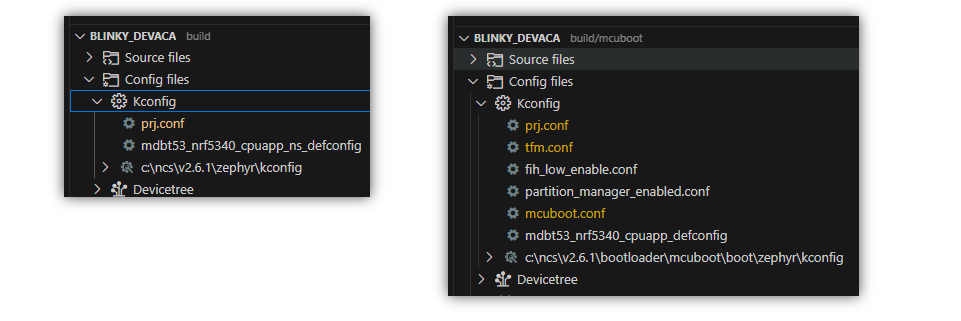
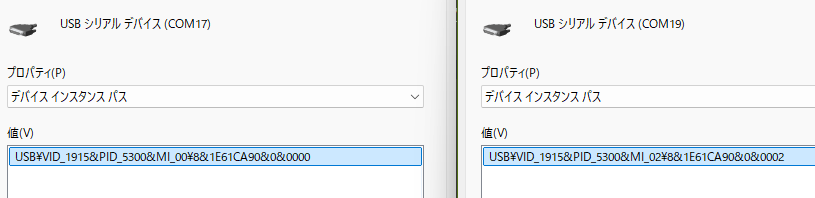
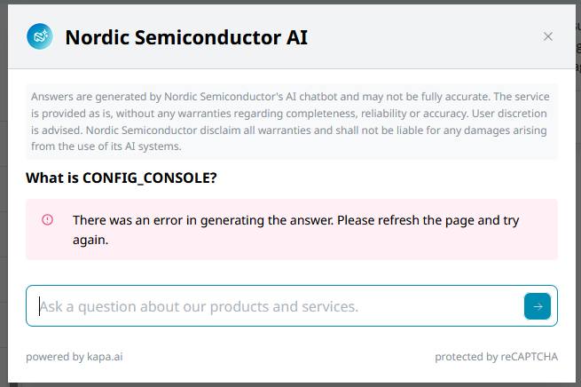

# USBを有効にする

<i>2024/08/02</i>

評価ボード[nRF5340 MDBT53-1Mモジュールピッチ変換基板](https://www.switch-science.com/products/8658)のボード定義ファイルを作り直そうとしている。
理由は ncs v2.6 以降で動かなかったためである。

ここ最近は、Partition Manager を使うために Thingy:53 のボード定義ファイルをベースにしようとしていた。
しかしどうしてもうまくいかないので、Partition Manager を使っていない nRF5340DK をベースにする方針に変更した。

というのが前回までのあらすじである。

----

## MCUbootでUARTを有効にする

まだDFUはやっていないが、準備はしておきたい。
その前段階として、MCUboot から Serial Recoveryモードになれるようにしておく。

[以前](../07/20240716-boot.md)も同じようなことをやったが、あのときは GPIO のピンアサインを修正した。
今回は UART が有効になってなかったため、DTSファイルと Kconfigファイルを変更した。

[commit](https://github.com/hirokuma/ncs-blinky-sample/commit/3e603dd3035383a97191052985ebbfa65e9e216c)

評価ボードは UART用のピンが出ているわけではないので、LED とボタンを邪魔しなければどのピンでも良かった。

コードでいえば[この辺](https://github.com/nrfconnect/sdk-mcuboot/blob/v2.0.99-ncs1-1/boot/zephyr/main.c#L605-L610)。
ボタン押下以外にもいくつか`boot_serial_enter()`が呼ばれる経路がある。  
[評価ボード手順](https://144lab.kibe.la/shared/entries/467b2482-2346-4c3e-8e0f-28d7403de2b9#usb)ではボタンを押したまま起動すると USB経由でファームウェアの更新ができるようになっていた。
なので名前が「Serial Recovery」だが、ファーム更新もできるのだと思う。

上のcommitでは、ボタンを押したまま起動すると LED点滅しない。
なので Serial Recoveryモードになっているのだと思う。
確認のため、USB でできるようにしよう。

## MCUbootでUSBを有効にする

正確には USB の CDC(Communication Device Class) ACM(Abstract Control Model)で、いわゆる USBシリアルというやつだ。
わざわざ FTDIのチップなどを外付けしなくても nRF5340 だけでできてしまう(コネクタはいるが)。

[Exercise 2 – DFU over USB, adding external flash & custom keys](https://academy.nordicsemi.com/courses/nrf-connect-sdk-intermediate/lessons/lesson-8-bootloaders-and-dfu-fota/topic/exercise-2-dfu-over-usb-adding-external-flash/)

これと nRF5340DK, Thingy:53 のボード定義を見ながら変更していったのだが、リンクエラーが発生する。

```
ld.bfd.exe: zephyr\zephyr_pre0.elf section `noinit' will not fit in region `RAM'
ld.bfd.exe: region `RAM' overflowed by 8200 bytes
collect2.exe: error: ld returned 1 exit status
```

`CONFIG_PM_PARTITION_SIZE_MCUBOOT=0x15000`を`child_image/mcuboot.conf`に追加することは書いてあったが`CONFIG_MCUBOOT_USE_ALL_AVAILABLE_RAM=y`はなかったので忘れていた。
なお`CONFIG_MCUBOOT_USE_ALL_AVAILABLE_RAM`は`prj.conf`の方である。`mcuboot.conf`ではダメだ。
あるいはボード定義ファイルの defconfig でもよかった。
[DevAcademy](https://github.com/NordicDeveloperAcademy/ncs-inter/blob/e0a573cb95a1d622a4c2344237f466d6c71c5ace/lesson8/inter_less8_exer2_solution/boards/nrf5340dk_nrf5340_cpuapp_ns.conf#L4)ではボード定義ファイルの方に書いていたのでそうしておこう。



[CONFIG_MCUBOOT_USE_ALL_AVAILABLE_RAM](https://docs.nordicsemi.com/bundle/ncs-latest/page/kconfig/index.html#!%5ECONFIG_MCUBOOT_USE_ALL_AVAILABLE_RAM$)はThingy:53しか見ていないが、なんでだろうか。
Nordicのサイトで検索しても[nRF Connect SDK v2.3.0 Release Notes](https://docs.nordicsemi.com/bundle/ncs-latest/page/nrf/releases_and_maturity/releases/release-notes-2.3.0.html#d1555e1139)しか出てこなかった。もうちょっと大々的に宣伝した方がよいのではなかろうか。

ともかく、これでボタンを押しながら起動すると Windows から USB を認識するようになった。

[commit](https://github.com/hirokuma/ncs-blinky-sample/commit/b35f06a7fcb65f27e2a78ad9721aab3f8e5c456b)

`mcuboot.conf`はいろいろ増えているが、[Thingy:53のMCUboot設定ファイル](https://github.com/nrfconnect/sdk-mcuboot/blob/v2.0.99-ncs1-1/boot/zephyr/boards/thingy53_nrf5340_cpuapp.conf)を参考にした。
`CONFIG_BOARD_SERIAL_BACKEND_CDC_ACM`をコメントアウトしているのは[Thingy:53のKconfig.defconfig](https://docs.nordicsemi.com/bundle/ncs-latest/page/nrf/device_guides/nrf53/thingy53_application_guide.html#usb)のため未定義になったからだ。
[CONFIG_USB_DEVICE_REMOTE_WAKEUP](https://docs.nordicsemi.com/bundle/ncs-latest/page/kconfig/index.html#!%5ECONFIG_USB_DEVICE_REMOTE_WAKEUP$)は不要だろう。

`CONFIG_USB_DEVICE_MANUFACTURER`などは文字列だから良いとして`CONFIG_USB_DEVICE_VID`や`CONFIG_USB_DEVICE_PID`はThingy:53の値と同じだが実験中であれば使い回して良いのかな。

DevAcademyのExerciseでは、確かボタンを押さずに起動してもUSBデバイスとして認識していたと思う。
これは`main()`などに何も書いていないからだ。

それはよいのだが、なぜか USBデバイス 2つ分として見えているのだ。



同じものを 2つ表示しているのではなく、ちゃんと別のものとして見えているようだ。  
DTSファイルは cpuapp にしか追加していないので、cpunet が影響しているわけでもなかろう。

DTSファイルの`chosen`で`zephyr,console`と`zephyr,shell-uart`をコメントアウトしたが変わらず。  
`uart-mcumgr`もコメントアウトしたが変わらない。ビルドエラーにもならないし、ボタンを押すと Serial Recoveryモードになるし。

DFU用とログ用で2つあるのでは？と`CONFIG_LOG=n`を設定したが変わらず。  
`CONFIG_MULTITHREADING`でもなかった。["Required by USB and QSPI"](https://github.com/nrfconnect/sdk-mcuboot/blob/v2.0.99-ncs1-1/boot/zephyr/boards/thingy53_nrf5340_cpuapp.conf#L34-L35)とあったから追加していたのだが、USBとQSPIの両方を使う場合だけ必要なんだろうか？

わからんな！  
少し整理したこの状況で続けることにしよう。

[commit](https://github.com/hirokuma/ncs-blinky-sample/commit/987a8a36b8eda35fc6084acf9bcca113c35e11d3)

----

## ログを出してみよう

USBシリアルが有効になったのでログを出してみよう。

[Lesson 4 – Printing messages to console and logging](https://academy.nordicsemi.com/courses/nrf-connect-sdk-fundamentals/lessons/lesson-3-printing-messages-to-console-and-logging/)

アプリに追加しただけだが、ボタンを押さずに起動しても USBデバイスとして見えていた。

[commit](https://github.com/hirokuma/ncs-blinky-sample/commit/1ef0dbfb948c2df37bf2155580c3dee24bf14244)

```text
*** Booting nRF Connect SDK v3.5.99-ncs1-1 ***
```

メッセージは[BOOT_BANNER_STRING](https://github.com/nrfconnect/sdk-nrf/blob/v2.6.1/Kconfig.nrf#L37-L39)であろう。
[boot_banner()](https://github.com/nrfconnect/sdk-zephyr/blob/v3.5.99-ncs1-1/kernel/banner.c#L27)は[bg_thread_main()](https://github.com/nrfconnect/sdk-zephyr/blob/v3.5.99-ncs1-1/kernel/init.c#L322)から呼び出されていて、その後に`main()`を呼んでいる。  
この`main()`がアプリかMCUbootかがはっきりしない。

アプリの`main()`に`printk()`でログを吐くようにすると、バナーの後にログが出た。
あとはMCUbootのログが出せればわかるかと思ったが、MCUbootでのログの出し方が分からない。
また、アプリでUSBを有効にした場合と、MCUbootでボタンを押してUSBを有効にした場合では Windows から見た USBデバイスが違ったものとして認識されている。
USBシリアルでログを出す場合、PCがUSBデバイスを認識するまでの間に出力したデータは捨てられそうな気がしたのだが、そうでもないのか。

[commit](https://github.com/hirokuma/ncs-blinky-sample/commit/af844e5785fc8737e6de746afe5ae741bea6fdb3)

`mcuboot.conf`に`CONFIG_UART_CONSOLE=n`を書くのが面倒だったから defconfig で`CONFIG_CONSOLE`と`CONFIG_UART_CONSOLE`を削除したらUSBシリアルからログが出力されなくなってしまった。
あれは"CONSOLE"らしい。
[CONFIG_CONSOLE](https://docs.nordicsemi.com/bundle/ncs-latest/page/kconfig/index.html#!%5ECONFIG_CONSOLE$)の説明を読んでも "console drivers" ではわからんよ。

ここが Nordic AI の使いどころか！



違ったようだ。
