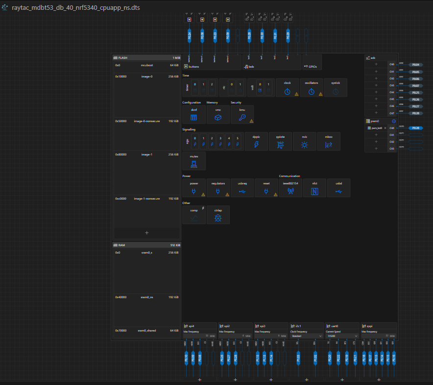

評価ボード[nRF5340 MDBT53-1Mモジュールピッチ変換基板](https://www.switch-science.com/products/8658)用のボード定義ファイルのたたき台を作ったところではあるが、この評価ボードも発売されて1年以上経つので他にもやっている人はいるんじゃなかろうか。

「MDBT53」で検索するとスイッチサイエンスさんではなく発売元の評価ボードがあった。

[Raytac MDBT53-DB-40](https://www.switch-science.com/products/8620?_pos=1&_sid=6944ab6c4&_ss=r)

そういえば、最初はそっちを買おうとしてたけど品切れだったから止めたんだったか。

発売元サイトからはその商品はなくなっていたのだが、アンテナが違うタイプの[MDBT53V-DB-40](https://www.raytac.com/product/ins.php?index_id=140)は残っていた。  
まあ、今から買うわけではないので載っていなくても良いのだ。

LEDとボタン、あとはUSBコネクタが載っている以外は部品もなさそうだ。  
これなら nRF5340DK や Thingy:53 をベースにするよりもよさそうだ。

MDBT53-DB-40は [Zephyr](https://docs.zephyrproject.org/latest/boards/raytac/mdbt53_db_40/doc/index.html) や [Nordic](https://docs.nordicsemi.com/bundle/ncs-latest/page/zephyr/boards/raytac/mdbt53_db_40/doc/index.html) のサイトにもある(同じ内容かも知れんが)。

----

早速、`raytac_mdbt53_db_40_nrf5340_cpuapp_ns`でビルドした。
Devicetree Visual Editor で見ても機能の設定はあるもののその先につながっているものはない。

blinky サンプルで Devicetree overlay で LED とボタンを割り当て直し `prj.conf`に`CONFIG_BOOTLOADER_MCUBOOT=y`を追加すると動いた。  
今まで苦労したのに。。。

と後悔しているわけではない。  
1ヶ月くらい調べてボード側について多少知識が蓄積できたのだからよいのである。

ブランチの名前が分かりづらくなったので、どっちベースなのかわかるようにした。

* [nrf5340dk-base](https://github.com/hirokuma/ncs-custom-board/tree/nrf5340dk-base)
* [raytac-base](https://github.com/hirokuma/ncs-custom-board/tree/raytac-base)

PMファイルはどちらにもないが、実はPMファイルがあるのは Thingy:53 だけなので必要になってから考えよう。
