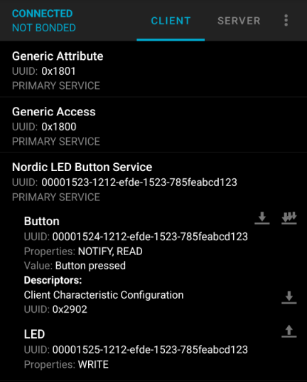
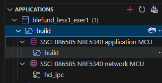

[前回](./20240805-ble.md)の続き。

## [Exercise 1](https://academy.nordicsemi.com/courses/bluetooth-low-energy-fundamentals/lessons/lesson-1-bluetooth-low-energy-introduction/topic/blefund-lesson-1-exercise-1/)

LED Button Service(LBS)を動かしてみようという Exercise である。
[Bluetooth SIG](https://www.bluetooth.com/specifications/specs/)の方にはない service だが [nordic](https://docs.nordicsemi.com/bundle/ncs-2.6.1/page/nrf/libraries/bluetooth_services/services/lbs.html)のページにはあるので、独自サービスなのか？
しかし「Nordic UART Service」なんかはちゃんと "nordic" と入っているので違うのか。

単なる列挙になりそうだが、LBSの概要をメモしておこう。

### LBS

LEDの状態を受け取ったり、ボタンのステータスが変化したときに通知を送信したりするサービス。

LEDの状態を受け取る、というのはクライアントからの変更要求を受け取るという意味なのだろうか？ 
表になっていないとわかりづらいな。

#### Service UUID

`00001523-1212-EFDE-1523-785FEABCD123`

#### Characteristic

##### Button Characteristic

`00001524-1212-EFDE-1523-785FEABCD123`

##### LED Characteristic

`00001525-1212-EFDE-1523-785FEABCD123`

----

GitHubにある LBS peripheral サンプルコードを動かすと LED1 が点滅する。
そして Advertising しているのでスマホアプリ nRF Connect for Mobile で接続してあれこれやってみましょう、というのが Exercise の内容だ。

Raytac ベースでやると 確かに LED は点滅している。
Advertisingもしている。
接続すると、ボタンを押した状態で "Nordic LED Button Service" を Read すると "Button pressed" になっていた。

LED は 3つ(LED1=status, LED2=connect, LED3=service)使うようになっているが、開発ボードには 1つしかないので変更したい。

`src/main.c` にそれっぽい定義があるのだが、{DK_LED1](https://github.com/NordicDeveloperAcademy/bt-fund/blob/main/lesson1/blefund_less1_exer1/src/main.c#L32-L38)などは知らない定義である。
[dk_buttons_and_leds.h](https://github.com/nrfconnect/sdk-nrf/blob/v2.6.1/include/dk_buttons_and_leds.h)に定義はあるものの、単に`0`や`1`の番号だけだ。
"Other libraries" に [DK Buttons and LEDs](https://docs.nordicsemi.com/bundle/ncs-2.6.1/page/nrf/libraries/others/dk_buttons_and_leds.html)という章があったので、Nordic DKボードようなのだろう。

それだとDKを持っていない人には意味が無いのだが、[Use on non-DK boards](https://docs.nordicsemi.com/bundle/ncs-2.6.1/page/nrf/libraries/others/dk_buttons_and_leds.html#use_on_non-dk_boards)節にカスタマイズの仕方が書かれていた。  
が・・・どれがカスタマイズ項目なんだろう？

「LED1」は[nRF5340DKの画像](https://docs.nordicsemi.com/bundle/ug_nrf5340_dk/page/UG/dk/kit_content.html)を見ると「LED1」～「LED4」なので、Devicetreeの[led_0](https://github.com/nrfconnect/sdk-zephyr/blob/v3.5.99-ncs1-1/boards/arm/nrf5340dk_nrf5340/nrf5340_cpuapp_common.dtsi#L24-L27)と同じで良いはずだ。
だとすると、私の[Raytacベースのled_0](https://github.com/hirokuma/ncs-custom-board/blob/f124d5b5a4581022f30545bdc26676ebf8c43aab/boards/arm/ssci086585_nrf5340/ssci086585_nrf5340_cpuapp_common.dts#L24-L27)も同じようになっている。

雰囲気からすると、Devicetreeの `leds`ノードと `buttons`ノード に列挙されている定義をまとめて登録して、アクセスするときにはそれをインデックス値で指定できるようになっている。
なので、ラベル名やエイリアスは深く考えずに Devicetree の順番に割り当てられると思っておこう。

なら単純に[USER_LED](https://github.com/NordicDeveloperAcademy/bt-fund/blob/main/lesson1/blefund_less1_exer1/src/main.c#L36)を`DK_LED1`にすればよい。
元々`DK_LED1`が割り当てられていた`RUN_STATUS_LED`は`DK_LED3`にもでしておこう。
今のわたしのボードにはLEDとボタン以外はGPIOが空いているので、どうでもよいのだ。

そうすると nRF Connect for Mobile から LED の ON/OFF 制御ができるようになった。
Read がないためか制御しかできないが、そういうもんだろう。

関係ないけど、マイコンの GPIO 定義で Write only にしていてもポートを読むと値が取得できたのでハードの人に質問したことがあるが、そういうものだっていうことだった。
あれはそのマイコンだけなのか、GPIOの切替ができるタイプはだいたいそうなのか。  
こういうちょっと込みいったところになると知識がまったく無いのがつらい。

VCOM でログを見ることができるようだったが、Raytacベースの方はまだそこまで仕込んでないので何も出力されなかった。
あとでやろう。

----

ともかく、BLE機能が使えることが確認できて良かった。

cpuapp と cpunet があったはずだが、どうやって使い分けるのだろう？ 
Exercise 1 には nRF5340DK への説明文に COM ポートが app core と network core の 2つあって今回は app の方だ、とあったが、つまり network core からもハードウェアの操作がまったくできないわけではないということになる。

まあ、これはやっていけばわかるだろう。
