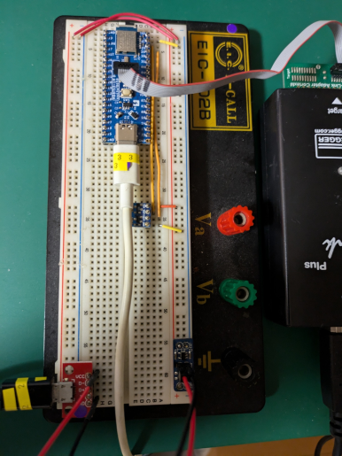
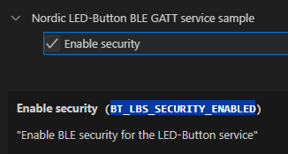
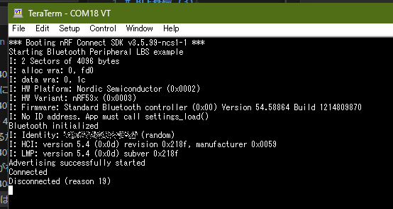

[前回](./20240807-ble.md)、DevAcademy [Exercise 1](https://academy.nordicsemi.com/courses/bluetooth-low-energy-fundamentals/lessons/lesson-1-bluetooth-low-energy-introduction/topic/blefund-lesson-1-exercise-1/)で LBS を動かした。

どうでもよいが「LBS」だと足りない気がして「LBSサービス」と書いてしまいそうになる。
せめて「LBサービス」なのかもしれないが、"S" で終わっていないと落ち着かない気がするのだ。

LED は 3つはないと不便そうだったのでブレッドボードを使って追加した([2ch FET付きLEDボード](https://www.switch-science.com/products/2397))。
基板には「3.3V」と「VIN」があるのだが、それぞれ3.2Vちょっとと4.5Vちょっとくらいだった。
電圧的には足りてるのだが、他にも接続したいこともありそうなので [USBマイクロBコネクタ・ピッチ変換基板](https://www.switch-science.com/products/1599) で USB から 5V をもらってきて、[ブレッドボード用電源ボード3.3V](https://www.switch-science.com/products/1265) で 3.3Vを作っている。



このくらいだと USBハブのバスパワーから電源を得ても大丈夫な気がするのだが、どうなんだろうね。
セルフパワーにもできるハブを使っているので、足りなければACアダプタを挿せばよい。4.5V くらいしか出力されていないのもバスパワーにしているせいだろう。

----

少し[main.c](https://github.com/NordicDeveloperAcademy/bt-fund/blob/main/lesson1/blefund_less1_exer1/src/main.c)を見ておく。

LED/Buttonライブラリは気にしないとするとこんなところだ。

* `bt_enable()`: BLE有効化
* `bt_lbs_init()`: LBSサービスライブラリの初期化
* `bt_le_adv_start()`: Advertising開始
* 無限ループ

LBSサービスの初期化でコールバック関数を登録し、LEDは`dk_set_led()`で制御、Buttonは現在持っているボタンの状態を返すようになっている。

`CONFIG_BT_LBS_SECURITY_ENABLED`が有効な場合はもう少し処理が追加されていて、認証が行われるようだ。
認証とはなんだったか。。。SMPとかそういうやつだとは思うが記憶にない。  
この Exercise には出てこなかったので、別で説明があるだろう。



最後は LED を点滅する無限ループになっているのだが、無限に止めたい場合は [k_sleep()](https://docs.zephyrproject.org/apidoc/latest/group__thread__apis.html#ga48d4b041790454da4d68ac8711f29657)の引数に`K_FOREVER`を指定すれば良いそうだ。
ncs ではない時代はタイマーを使って点滅させていたような気がする。便利になったものだ。

あとは`printk()`でのログ出力を有効にしておきたい。
これは以前やった [Exercise 2 – DFU over USB, adding external flash & custom keys](https://academy.nordicsemi.com/courses/nrf-connect-sdk-intermediate/lessons/lesson-8-bootloaders-and-dfu-fota/topic/exercise-2-dfu-over-usb-adding-external-flash/) のまねをする。

* Devicetree の overlayファイルに追加

```
/ {
	chosen {
		zephyr,uart-mcumgr = &cdc_acm_uart0;
	};
};

&zephyr_udc0 {
	cdc_acm_uart0: cdc_acm_uart0 {
		compatible = "zephyr,cdc-acm-uart";
	};
};
```

* `prj.conf` に追加

```
# USB
CONFIG_USB_DEVICE_STACK=y
CONFIG_UART_LINE_CTRL=y
```

* `main.c` に追加

```c
...
#include <zephyr/usb/usb_device.h>

...

	if (IS_ENABLED(CONFIG_USB_DEVICE_STACK)) {
		int ret = usb_enable(NULL);
		if (ret) {
			return -1;
		}
	}
```



しばしば使いそうなので Raytacベースの設定に追加した。
KconfigでチェックボックスをONにしたら有効になるのがよいのだが、やり方が分からんかった。
この方法だとメンテナンスするファイルが増える一方なので望ましくないのだが。

[commit](https://github.com/hirokuma/ncs-custom-board/commit/396a96a66d42430fd6d9ced18e0c7d74c706d278)

----

ncs で LBS 以外に既に実装されているサービスはこれだけある。

[Bluetooth libraries and services](https://docs.nordicsemi.com/bundle/ncs-2.6.1/page/nrf/libraries/bluetooth_services/index.html)

たぶん「GATT」で始まっているのが[Bluetooth SIG標準](https://www.bluetooth.com/specifications/specs/?types=specs-docs&keyword=service&filter=)のサービスだろう。
少ない気もするが、そもそもそんなに既存で使うシーンがあるサービスは多くないと思う。
BAS はバッテリー残量などで需要がありそうだが、それ以外は作った方が早いかもしれない。

[nrfリポジトリ](https://github.com/nrfconnect/sdk-nrf/tree/v2.6.1/subsys/bluetooth/services)の下にあるようだ。
これを参考にすればサービスを作るのは難しくないのかもしれない。

が、DevAcademy の順番としては次は Advertising なのでそれにあわせよう。
