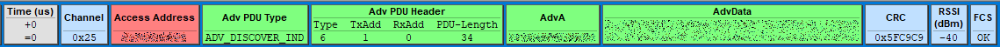
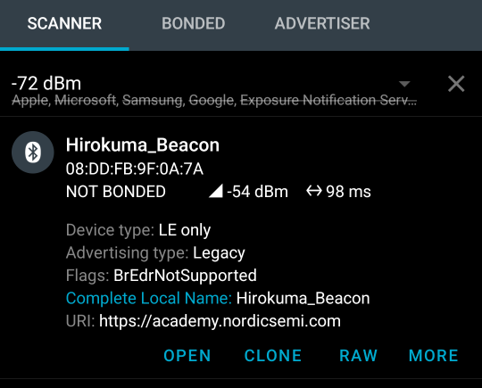
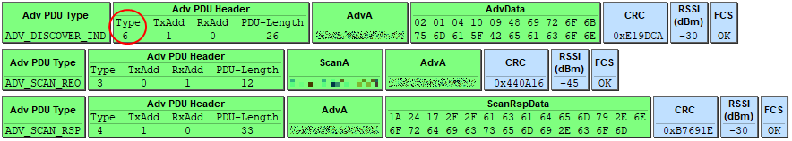
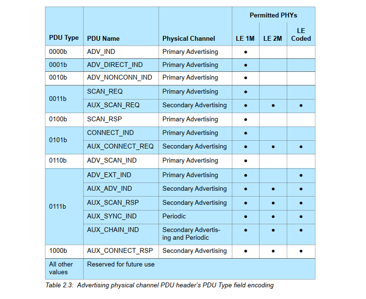
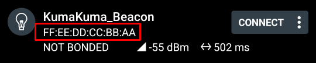

# BLE基礎 (4)

<i>2024/08/09</i>

前回 USB-CDCでログ出力できるようにしたが、`printk()`はバッファされず、出力し終わるまで戻ってこない関数とのこと。

[printk() function](https://academy.nordicsemi.com/courses/nrf-connect-sdk-fundamentals/lessons/lesson-3-printing-messages-to-console-and-logging/topic/printk-function/)

Linuxでの`stderr`みたいなものか。

バッファされるとプログラムの進みとタイミングがずれたりしてわかりづらいだろうってことで Exercise では`printk()`を使っているのかもしれない。

----

## [Lesson 2 – Bluetooth LE Advertising](https://academy.nordicsemi.com/courses/bluetooth-low-energy-fundamentals/lessons/lesson-2-bluetooth-le-advertising/)

Advertising についてである。
こちらは Nordic のウェビナーPDF だが、あとで読みたいところである。

[Everything you need to know about Bluetooth LE advertising(PDF)](https://devzone.nordicsemi.com/cfs-file/__key/communityserver-discussions-components-files/4/6064.bluetoothLEAdvertisingPresentation.pdf)

### Lesson

内容は読めばよいので、概要だけ。

* [Advertising process](https://academy.nordicsemi.com/courses/bluetooth-low-energy-fundamentals/lessons/lesson-2-bluetooth-le-advertising/topic/advertising-process/)
  * Advertisingってなに？という基本事項
* [Advertising types](https://academy.nordicsemi.com/courses/bluetooth-low-energy-fundamentals/lessons/lesson-2-bluetooth-le-advertising/topic/advertising-types/)
  * Advertisingの種類は4つある
  * 3つは例が書いてあるのでなんとなくわかるが`ADV_SCAN_IND`はなんだろう。組み合わせとしてできるから禁止するほどでもないしいいか、って感じだろうか。`SCAN_REP`を返すからちょっと情報が多く取得できるとかかもしれない。
* [Bluetooth address](https://academy.nordicsemi.com/courses/bluetooth-low-energy-fundamentals/lessons/lesson-2-bluetooth-le-advertising/topic/bluetooth-address/)
  * BLEアドレスの種類
* [Advertisement packet](https://academy.nordicsemi.com/courses/bluetooth-low-energy-fundamentals/lessons/lesson-2-bluetooth-le-advertising/topic/advertisement-packet/)
  * Advertising の PDU(Packet Data Unit)について
  * 接続したら GATT でアクセスするけど Advertising は GAP だからプロトコルスタックの図でも GATT と GAP が並列で並んでいるのかな。
  * 送信も受信もライブラリがある程度やってくれるだろうが、デバッグするときには知っておいた方が良いのかも。
    * 持っているBLEスニファだとこんな感じで取得できる。
      * DevAcademyの最後にスニファの章があるので作るコーナーなのかも
    * 
  * 構造はともかく、どういうデータが入れられるかとサイズは知らないといかんが、ここにはそこまで詳しいことは書いてない。

### Exercise

あとは exercise が 3つとクイズが 1つだ。
exercise で使う[リポジトリ](https://github.com/NordicDeveloperAcademy/bt-fund/tree/main/lesson2)は問題用と解決済みがあるので、答え合わせできるのがありがたい。

前回の exercise で[nRF5340 MDBT53-1Mモジュールピッチ変換基板](https://www.switch-science.com/products/8658)にLEDを追加したが、overlay で追加したのでそのファイルを持ってこないといかんかった。
ボード定義ファイルにいれるほどではないけど、よく使う設定を再利用したいものだ。
しかしボード定義を増やすのは面倒なので、それなら overlay ファイルをコピーすれば済むだけなのはまだ手軽なのか。

#### [Setting the advertising data](https://academy.nordicsemi.com/courses/bluetooth-low-energy-fundamentals/lessons/lesson-2-bluetooth-le-advertising/topic/blefund-lesson-2-exercise-1/)

Advertising するだけ。

[BT_LE_ADV_NCONN](https://docs.nordicsemi.com/bundle/ncs-latest/page/zephyr/connectivity/bluetooth/api/gap.html#c.BT_LE_ADV_NCONN)は「Non-connectable advertising with private address」で定義値は[ここ](https://github.com/nrfconnect/sdk-zephyr/blob/v3.5.99-ncs1-1/include/zephyr/bluetooth/bluetooth.h#L911-L914)にある。
近くに`BT_LE_ADV_PARAM()`を使った定義がいろいろあるが、コードを見ないとなんだかわからないな。  

* `BT_LE_ADV_PARAM()`
  * 第1パラメータ
    * `0`: non-connectable
    * `BT_LE_ADV_OPT_CONNECTABLE`: connectable
  * 第2, 3パラメータ
    * intervalのmin, max

`ADV_SCAN_IND`と`ADV_NONCONN_IND`の指定はないので、おそらく response packet を与えているかどうかで判断しているのだろう。
今回は指定しているから`ADV_SCAN_IND`になっているはずである。

私の使っているBLEスニファーだと `ADV_DISCOVER_IND` と表示されているが、Adv PDU Header の Type値が`6`なので、Core_v5.1 Vol.6 Part B "2 Air interface packets" の Table 2.3 によると `ADV_SCAN_IND` のことらしい(Core_v4.0 だと Table 2.1)。

#### [Dynamically changing the advertising data](https://academy.nordicsemi.com/courses/bluetooth-low-energy-fundamentals/lessons/lesson-2-bluetooth-le-advertising/topic/blefund-lesson-2-exercise-2/)

パラメータの中の"Manufacturer Specific Data"を動的に更新する。
普通だと`bt_le_adv_start()`でパラメータを与えて開始するので、

[BT_LE_ADV_PARAM()](https://docs.nordicsemi.com/bundle/ncs-latest/page/zephyr/connectivity/bluetooth/api/gap.html#c.BT_LE_ADV_PARAM)にmin, maxを指定するが、単位は秒数とかではなく`0.625ms`に掛ければ秒数になるという値である。
min <= max になっていればよいらしい。
ここでは `min=800`, `max=801` なので `min=500msec`, `max=500.625msec`である。

といいつつ、実際に動かすと 450msec くらいになったりもしていた。
nRF Connect for Mobile を Refresh すると 500msec 付近になっていたから、一度 SCAN が途切れたりして計算がずれただけとかだろうか。

なんで`adv_mfg_data`に`const`が付いてないのかと思ったら、`adv_mfg_data`のアドレスを`ad[]`が持っていて、ボタンが押されたら`adv_mfg_data`の中身を更新して`bt_le_adv_update_data()`するというしくみだからだった。
ただ`adv_param`は`const`でよいはずだ。そんなに細かく気にするところではないだろうが、RAMは大切だし、初期値持ちになるので Flashにもデータがある。そして初期値をRAMにコピーするという手間もあるので、`const`でよいなら付けた方が良いはずだ。

ま、間違ってないよね？？ 
C言語も久々なので弱気になっている。

#### [Exercise 3](https://academy.nordicsemi.com/courses/bluetooth-low-energy-fundamentals/lessons/lesson-2-bluetooth-le-advertising/topic/blefund-lesson-2-exercise-3/)

接続するタイプの advertising。
LBS を使ったサンプルなので以前と同じ感じになりそうだが、アドレスの変更をやっている。

サービスのUUIDが[BT_UUID_LBS_VAL](https://docs.nordicsemi.com/bundle/ncs-2.6.1/page/nrf/libraries/bluetooth_services/services/lbs.html#c.BT_UUID_LBS_VAL)で定義されているので`<bluetooth/services/lbs.h>`をincludeしてみたのだが、ビルドエラーになった。
他にもincludeしないと解決できないということか。

nRF Connect for Mobile から CONNECT はできるのだが、Characteristic として出てくるのは 0x1800 と 0x1801 といういつものやつだけで LBS は出てこない。
コールバック関数の登録もないので、接続しても LEDは変化しない。`bt_lbs_init()`を呼び出していないからだろう。
