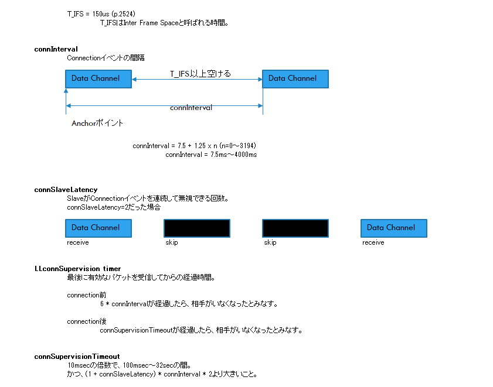
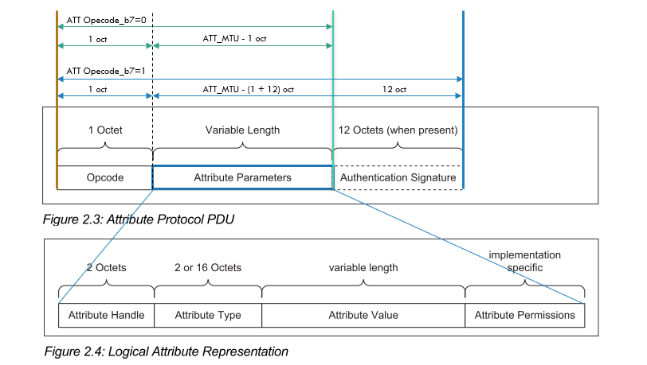

# BLE基礎 (6)

<i>2024/08/12</i>

DevAcademyの[Bluetooth Low Energy Fundamentals](https://academy.nordicsemi.com/courses/bluetooth-low-energy-fundamentals/)をやっているところである。

[前回](./20240811-ble.md)は"Connection process"までだったので、その続きから。

## [Lesson3 Bluetooth LE Connections](https://academy.nordicsemi.com/courses/bluetooth-low-energy-fundamentals/lessons/lesson-3-bluetooth-le-connections/)

### Connection parameters

* コア仕様書では master や slave という言葉が使われているが DevAcademy では Central と Peripheral に置き換えているようだ
  * Slave latency --> Peripheral latency
  * L2CAP の role で "master", "slave" が使われているか
* connSlaveLatencyの意味が分かってなかったけど、connIntervalを小さくしつつ消費電力を抑えたいのね
  * 無線マウスでときどき応答の悪いものもあったと思うが、あれはこの辺のパラメータの調整不足だろうか
* 以前なかったパラメータが [PHY radio mode](https://academy.nordicsemi.com/courses/bluetooth-low-energy-fundamentals/lessons/lesson-1-bluetooth-low-energy-introduction/topic/phy-radio-modes/) だ
  * コア仕様書v4 は 1M PHY しかなかったからだ
  * 大きく Uncoded PHY と Coded PHY に分けられ、uncoded PHY が 1M PHY と 2M PHY に分かれる。
  * Advertising 関係で 2M PHY や Coded PHY が使える PDU は 1M PHY の半分くらいである。コア仕様書を「Permitted PHYs」で検索してみよう。
  * たぶん`LL_PHY_REQ`/`LL_PHY_RSP`で設定するのだと思う

* MTUのデフォルト値は23byteでデータ長(data length)のデフォルト値は27byte？
  * コア仕様書 Vol.3 Part G(GATT), "5.2.1 ATT_MTU" に 23 byte と書かれている
    * Vol.3 Part F(ATT), "3.3.1 Attribute PDU format" に構成が書いてある
      * 先頭 1 byte が OpCode
      * OpCodeの b7=0: `ATT_MTU-1`をパラメータとして使える
      * OpCodeの b7=1: `ATT_MTU-13`をパラメータとして使える。かつ Authentication Signatureフィールド(12 byte)あり。
    * 署名がないタイプだと、22 byte、そこからさらに ATT のフォーマットがある
      * 
  * MTU > data length の場合、データは data length のチャンクに分割される
    * ATT_MTU とここでいう MTU は別物？
    * [昔の記事](http://blog0.hirokuma.work/2014/12/bleattmtu.html)はあるのだが、画像がないのでよくわからん
      * [MTU上限が延びた](http://blog0.hirokuma.work/2016/07/nrf52att-mtu-1.html)という
    * Vol.6, Part B, 2章にパケットレベルでのフォーマットが載っている
      * MTU は PDU の長さということでよかろうか
      * これが 39 byte → 257 byte → 258 byte、と変化してきたようだ。
        * 258 になったのは v5.1 から
    * 分割するのは[Long Write](http://blog0.hirokuma.work/2015/12/nrf51long-write.html)みたいな話だろうか
    * Data Length Extension(DLE)
      * Vol.6, Part B, "4.6.6 LE Data Packet Length Extension"
        * v4.2で追加された
          * 変更履歴が Vol.1, Part C に載っていることに気付いた
      * これが 27 byte がデフォルトで、最大 251 byte まで延ばせるといっている。
        * `LL_LENGTH_REQ`/`LL_LENGTH_RSP`に最小 27 oct と書いてあるからこれか(Vol.6, Part B, "2.4.2.21 LL_LENGTH_REQ and LL_LENGTH_RSP")
        * Vol.6, Part B, Table 4.4 に 27 とか 251 とか表になっているのであってるだろう

* 接続パラメータの初期値は central が持っている
  * peripheral は変更要求を投げられる
  * が、最終決定は central
* コア仕様のアップデートで追加された部分は、最初はデフォルト値で、その後どちらからも変更要求できる
