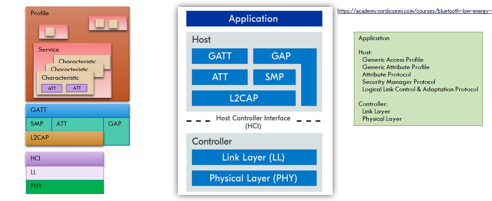
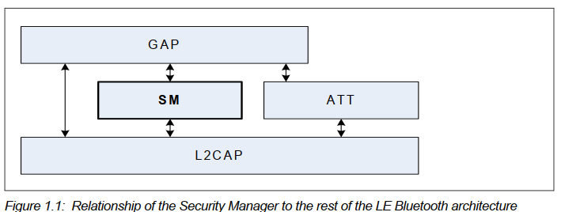

DevAcademyの[Bluetooth Low Energy Fundamentals](https://academy.nordicsemi.com/courses/bluetooth-low-energy-fundamentals/)をやっているところである。

「BLE基礎」といっておきながら ncs のことばかりやっているが、気にしないようお願いします。

### Connection state

BLE基礎と書いた手前、コア仕様書の章と多少は照らし合わせておこう。

* V5.1, Vol.6: Core System Package \[Low Energy Controller volume\]
  * Part B: Link Layer Specification
    * 4. Air Interface protocol
      * 4.5 Connection state
        * 4.5.1 Connection events
        * 4.5.2 Supervision timeout

章としては Link レイヤーになる。

私はどうにもプロトコルのレイヤーというものに弱く。。。  
インターネットと同じであれば、自分の階層のプロトコルデータを作って下の階層に渡すと、下は下で自分のプロトコルデータをその前に載せてまた下の階層に。。。という感じのはず。

ATT PDU は Vol 3, Part F などにあるように最大 ATT_MTU のデータで、これが GATT のレイヤー、Advertising は GAP のレイヤー。  
SMP は GAP の下にあるが、セキュリティということはデータの符号化・復号化だろうし GATT 側というか ATT の下にならないんだろうか。

Vol 3, "Part H: Security Manager Specification" に図があった。
ATT とは横並びで GAP の下になっていた。

SMP で符号化・復号化するのではなく、あくまで鍵交換などの役割だけ？  
Security は Lesson 5 にあるようだから、そこまで待とう。

### Central のことも気を遣おう

connection parameter については適当に決めるのではなく相手側の都合もあるので、Peripheral を作る場合はスマホ側のことも気にしておくとよいだろう。
例えばこちらは Apple の Developer サイトに載っていた情報だ。

* [Using the correct Bluetooth LE Advertising and Connection Parameters for a stable connection](https://developer.apple.com/library/archive/qa/qa1931/_index.html)

まあ、"`LLconnSupervision`"で検索したときに出てきただけだがね。
