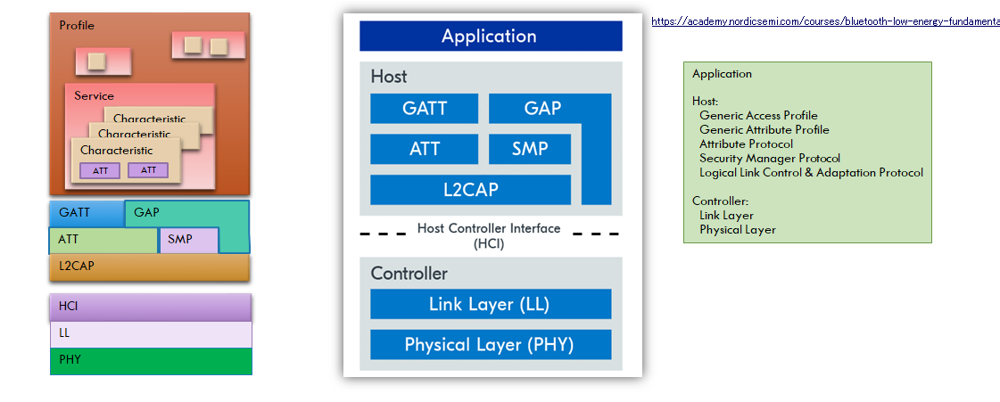
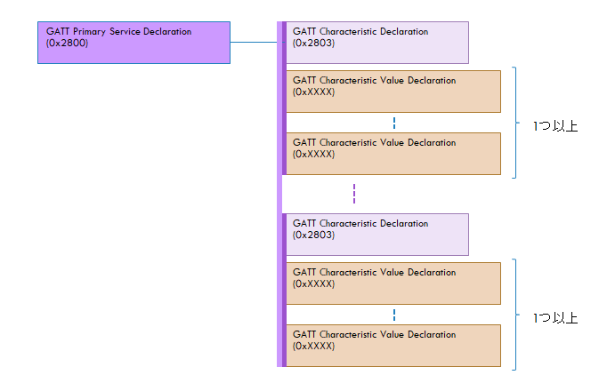
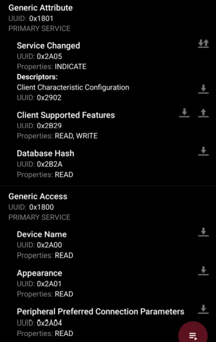

DevAcademyの[Bluetooth Low Energy Fundamentals](https://academy.nordicsemi.com/courses/bluetooth-low-energy-fundamentals/)をやっているところである。

前回 SMP は GAP としかアクセスしないことがわかったので図を更新しておこう。

## [Lesson 4 – Data exchange in Bluetooth LE](https://academy.nordicsemi.com/courses/bluetooth-low-energy-fundamentals/lessons/lesson-4-bluetooth-le-data-exchange/)

今まで Advertising, Connection とやってきたが、サービスは実装された LBS を使うだけだった。
この Lesson では GATT/ATT や Characteristic の詳細を見ていく。

といっても、完全に自作の Service にすると Central 側も用意しないといけなくなるので、そこまではやらず、一から LBS を作ろう、というもののようだ。
NUS(Nordic UART Service)もやるようだ。

* GATT operations
  * Service discovery
  * Client-initiated operations
    * Read
    * Write
    * Write without response
  * Server-initiated operations
    * Notify
    * Indicate
  * コア仕様書 V5.1, Vol 3, Part G: General Attribute Profile(GATT)
    * "3.3.1.1 Characteristic Properties"
      * bit表現
      * "Broadcast"というのもあった。使われないのかな？
    * 4.8～4.11 あたり
      * Notify と Indicate は Client Characteristic Configuration Descriptor(CCCD) への設定が必要になってくる
* Services and characteristics
  * entities (services and characteristics)という表現があるのでデータベースのようなイメージなのか
    * ATTレイヤーがそうのようだ。ATT table という呼び名も単に表形式だからというだけでなく DB の table に名前を寄せていたのだろうか。
  * コア仕様書 V5.1, Vol 3, Part F: Attribute Protocol(ATT)
    * Part F と G の違いが今ひとつ分かってない。。。
      * F は "protocol"、G は "profile"
      * "ATT" は "Attribute Protocol"、"GATT" は "Generic Attribute Profile" なので、Part F が "ATT" で Part G が "GATT" になるのか？
      * GATT が Profile ということは、HRS profile なども GATT の範疇？
  * Attribute 1 つ分の構成
    * Handle: ATTテーブル内でユニークな16bit値。ATT tableの行番号に相当(連番ではないが)
      * stackによって割り当てられるので、外部で使う値ではないのかな？
    * Type(UUID): この Attribute を指す UUID。
    * Permissions: 符号化、認証、読込み可、書込み可
    * Value: 値
  * 2種類の UUID
    * Bluetooth SIGが定義した 16bit UUID
      * `0x180d` は [assigned_numbers/uuids/service_uuids.yaml](https://bitbucket.org/bluetooth-SIG/public/src/91431397af5c7fc72298a36317d255b0063f8da9/assigned_numbers/uuids/service_uuids.yaml#lines-68:70)にある
        * ncs では [zephyr/bluetooth/uuid.h](https://github.com/nrfconnect/sdk-zephyr/blob/v3.5.99-ncs1-1/include/zephyr/bluetooth/uuid.h#L344-L347)に定義がある
        * [GATT Heart Rate Service (HRS) Client](https://docs.nordicsemi.com/bundle/ncs-2.6.1/page/nrf/libraries/bluetooth_services/services/hrs_client.html)に書いていないのはユーザが使わないからだろう
          * この辺のページは ncs で定義済みの service 実装が載っているようだが、「Service」と「Service Client」がある。"Client" が付いているのは Central でなくてもよいが値を受け取る方ってことか？
          * HRS は "Client" しかないけど、nRF に HRS 載せるんだったら Heart Rate を提供する "Server" の方になりそうだが。
          * [peripheral_hr](https://github.com/nrfconnect/sdk-zephyr/blob/v3.5.99-ncs1-1/samples/bluetooth/peripheral_hr/src/main.c#L23)では "Client" ではない `<zephyr/bluetooth/services/hrs.h>` を include しているので、ドキュメントに出てないだけで "Server" の実装もあるのだろう。
      * `0x2a37` は characteristic の UUID なので [assigned_numbers/uuids/characteristic_uuids.yaml](https://bitbucket.org/bluetooth-SIG/public/src/91431397af5c7fc72298a36317d255b0063f8da9/assigned_numbers/uuids/characteristic_uuids.yaml#lines-167:169)にある
      * ATT PDU は短めだし、短い方が通信時間が短くて省電力になるので UUID が短いと効率が良い。が、全部の定義をできるわけでもないので、自作の場合は重複しにくい 128bit UUID を使う。
    * ベンダーが定義した 128bit UUID(16bytes)
      * UUIDの表記は[wikipedia](https://ja.wikipedia.org/wiki/UUID#%E3%83%90%E3%83%AA%E3%82%A2%E3%83%B3%E3%83%88)によると `xxxxxxxx-xxxx-xxxx-xxxx-xxxxxxxxxxxx` とバイト数だと `<4>-<2>-<2>-<2>-<6>`のようにハイフンで区切ることになっている
      * base UUID は `xxxxZZZZ-xxxx-xxxx-xxxx-xxxxxxxxxxxx` と `ZZZZ` 以外の部分
        * [LBS](https://docs.nordicsemi.com/bundle/ncs-latest/page/nrf/libraries/bluetooth_services/services/lbs.html)の場合
          * LBS service: `00001523-1212-EFDE-1523-785FEABCD123`
          * LBS Button Characteristic: `00001524-1212-EFDE-1523-785FEABCD123`
          * LBS LED Characteristic: `00001525-1212-EFDE-1523-785FEABCD123`
      * base UUID + 16bit UUID、という見方をする
        * 先に base UUID をどこかに保存しておいて、あとは 16bit UUID だけで操作することができるので Bluetooth SIG 定義の UUID と同じ感じでアクセスできる
  * Service
    * 
    * Primary Service Declaration: `0x2800`
    * Characteristic(V5.1, Vol 3, Part G "3.3.1 Characteristic declaration"): `0x2803`
      * Value(V5.1, Vol 3, Part G "3.3.2 Characteristic Value declaration")
      * Descriptor(V5.1, Vol 3, Part G "3.3.3 Characteristic descriptor declaration")
        * User description(V5.1, Vol 3, Part G, "3.3.3.2 Characteristic User Description"): `0x2901`
          * Characteristic の略称？
        * Client configuration(V5.1, Vol 3, Part G, "3.3.3.3 Client Characteristic Configuration"): `0x2902`
          * Notify/Indicate
          * 略して"CCCD"と呼ばれたりする
* Attribute table
  * V5.1, Vol 3, Part G, Appendix B "Example Database Hash"
  * LBS サンプルを nRF Connect for Mobile と接続したときの画面
    * 
