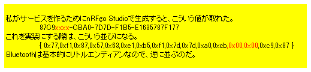
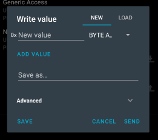

## UUID

128-bit UUIDの表記が`4-2-2-2-6`というのは分かったが、バイナリに展開されたときはどうなるのか気になった。
WSL2 で確認しておこう。

[Generating a random UUID in C - Stack Overflow](https://stackoverflow.com/questions/51053568/generating-a-random-uuid-in-c)

```console
$ apt-cache search libuuid
...
uuid-dev - Universally Unique ID library - headers and static libraries
...

$ sudo apt install uuid-dev
```

Cソースはそのまま使おう。

```console
$ gcc -o tst test_uuid.c -luuid
ueno@hozan:~/ueno2/clang$ ./tst
6e5b0e0f-3034-4aaf-9047-d06212e0e6f0
```

うむ。  
出力は文字列になっているが `uuid_t` は `typedef unsigned char uuid_t[16];` なので、16byte 分の UUID が生データで入っているはずだ。

こんな感じで追加して。

```c
    const uint8_t *c = (const uint8_t *)&binuuid;
    for (int lp = 0; lp < sizeof(binuuid); lp++) {
        printf("%02x", *c);
        c++;
    }
    printf("\n");
```

実行。

```console
$ ./tst
98872f78-2a09-405c-9e57-81688ce73a3e
98872f782a09405c9e5781688ce73a3e
```

big endian そのままだった。  
ちなみに自分で値を埋めたい場合はこういう感じで初期化する。`static const uuid_t` で宣言される。

```c
    UUID_DEFINE(binuuid,
        0x01, 0x02, 0x03, 0x04,
        0x05, 0x06,
        0x07, 0x08,
        0x09, 0x09,
        0x0a, 0x0b, 0x0c, 0x0d, 0x0e, 0x0f);
```

が [Wikipedia](https://en.wikipedia.org/wiki/Universally_unique_identifier#Encoding) にはシステム依存と書いてある。
そして Bluetooth はだいたいの箇所で little endian になっている。
私の過去メモにもこう書いてあった。



little endian になるそうだ。

## Lesson 4 

なぜ急に UUID の話をしたかというと、Exercise で LBS を自分で実装するからだ。
まあ、ncs が提供しているマクロをそのまま使えばよいだけなのだが気になるではないか。

前回、Bluetooth SIG 以外は 128bit UUID を使い、base UUID と 16bit UUID と書いてあったのに最初のステップで`BT_UUID_128_ENCODE()`を使って定義するところでは base UUID どうのこうのは出てこない。
同じ Service 内で base UUID の部分を変更した Characteristic の UUID を使おうとしたらどうなるかは興味がある。

base UUIDが`0xXXXXXXXX, 0x1212, 0xefde, 0x1523, 0x785feabcd123`と32bit分になっているけど、16bit分よね？

### [Exercise 1](https://academy.nordicsemi.com/courses/bluetooth-low-energy-fundamentals/lessons/lesson-4-bluetooth-le-data-exchange/topic/blefund-lesson-4-exercise-1/)

LBS サービスのテンプレートがあるので、それに中身を埋めていくだけ。
まあ、他の exercise も埋めるだけなのだが。

[commit](https://github.com/hirokuma/ncs-bt-fund/commit/e9c32408bdab49725bef83710175b9631aa183b7)

LED characteristic の UUID を base から外してみた(`0x1212` → `0x1213`)ら、特にエラーも無く初期化でき、サービスの検索もできていた。
ただ "Unknwon Characteristic" になっていた。
"WRITE" で表示されるダイアログが違うのは`bool`ということがわからなかったのか。



こういう単純ミスをチェックするには unit test だと思うが、ncs で作ったアプリって unit test できないものだろうか。  
値を実機でしか確認できないというのは面倒なものだ。
