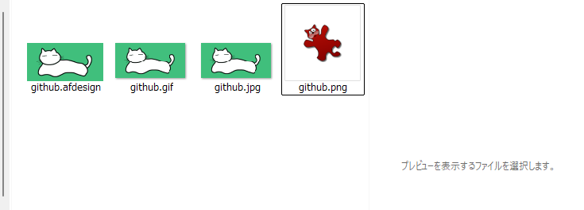

# Windows11でPNGだけサムネイルが表示されなくなった(未解決)

<i>2024/08/21</i>

[X](https://x.com/hiro99ma/status/1825742753306914823)でもちょっと書いたが、Windows11でPNGだけサムネイルが表示されなくなった。
こんな感じでサムネイルもプレビューも表示されない。
赤いキャラクターが表示されているのは[IrfanView](https://www.irfanview.com/)というビュアーをデフォルトに設定しているためである。Windows付属のフォトにしていると何も表示されない。

不思議なのは、JPEGやGIFは表示されるし、PDFやKritaのようにアプリがサムネイルを作っているものも表示されるのだが、PNGだけダメなのだ。
PNGファイルを標準のフォトアプリで開くと、そのフォルダ内のPNGファイルだけはサムネイルが作成される。他のアプリだとダメそうだし、他のフォルダには影響がない。  
この状態で何が面倒かというと、Execl で画像ファイルを挿入しようとしてもクリップアートのようにファイルが大量にある場合はどれだか見分けが付かないのだ。

現象としてはWindows10時代からあるようで、検索するといろいろ出てくる。

[DuckDuckGo "windows 11 png thumbnails not showing"](https://duckduckgo.com/?q=windows+11+png+thumbnails+not+showing&t=newext&atb=v440-7__&ia=web)

最初に出てくるのはエクスプローラーの設定がそうなっている場合の話である。
パフォーマンスオプションにも同じような設定がある。
が、他のサムネイルは表示されているのでこれではない。

次に出てくるのは`IconCache.db`を削除して再作成する方法である。
`thumbcache*.db`を削除するというのもある。
[Everything](https://www.voidtools.com/support/everything/)などを使っていると探すのが楽だろう。  
`IconCache.db`はユーザ権限で削除できるのだが`thumbcache*.db`はエクスプローラが開いているので管理者権限がいる場合があった。`DEL`みたいな組み込みコマンドだと`sudo`が使えないので面倒だ。
これは Windowsの設定アプリからもできるんじゃないかと思ったがよくわからん(設定>システム>ストレージ>一時ファイル>"縮小表示"にチェックしてファイルの削除)。
標準のディスククリーンアップからも同じようなことができる。  
そして、私の場合は効果がなかった。
いや、先ほど標準フォトでPNGを開くとフォルダ内のPNGはサムネイルが表示されると書いたが、あれが消えるのでキャッシュが削除されたというのは間違いないだろう。
それによってPNGのサムネイルが作成される効果がないというだけである。  
この状態で、大アイコン表示にしているエクスプローラで標準フォトからPNGファイルを開くと `iconcache_256.db` のファイルサイズが増えた。

PNGの標準アプリをフォトにすればよいのではと思ったのだが、関係なかった。
まあ、それならJPEGなども別あぷりにしているのにサムネイルが作成される説明が付かないから仕方ない。

キャッシュファイルを削除した後でエクスプローラで画像があるフォルダを選択すると、JPEGなどはちょっとの間だけアプリアイコンが表示された後にサムネイルが表示されている。
キャッシュを読むのが遅れているというよりも、その場でサムネイルを作成しているという方が理屈に合うと思う。
そうでないと全部のディスクをさらってサムネイルを作るなんていう時間がかかるし表示するつもりがない画像にもサムネイルを作ることになってスペースを無駄に消費することになるし。

となると、なぜかは知らないがPNGだけサムネイルを作成するフィルターから外されていることになる。
JPEGなども標準フォトではないアプリを割り当てているので、デフォルトアプリが影響しているとは思えない。
ならばもうシステム側の問題だろう。最初からそうではあるのだが。

`SFC`やら`DSIM`やらも試したが、全部ダメだった。
なんとかしてくれー。

解決法として「そりゃないんじゃないの」と思うのが Windowsのユーザプロファイルを再作成する方法である。
たしかに解決するかもしれないが、そのコストはかなりなものだ。

今日はあきらめた。

----

<i>2024/08/23</i>

昔も同じことがあった気がしたので探した。

[hiro99ma blog: \[win10\]\[office\]PNGのサムネイルが表示されない(未解決)](https://hiro99ma.blogspot.com/2018/06/win10officepng.html)

6年前とほとんど同じタイトルであることに、人間は変わらないものだと考えるか、成長が見られないと考えるかは自由だ。。。
未解決なところまで同じだし、困ったものだ。

当時がどうだったのか覚えていないのが残念だ。
確か、アプリから開いたファイルオープンのダイアログではサムネイルが表示されず、直接 Explorer で表示するとサムネイルが表示されたんだったと思う。
一度表示されたら、次はダイアログでも表示されていたのだったような。

今は、フォルダを開いてもサムネイルは表示されず、「フォト」か「フォトレガシー」アプリで開かないとサムネイルが作成されない。
そして一度にサムネイルが作成されるファイル数も限りがあるようで、50ファイルくらいのようだった。
それより後ろのファイルはまだサムネイルがないので、またアプリで開いて・・・ということになる。

そんな作業やってられんよ！！  
それに、新しい PNG ファイルはサムネイルが作成されないし。

今月の最初の方は表示されていたように思う。
先週までは大丈夫だったんじゃないか。
なので、私がなにかやったんだと思う。あるいは Windows Update やアプリのインストールなどが関係しているか。

久々に [SysInternals](https://learn.microsoft.com/ja-jp/sysinternals/downloads/)をアップデートして AutoRuns で設定をいじったのだ。  
最近、開発用にいろいろアプリをインストールしたりしたので、変なアプリがいないかを適当に見て回って、そのときに何かしたような。。。してないような。。。
でも、そんなに影響あるアプリがあったんだろうか。。

[Winaero Tweaker](https://winaerotweaker.com/)であれこれやったが、キャッシュの削除などはされるもののPNGだけはサムネイルが作成されない。
やっぱりシステム側だよなあ。

PowerToysのプレビューはシステムの設定をいじってそうだ、と試したがダメ。  
OneDriveをインストールしてみたが、ダメ(普段からアンインストールしている)。  

