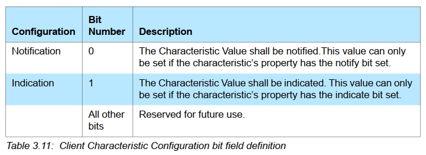
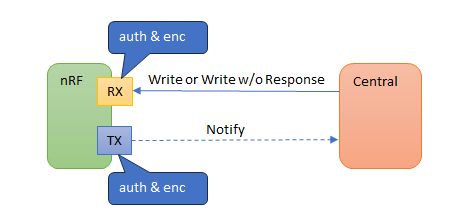
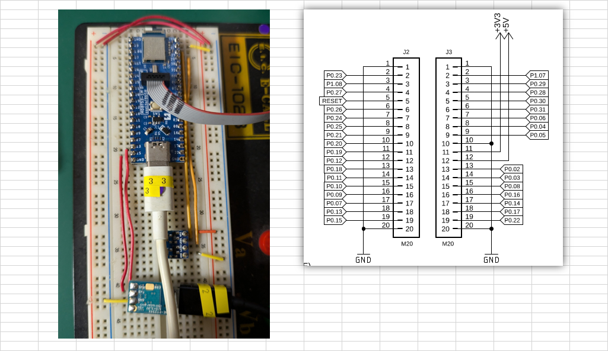
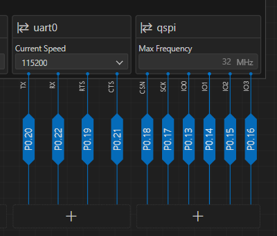
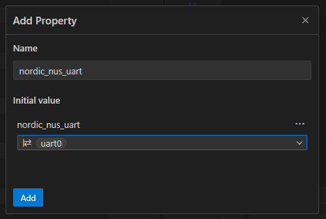
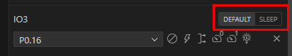

# BLE基礎 (12)

<i>2024/08/23</i>

## Lesson 4 

### [Exercise 2](https://academy.nordicsemi.com/courses/bluetooth-low-energy-fundamentals/lessons/lesson-4-bluetooth-le-data-exchange/topic/blefund-lesson-4-exercise-2/)

Exercise 1 では LBS に Button の Read、LED の Write を付けた。  
今回は Notify と Indicate を付けるようだ。
LBS は Button の Indicate だけなのだが、別の Characteristic "MYSENSOR" を追加してダミーデータを定期的に notify するところまでこの Exercise に入っている。

* Indicate の追加は、READ の Characteristic の設定に追加 & CCCD
  * bit fieldの変更
    * `BT_GATT_CHRC_READ | BT_GATT_CHRC_INDICATE`
    * V5.1, Vol 3, Part G, "3.3.1.1 Characteristic Properties"
  * Client Characteristic Configuration Descriptor(CCCD)の追加
    * V5.1, Vol 3, Part G, "3.3.3.3 Client Characteristic Configuration"
    * Notify/Indicate できるかどうかは property の bit で設定している
    * Central は CCCD に書き込んで Notify/Indicate する/取りやめを設定できる(CCCD が WRITABLE の場合)
    * CCCD のデフォルト値は `0x0000`("3.3.3.3"より)
  * [Button Characteristic](https://docs.nordicsemi.com/bundle/ncs-2.6.1/page/nrf/libraries/bluetooth_services/services/lbs.html#button_characteristic_00001524-1212-efde-1523-785feabcd123)では Indicate ではなく Notify になってるな
    * [実装](https://github.com/nrfconnect/sdk-nrf/blob/v2.6.1/subsys/bluetooth/services/lbs.c#L38)も`BT_GATT_CCC_NOTIFY`だけ見ている
      * LBS ではなく MY_LBS だから深くは考えまい
    * [Attribute table](https://academy.nordicsemi.com/courses/bluetooth-low-energy-fundamentals/lessons/lesson-4-bluetooth-le-data-exchange/topic/attribute-table/)の方では「Indicate:0x01」「Notify:0x02」になっている。
      * "Notification(`bit0`)" or "Indication(`bit1`)" 
      * 
  * `BT_GATT_CCC()`で指定したコールバック関数で Notify/Indicate の有効・無効をチェックしているが、property で `BT_GATT_CHRC_INDICATE` にしてコールバック関数では `BT_GATT_CCC_NOTIFY` をチェックするようにしてもよいのだろうか？
    * こういう、普通は間違えないけど間違ったら発見に時間がかかりそうなやつは事前にテストできると良いのだが
  * `ind_params.attr = &my_lbs_svc.attrs[2];`
    * `2` というマジックナンバーはなんとかできんだろうか。
    * [本家LBS](https://github.com/nrfconnect/sdk-nrf/blob/v2.6.1/subsys/bluetooth/services/lbs.c#L132)も`2`と書いているし仕方ないのか
    * しかし、ハードコーディングできるということは事前に知ることも可能なはずだ
      * Exercise 5.2 に書いてあったデバッグした値
        * `attrs[0]`: Service Declaration
        * `attrs[1]`: Button Characteristic Declaration
        * `attrs[2]`: Button Characteristic Value
        * `attrs[3]`: CCCD
        * `attrs[4]`: LED Characteristic Declaration
        * `attrs[5]`: LED Characteristic Value
      * `BT_GATT_SERVICE_DEFINE()`に定義
        * `BT_GATT_PRIMARY_SERVICE`(`0`)
        * `BT_GATT_CHARACTERISTIC(BUTTON)`
          * これが "declaration"(`1`) と "value"(`2`) になる
        * `BT_GATT_CCC`(`3`)
        * `BT_GATT_CHARACTERISTIC(LED)`
          * これも "declaration"(`4`) と "value"(`5`) になる
      * 対応はつくが、確かに`2`としかいいようがないな
      * 関係ないけど`BT_GATT_CCC()`は BUTTON とか LED とかの指定はないが、UUID が `0x28xx`や`0x29xx` は次の `0x2800` などが出てくるまで同じ service グループとみられるのかな。
  * nRF Connect for Mobile が知らない UUID は "Unknownなんちゃら" と表示される
    * Characteristic User Description(V5.1, Vol.3, Part G, 3.3.3.2) を設定しておけば表示されるんじゃなかろうか

### [Exercise 3](https://academy.nordicsemi.com/courses/bluetooth-low-energy-fundamentals/lessons/lesson-4-bluetooth-le-data-exchange/topic/blefund-lesson-4-exercise-3/)

LBS をサンプルにするのは前回までで、これは NUS(Nordic UART Service)を使う。
USBのバルク転送みたいなもので、適当にデータの送受信がをするだけの service である。
BLEなのでそこまで速度は出せないだろうが、115kbps みたいな通常の UART よりも速いだろう。

RX の方が Write/Write without Response で、TX の方が Notify になっている。  
普通の UART だとお互いの RX と TX をクロスして接続するのだが、ここは BLE だ。

* RX に Write するのは Client、 Server はそれを読み込む。
* TX は Notify なので Server が送信し、Client がそれを読み込む。



このサンプルは USB を使うようになっている。
また [UART0](https://docs.nordicsemi.com/bundle/ug_nrf5340_dk/page/UG/dk/vir_com_port.html) は Nordic DK では [SEGGER MCU](https://docs.nordicsemi.com/bundle/ug_nrf5340_dk/page/UG/dk/if_mcu.html)を介して USB-CDC につながっているらしい。
ログも USB-CDC で出力しているのだがどうなるんだ？ 
いや、そもそも UART0 とつながっていないからいいのか。
そもそも、NordicDK からは UART になっているならアプリで USB を使うようにする必要はないのでは？ 
いろいろわからんが、SEGGER を接続すると USBシリアルポートも増える理由は分かった。

#### UART

その代わり、評価ボード[nRF5340 MDBT53-1Mモジュールピッチ変換基板](https://www.switch-science.com/products/8658)には LED とボタン以外接続していないので、そちらの準備が必要か。
`P0.13`を TxD、`P0.15`を RxD として使うことにした。
ブレッドボードの都合である。



USBシリアル変換は確か秋月通商で購入したものだ。
5Vピンがあったので入力かと思ってしまったが、USBケーブルを接続するからその 5Vから電源を取れるようになっていた。
MDBT53ボードにも USB接続をしているので不要だとは思うが GND はつないでおく。

これに USBシリアルの接続だけするとなぜか MDBT53ボードが動き出す。。。
どこから電源取ってるの？  
抜き差ししてみたが、USBシリアルの TxD と MDBT53ボードの `P0.15` だった。
RxD は 2.5Vくらい、TxD は 3.2V くらいで、RxD の方を `P0.15`とつないでも動作しなかったし、TxD の方を `P0.13`とつなぐと動作した。
なので単に電圧だけなんだろうが、それだとアクティブHIGH のピンだと電源が入ってしまうよなあ。

Devicetree Visual Editor で見てみたが、特にそれらがどうということもなさそうだ。



信号の IN と OUT を間違えたとかならそこまで心配しないけど、電源関係はちょっとねぇ。
回路図を見る限り`P0.15`などは Nordic のピンと直結しているだけだから大丈夫だとは思うが。

#### 本編

UART のことはいったん忘れて Exercise に戻る。

NUS は ncs に `CONFIG_BT_NUS=y` を追加することで使えるようだ。
そういえば LBS はそういう設定無しで使えるのだが、この違いは何だろう？
と思ったら、LBS も `CONFIG_BT_LBS` があるのだね。記憶から抜けていた。。。

```cmake
zephyr_sources_ifdef(CONFIG_BT_NUS nus.c)
zephyr_sources_ifdef(CONFIG_BT_NUS_CLIENT nus_client.c)
zephyr_sources_ifdef(CONFIG_BT_LBS lbs.c)
```

それにしても `prj.conf` に最初から書いてある設定が多い。
Exercise では `CONFIG_BT_NUS` しか追加しないが、`CONFIG_BT_NUS_AUTHEN`や`CONFIG_BT_NUS_SECURITY_ENABLED` など NUS関係と思われる設定が既にある。
`CONFIG_FLASH`とか`CONFIG_FLASH_PAGE_LAYOUT`とか、急になんで出てくるかね。

* TX も RX も authentication & encryption(AUTHEN) を有効にもできるのだが、その辺は次の Lesson でやるので今回は `CONFIG_BT_NUS_AUTHEN=n` で無効にする
* TX Characteristic は同時接続できるらしい
  * 
* `BT_ADDR_LE_STR_LEN` = 30 なのだが、どういう値だ？
  * `xxxx:xxxx:xxxx:xxxx:xxxx:xxxx\0` = 30
* `DEVICE_DT_GET(DT_CHOSEN(nordic_nus_uart))`でビルドがエラーになった
  * `nordic_nus_uart`は device tree のラベルかな？
  * `DT_CHOSEN()`ということは[solution](https://github.com/NordicDeveloperAcademy/bt-fund/blob/main/lesson4/blefund_less4_exer3_solution/boards/nrf52840dongle_nrf52840.overlay#L10)のまねをして`nordic,nus-uart`を書くのかな？
  * 
* qspi を削除して uart0 を有効にしたためか立ち上がらなかった
  * ピンの設定だけ外した
  * DEFAULT と SLEEP をそれぞれやらないといかんのは忘れやすいよね
    * 

ビルドは通ったのだが起動しない。。。

* Debug にすると、ブレークポイントを設定しなくても `main()` まで呼ばれるようなら自動的に `main()` で一度止まる。
* そこまで行かなかったので、DeviceTree の設定がどこかよくなかったか。
* デバッグしようとしても HardError とか nrfjprog が exit 33 とかで動かなくなってしまった。

今日は疲れたので後日！
