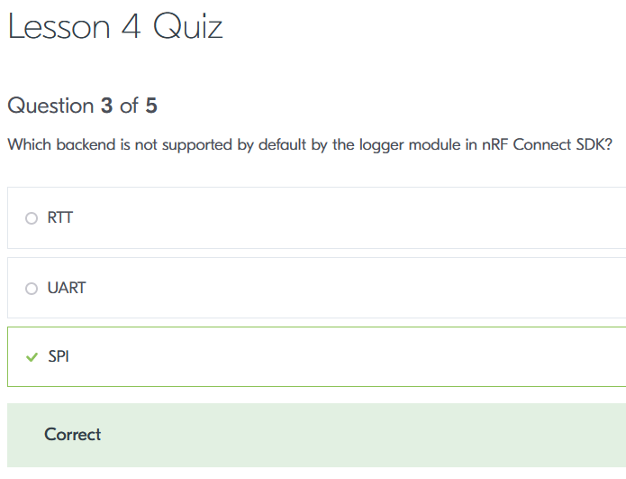

# ncs: LOG

<i>2024/08/25</i>

[前回](./20240822-ble.md)は DevAcademy で NUS(Nordic UART Service) の exercise をしているところだった。
評価ボード[nRF5340 MDBT53-1Mモジュールピッチ変換基板](https://www.switch-science.com/products/8658)で UART を使ったことが無かったので、どこが失敗しているのかよくわからなくなっていた。

NUS を進める前に DevAcademy の Fundamentals で基礎的なところをやっておこう。

## [Lesson 4 – Printing messages to console and logging](https://academy.nordicsemi.com/courses/nrf-connect-sdk-fundamentals/lessons/lesson-3-printing-messages-to-console-and-logging/)

ログ出力である。

nRF53 DK などの DevKit は `uart0` をオンボードの Segger J-Link と接続してあり、J-Link の方で USBシリアルに変換しているとのこと。
デフォルトのログ出力も `uart0` になっている。
なお nRF53 には app と net の 2コア構成のため、DK はそれぞれ `uart0` と `uart1` を[接続している](https://docs.nordicsemi.com/bundle/ug_nrf5340_dk/page/UG/dk/vir_com_port.html)そうだ。  
オンボードではない J-Link を使っているが、そちらは VCOM0 だけしかない。オンボード版はその辺をカスタマイズできるのか。

### [Exercise 1](https://academy.nordicsemi.com/courses/nrf-connect-sdk-fundamentals/lessons/lesson-3-printing-messages-to-console-and-logging/topic/exercise-1-4/)

Exercise 1 をやってみたが、やはり前回と同じ設定では `main()` までたどり着かなかった。  
デバッガが reset.S で止まったのだが、そこで止まっていてもなんだかわからんよという箇所だった。

* [ボード定義](https://github.com/hirokuma/ncs-custom-board/commit/f52691b7d6ba828918daa73f2b9ba2dafcf540d0)を少し変更した
  * 重複した設定の削除なので、これはおそらく影響ないと思う。
  * が、そういうのがよくわからんのよね。。。
  * overlay があるためかもしれないが、ボード定義ファイルたちの中に同じ設定が複数箇所あってもエラーにならないようなのだ。
* [Exercise 1](https://github.com/hirokuma/ncs-fund/commit/f6a8f2f7cc906d02711ba47c0b8afc6b7bb79251)はこんな感じ
  * アプリよりも DeviceTree ファイルの方がメインだ
    * `chosen`で`zephyr,console = &uart0`を設定？指定？した
      * これは[ボード定義](https://github.com/hirokuma/ncs-custom-board/blob/f52691b7d6ba828918daa73f2b9ba2dafcf540d0/boards/arm/ssci086585_nrf5340/ssci086585_nrf5340_cpuapp_common.dts#L12)で既にやっているのでなくてもよい
      * USBシリアルを使う定義の時は[こう](https://github.com/hirokuma/ncs-custom-board/blob/f52691b7d6ba828918daa73f2b9ba2dafcf540d0/boards/arm/ssci086585_nrf5340/ssci086585_nrf5340_cpuapp_common_usb.dtsi#L5)していたので名残のようなものだ
      * MDBT53ボードは UART はあまり標準って感じじゃないので `chosen` の設定を外しておいた方が間違いがないだろうか？

とりあえず、この設定で`printk()`でのログ出力を`uart0`に出すことができた。

LED とボタンは `dk_buttons_and_leds` ではなく自分で DeviceTree の設定を取得して使うようになっていた。
ncs の使い方をやってるのだからそうじゃないとね。

###  [Exercise 2](https://academy.nordicsemi.com/courses/nrf-connect-sdk-fundamentals/lessons/lesson-3-printing-messages-to-console-and-logging/topic/exercise-2-4/)

Exercise 1 では `printk()` で文字列を出力するとそのまま出力されるサンプルだった。  
Exercise 2 はそのリッチ版である。

* タイムスタンプ付き
* ログレベルに応じて色付け
* HEXダンプ

私は TeraTerm を使っているが、ちゃんと色つきで出力された。

関係ない話だが、vscode で ncs アプリを開くとソースコード管理がプロジェクトを開いたフォルダではなく ncs の west が管理している方が出てくる。
[Source control UI](https://docs.nordicsemi.com/bundle/nrf-connect-vscode/page/reference/ui_source_control.html)にもそう書いてあるのだが、カレントディレクトリも west manifest に含めないとここに表示されないということなのか？  
でも、ncs は ncs だしアプリはアプリだしで、ncs と混ぜ込まなくてよいと思うのだがなあ。
せめて切り替えたりできればよいのに。

### [Exercise 3](https://academy.nordicsemi.com/courses/nrf-connect-sdk-fundamentals/lessons/lesson-3-printing-messages-to-console-and-logging/topic/exercise-3-4/)

これはやるだけ。

* 色無し
* 付加情報を最小限にする
  * タイムスタンプ無し
  * ログレベルは1文字(`<inf>` --> `I` など)

### Quiz

Lesson の最後はクイズでちゃんとやったか確認する。

といっても、別に次に進めないわけでもないので適当にやっている。
そして、あまり問題を読まずにこたえて間違っている。。。

例えばこんなの。

「デフォルトはUARTよね？」で最初間違えたのだが、よく見ると「デフォルトではサポートしていない」のをこたえるのだ。  
いやあ、よく読まないとダメだねぇ。

[Fundamentals Lesson 4](https://github.com/hirokuma/ncs-fund/tree/da75e53b683367bd744f8f5f454a0e9121ea8073)だけやったので、また BLE に戻ろう。
