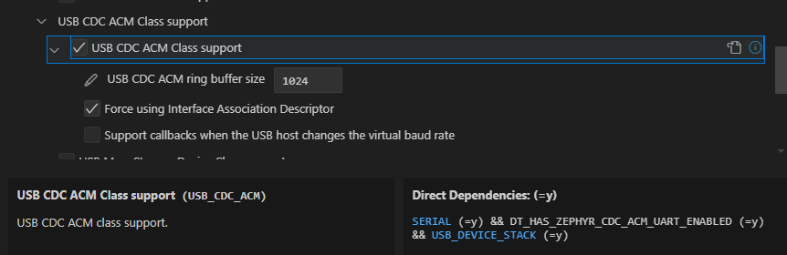
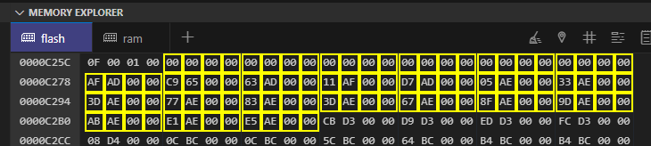

[前回](20240827-ncs.md)の続き。

DevAcademy Lesson 5 Exercise 1 は、nRF が UART で "1" or "2" or "3" を受信すると該当する LED をトグルさせるという動作を行う。

`uart0` だけでやった場合には動作する。  
なのに DTSファイルで `zephyr_udc0`のプロパティを設定しただけで動かなくなるという現象に悩まされている。

やりたいのは、ログ出力は USBシリアルで吐き出して、UART はそれと関係なく使うというだけ。

## 再実験

non-secure が関係するかどうかを考えたくないので `cpuapp`と`cpuapp_usb`だけで考える。  
「USBシリアル」は nRF の USB-CDC を指している。

### USBを有効にしたボード定義ファイル

* `cpuapp_usb`をそのまま使う
  * 結果: NG
    * USBシリアルにはログが出力される
    * `uart_callback_set()`で`-88`が返る

### USBを有効にしたボード定義から`zephyr_udc0`を無効にする

* `cpuapp_usb`から`zephyr_udc0`の設定をコメントアウトする
  * それだけだとダメなので`chosen`で`zephyr,console = &uart0`を設定
  * 結果: OK
    * USBシリアルは無効
    * UART 側にキー入力をしたら LED がトグルする

### USB無効のボード定義に`zephyr_udc0`だけ追加する

* `cpuapp`にoverlayで`zephyr_udc0`を追加
  * `zephyr,console`はそのまま(なので`uart0`を参照している)
  * 結果: OK

### USB無効のボード定義に`zephyr_udc0`と`CONFIG_USB_DEVICE_STACK=y`を追加

* 1つ上の環境に対して`prj.conf`に`CONFIG_USB_DEVICE_STACK=y`を追記するだけ
  * 結果: NG
    * UART 側にログが出ていた
    * UART 側に `uart_callback_set()`で`-88`が出力されていた

## 再実験の振り返り

USBが有効な状態で`zephyr_udc0`だけ削除したら動作したので`zephyr_udc0`に原因があるかと考えていたが、そうではないようだ。
しかし[CONFIG_USB_DEVICE_STACK](https://docs.nordicsemi.com/bundle/ncs-2.6.1/page/kconfig/index.html#!%5ECONFIG_USB_DEVICE_STACK$)も関係するということは、設定だけではないということだ。

`CONFIG_USB_DEVICE_STACK`を有効にすると、`CONFIG_SERIAL`も有効で`zephyr_udc0`も設定しているので自動的に[CONFIG_USB_CDC_ACM](https://docs.nordicsemi.com/bundle/ncs-2.6.1/page/kconfig/index.html#!%5ECONFIG_USB_CDC_ACM$)も有効になるのだろう。



### issue 1

これを読むと、UART2 は CDC ACM に、UART3 は普通に UART に使うということが書かれている。

[nRF5340: issue with USB CDC ACM and UART driver running in parallel - Nordic Q&A - Nordic DevZone - Nordic DevZone](https://devzone.nordicsemi.com/f/nordic-q-a/105599/nrf5340-issue-with-usb-cdc-acm-and-uart-driver-running-in-parallel)

`cdc_acm_uart`のサフィックスに付いた数字が `uart` のサフィックスと対応しているということ？
この人の場合、エラーは`ENOSYS`ではなく`ENOSETUP`なので前提は異なるものの、割り当てが違うのならエラーが違ってもおかしくはないのか。

試しにこうやると、USBシリアルが 2つになった。
`zephyr,console`に`cdc_acm_uart0`を指定した場合と`cdc_acm_uart1`を指定した場合でちゃんと出力先も切り替わっている。

```devicetree
&zephyr_udc0 {
	cdc_acm_uart0: cdc_acm_uart0 {
		compatible = "zephyr,cdc-acm-uart";
	};
	cdc_acm_uart1: cdc_acm_uart1 {
		compatible = "zephyr,cdc-acm-uart";
	};
};
```

では`cdc_acm_uart1`だけにするとどうなるかというと、`uart_callback_set()`のエラーが`-88`になったままである。

そもそも、`printk()`でログをUSBシリアルに吐き出していたときは UART の設定はしていないのに使っていた。
`zephyr,console`に`uart0`でも`cdc_acm_uart0`でも設定できるなら、UART のアクセスも `uart0` ではなく `cdc_acm_uart0` でやればよい。

なのでこの人も、`uart2` を CDC ACM に割り当てているわけではなく、単に CDC ACM と UART の両立に失敗しているだけなのかも？
ああ、でもエラー値が違うな。
10ヶ月も前なので、ncs v1 とかで状況が違うのかもしれん。

[uart_callback_set() v2.6.1](https://github.com/nrfconnect/sdk-zephyr/blob/v3.5.99-ncs1-1/include/zephyr/drivers/uart.h#L1240-L1259)

ここの issue に回答した人によると、CDC ACMドライバは ASYNC APIをサポートしていないのでコールバックを設定しようとすると`ENOSETUP`を返すと答えているけれども、今の実装を見ると `CONFIG_UART_ASYNC_API`が未定義だったら`-ENOTSUP`になっている。
うちの`-88`は`api->callback_set == NULL`によって`-ENOSYS`が返っているのだ。

### issue 2

ならば、こちらの issue はどうだ。
nRF52840 だが ncs v2.4 なので最近だし、なにより抜粋してある`uart_callback_set()`が同じ実装だ。  
そして戻り値は`-ENOSYS`。文句なしだろう。

[Cannot get Async UART0 to work with USB CDC - Nordic Q&A - Nordic DevZone - Nordic DevZone](https://devzone.nordicsemi.com/f/nordic-q-a/106129/cannot-get-async-uart0-to-work-with-usb-cdc)

ちょっと疑わしいのは、前の解答にもあった CDC ACM は Async API をサポートしないという件だ。
`uart_callback_set()`は非同期のコールバックを設定するAPIなので、非同期に仕様としていないなら`#else`のルートで無条件のエラー(`-ENOTSUP`)、それ以外は`api->callback_set`を見て対応しているかどうか判定、ということになってるのではなかろうか。  
と思ったが、`uart_callback_set()`は`uart0`に対しての指示だから CDC ACM は関係ないか。  
ちなみにこの issue の人は CDC ACM に対して `uart_callback_set()` しているので、まあ妥当な結果だろう。

### 自分のコード

`cdc_acm_uart0`はそのままにして`uart0`の設定を`uart1`を有効にして振り替えた。  
はい、ダメ。

`usb_enable()`を`uart_callback_set()`より後で呼ぶようにした。  
はい、ダメ。なにも出力されない。

それなら次に疑うのは、アプリから`DT_NODELABEL(uart0)`で取ってきているけど、実はこれが UART ではなく CDC ACM にすり替わっている、とかか。  
あり得るのか？

`uart->name`は`uart@8000`だった。
これは`uart0`の開始アドレスと一致したので、すり替わっているわけではないだろう。

`uart->api`が`struct uart_driver_api*`型なのでキャストしてダンプしてみる。
`callback_set`を含め[この辺](https://github.com/nrfconnect/sdk-zephyr/blob/v3.5.99-ncs1-1/include/zephyr/drivers/uart.h#L338-L349)は全部`0x00`だった。
それ以降には値が入っていたので、ポーリングなんかはできるんだろう。  
ちゃんと動くときは`callback_set`には`.text.uarte_nrfx_callback_set`のアドレスが入っていた。
箇所としては[uart_nrfx_uarte.c](https://github.com/nrfconnect/sdk-zephyr/blob/v3.5.99-ncs1-1/drivers/serial/uart_nrfx_uarte.c#L1694)である。

`UARTE_ANY_ASYNC`マクロで ifdef している。
ビルドして焼いてみるとこのインスタンス`uart_nrfx_uarte_driver_api`が既に `0x00` になっていた。
grep すると `CONFIG_UART_0_ASYNC`の方が出てこなかったので、そのせいで `UARTE_ANY_ASYNC` が未定義になり `callback_set` に `0x00` が代入されることになったのだろう。



よし、まあまあ進展した。  
[CONFIG_UART_0_ASYNC](https://docs.nordicsemi.com/bundle/ncs-2.6.1/page/kconfig/index.html#!%5ECONFIG_UART_0_ASYNC$)については次回だ。
