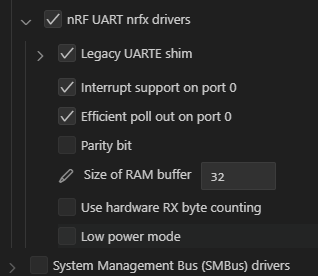
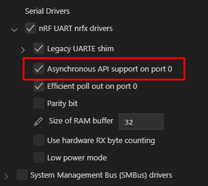
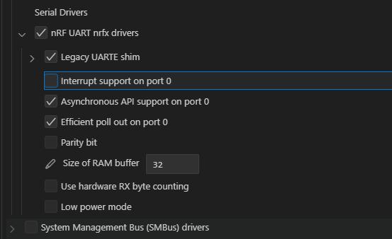

[前回](20240828-ncs.md)の続き。

## あらすじ

* DevAcademy [Fundamentals Lesson 5 - Exercise 1](https://academy.nordicsemi.com/courses/nrf-connect-sdk-fundamentals/lessons/lesson-4-serial-communication-uart/topic/exercise-1-5/)
* USB CDC ACM を有効にすると UART の ASYNC API を使うことができなくなった
* `CONFIG_UART_0_ASYNC`が無効になっているようだった

## [CONFIG_UART_0_ASYNC](https://docs.nordicsemi.com/bundle/ncs-2.6.1/page/kconfig/index.html#!%5ECONFIG_UART_0_ASYNC$)

こちらが USB CDC ACM を有効にしている場合の Kconfig。

そしてこちらが無効な場合の Kconfig。

ASYNC の項目すら出てきていない。
その代わり USB CDC ACM が有効な場合は `UART_0_INTERRUPT_DRIVEN` が有効になっている。  
では、それを無効にしてしまえば。。。

出てくるじゃないか！

しかしボード定義ファイルにも[CONFIG_UART_0_INTERRUPT_DRIVEN](https://docs.nordicsemi.com/bundle/ncs-2.6.1/page/kconfig/index.html#!%5ECONFIG_UART_0_INTERRUPT_DRIVEN$)については設定していないので、自動的に有効にされたことになる。  
原因は[CONFIG_UART_INTERRUPT_DRIVEN](https://docs.nordicsemi.com/bundle/ncs-2.6.1/page/kconfig/index.html#!%5ECONFIG_UART_INTERRUPT_DRIVEN$)のようで、USB CDC ACM 有効の場合は誰かに`=y`設定され、そうでない場合は未設定になっていた。
このページの "Selected by" にあるように `CONFIG_USB_CDC_ACM` などのためだろう。

わざわざ有効にしているからには意味があるに違いない。
ここは`CONFIG_UART_0_INTERRUPT_DRIVEN=n`だけに限定しておくのが無難か。

変更すると、ちゃんと動いた。
よかった。

[commit](https://github.com/hirokuma/ncs-fund/commit/d2ece5c687636ec7d69ce2f908bb69f85cd52e78)
