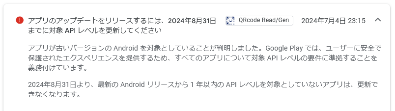
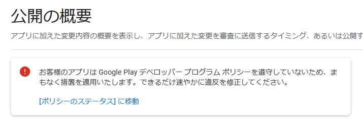

# android: APIレベル更新

<i>2024/09/02</i>

AndroidアプリをGoogle Playに更新している場合、毎年8月31日が[対象APIレベルの更新期限](https://support.google.com/googleplay/android-developer/answer/11926878?hl=ja)となっている。  
今回は API 34 である。

わかりづらいが「アプリのアップデートをリリースできなくなります」なのだ。
なので、影響があるのはこれらで、これらについては毎年8月31日以降は対象APIレベルを更新しなくてはならない。

* まだ公開していないアプリ
* 公開しているアプリのアップデート

既に公開済みのアプリについても制約がある。
今回だと。。。

* API 31(Android 12) 以前のアプリは 2024年8月31日以降は OS の API レベルよりも高い「新規ユーザー」からはアクセスできない
* API 30(Android 11) 以前のアプリは 2023年11月1日以降は OS の API レベルよりも高い「新規ユーザー」からはアクセスできない

分かりづらいが、アップデートする気がなくても 2年に 1回は APIレベルの引き上げを行わないと新規ダウンロードはできないという意味だと思う。

[Google Play の対象 API レベルに関するポリシー](https://support.google.com/googleplay/android-developer/answer/11917020?hl=ja)

「新規ユーザー」は、また端末にそのアプリをインストールしていないユーザーということだろう。
一度でもインストールしたことがあれば再インストールもできるようだ。
アカウントだけではなく端末とセットで紐付くことになるが、OS のリセットをするとさすがにダメなんじゃなかろうか。

----

私が公開している[QRCode Read/Gen](https://play.google.com/store/apps/details?id=com.hiro99ma.qrgenread)

このアプリは API 33 のままだが、9月2日現在でもインストールできた。  
Google Playアプリからインストールできたが、検索して出てくるかどうかは分からなかった。
「pub:hiro99ma」で出てきたので大丈夫な気はするが、「誰でも見える」「インストールしていれば見える」みたいな状態があるので、わかりづらい。

1年前もこの件を気にしていたのだが、いろいろ忘れているうちに対応してしまっていた。

* 2023/09/17 [Android API33に対応してなかったアプリ](https://hiro99ma.blogspot.com/2023/09/qr-qr-qrcode-readgen-google-play.html)

今回は既に期限が切れた後である。

では、API 33 のまま Google Play Console にリリースしてみよう。

[commit](https://github.com/hirokuma/android-qrcode-genread/commit/7cf7c5c0622aa15cbd651f211781d8f39cbdc046)

* 内部テスト: OK
  * 審査がないのですぐに反映される
* 内部テストからクローズドテストへのプロモート後、審査に出す
  * いまはクイックチェックのプログレスバーみたいなのが表示されるんやね
  * クイックチェックはOKだったので審査待ち
  * 審査もOKだった
* クローズドテストからオープンテストへのプロモート後、審査に出す
  * こちらにはクイックチェックはなかった。クローズドで一度やったから？
  * 審査が終わったがOKだった。。がオープンテストのトラックが一時停止になっていた
  * 再開の審査もOKのようだ。
* オープンテストから製品版へのプロモート後、審査に出す
  * 審査も通ってしまった。。

Google Playのサイトを見たが、最終更新日が今日になっている。
ブラウザのプライベートウィンドウでもそうだったので、開発者以外からもそう見えているはずだ。

「まもなく措置を適用いたします」と書いているので、今はまだ期限を過ぎたばかりなので猶予期間みたいなものなのかな？

「アップデートできなくなる」は開発者が Google Play Console でアップデートできなくなるのではなく、そのアップデートしたアプリをユーザーがインストールできなくなるという意味かもしれない。
それだったら操作自体ができたことはおかしいことではない。
失敗するとしたら 2世代前の APIレベルでアップしようとしたときだろう。まあ面倒なので試さないが。

このまましばらく様子を見てみよう。
