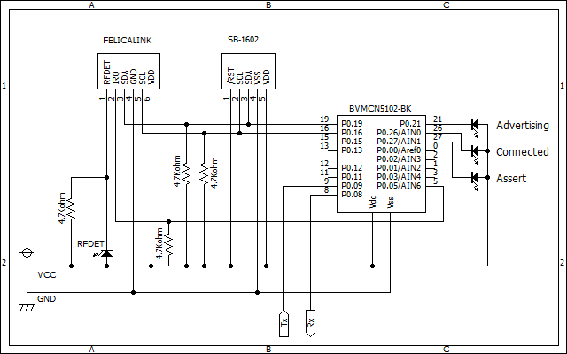
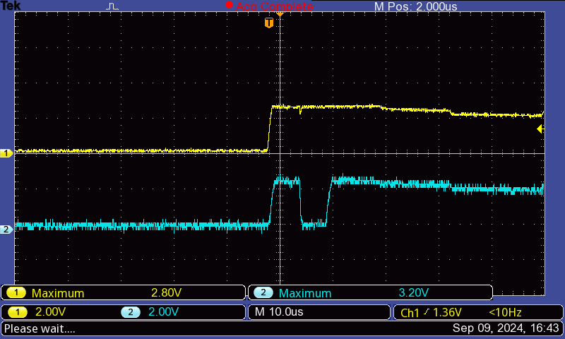
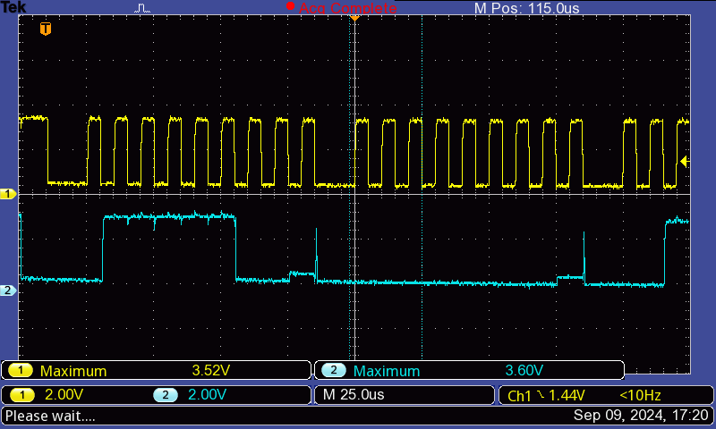
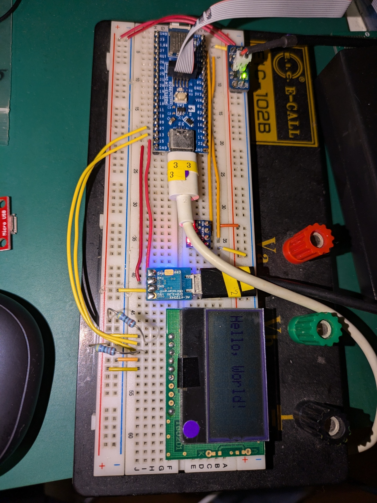

# ncs: I2C

<i>2024/09/09</i>

前回、DevAcademy Fundamental の内容を I2C 以外終わらせた。  
I2C はデバイスのありかが見つからなさそうなのでやらないつもりだったが、記事と部品が出てきた(画像がないのは、間違ってGoogleドライブから削除したため)。

[hiro99ma blog: \[nrf51\]SB1602はあっさり動いた](https://hiro99ma.blogspot.com/2015/04/nrf51sb1602.html)

部品はこちらで、SB1602B という名前。

[I2C低電圧キャラクタ液晶モジュール(16x2行) - SB1602B - Strawberry](https://strawberry-linux.com/catalog/items?code=27001)

## I2C

物理的な線の本数が少なくて済む I2C はそこまで高速さを求められない部品でよく使われている。
RTC、センサー、不揮発メモリの一部などなど。  
2本の線はデータとクロック。

1線の通信規格も別にあるが、あれは電圧と電流で使い分けるとかだっけ。
SIMなんかはそうだったと思うが制御したことないのでよくわからない。

SPI は 4線になるのか。  
3線シリアル(CSI)という仕様を使ったことがあるのだが、あれは NEC系のチップだっただろうか。

## I2C と TWI

Nordic のドキュメントでは I2C と書かずに [TWI(Two-Wire Interface)](https://academy.nordicsemi.com/courses/nrf-connect-sdk-fundamentals/lessons/lesson-6-serial-com-i2c/topic/i2c-protocol/)と書かれていて「I2C互換」となっている。  
実質 I2C なのだが微妙に仕様が違うのだろうか。
あるいは I2C は Phillips Semiconductors の登録商標です、みたいなことだろうか。

[wikipedia](https://ja.wikipedia.org/wiki/I2C)によると今はロイヤリティフリーらしい。
では厳密には仕様がちょっと異なるとかか。

[zephyerではI2C](https://docs.nordicsemi.com/bundle/ncs-latest/page/zephyr/hardware/peripherals/i2c.html)だが [nrfxではTWI](https://docs.nordicsemi.com/bundle/ncs-2.6.1/page/nrfx/drivers/twi/index.html)ということか。
nrfx は SoftDevice 時代からの名残かもしれないとも思ったが、API名はともかく引数が違う。
[nRF5 SDKをベースにしている](https://docs.nordicsemi.com/bundle/ncs-2.6.1/page/nrfx/index.html)ようなことは書かれているが、私が使っていない API系統があっただけかもしれない。  
ただ[Driver support matrix](https://docs.nordicsemi.com/bundle/ncs-2.6.1/page/nrfx/drv_supp_matrix.html#nrfx_drv_supp_matrix_1nrfx_drv_supp_matrix_table)によると nRF5340 では TWI をサポートしないそうだ。

基本的に Zephyr のドライバーを使い、どうしようもないときは nrfx を使うというやり方が良いということか。

## 個人的な愚痴

私としては、I2Cデバイスは難しいものだと思っている。

* プルアップがいるし、抵抗値を間違えるとうまく動かない
* ロジアナをつないでもだいたい信号が取れない
* 説明書でアドレス値が 8bit で書かれていることがある

回路図を渡されて抵抗値が書かれているならわかるが、こういう部品は「プルアップ抵抗を付けてください」くらいしか書いていない。
作りたい回路なんて人それぞれだし、I2C は複数デバイスをつなぐことができるのでその数で違ってきそうな気もするから仕方なさそうだ。

仕事ならハード屋さんがいるので頼むのだが、個人でブレッドボードでやっているくらいだと手持ちの抵抗の種類もそんなにないので選択肢が少ないし、そもそも抵抗値の加減がよくわからない。  
たしか 4.7kΩくらいを使ってたんじゃなかったか。
大きすぎると波形が鈍って、小さすぎるとそれはそれでダメだった記憶がある。

「ロジアナをつないでも」というのは、信号が取れない立ったか、つなぐと通信がダメになるだったかのどっちかだったと思う。  
たしか、入力インピーダンスの都合でロジアナ側に信号が吸い取られる？とかそんな説明をしてもらった気がする。
なので計測するならオシロスコープの方がよかったはず。  
そう思って[オシロスコープを購入](https://hiro99ma.blogspot.com/2019/03/blog-post.html)していたのだが、お仕事が組み込みじゃなくなったのでほとんど使わないままになっている。
もったいない。。。

最後の「アドレス値が 8bit」は八つ当たりというかなんというか。  
I2C の仕様としてはアドレス値は 7bit なのだが(10bitもあるらしい)、実際にデータを流すときには 7bit + R/Wのビット で計8bit使うことになる。
なのでデバイスによっては LSB に OR すればよいよう `0` を追加して 8bit にして表記してあることがあるのだ(ちなみに読込の時に`1`にする)。
悩むのでそういうときは一言書いておいてほしい。

今回の SB1602B の取説はちゃんと 7bit で書かれている。

## SB1602B

電源以外で必要なのが SDA/SCL と ~RST だけなので取り付けるのは簡単だ。  
~RST も動作するなら VDD に吊っておいてもよいそうだし。

液晶コントローラは ST7032i というものらしい。  
幸い制御方法は SB1602B の説明に書かれているので ST7032i の方は読まなくても使うことができる。

## ncs と I2C

### TF-M

I2C と TF-M の UART はベースアドレスがいくつか共用しているため、I2C を使う場合は`CONFIG_TFM_SECURE_UART=n`と`CONFIG_TFM_LOG_LEVEL_SILENCE=y`を設定して無効にするそうだ。  
TF-M は non-secure と名前が付いているやつだ。
使わないなら無視されるだろうし、I2C を使う場合は機械的に書いておけば良いのかな。

## 実験

昔つくった、nRF51822 + FeliCa Link + SB1602B でブレッドボードにつなげていた記録が残っていた。

私にしては野心的なことに 2つの I2C デバイスをつなげていたようだ。記憶にまったく無いが。

nRF5340 と SB1602B だけをつなげた回路を作り、DevAcademy の Exercise をまねしてプログラムを作った。
プルアップ抵抗は当時と同じく 4.7kΩにした。  
初回の`i2c_write_dt()`で`-EIO(-5)`が返ってきたので、何かダメなのだろう。
エラー値の意味は[Zephyr Error numbers](https://docs.zephyrproject.org/apidoc/latest/group__system__errno.html)を参照だ。

せっかくなのでオシロスコープを引っ張り出した。

横軸は1メモリで 10usec なので 100kHz。
I2C のスタンダードモードであれば妥当ではあるが、だとしても 1クロック分しか出ていない。  
それに SDA の方は立ち下がっていないのでスタートコンディションになっていない。

これはプルアップ抵抗がどうのこうのではないと思う・・・と書いたところで勘違いに気付いた。  
「プルアップ抵抗」と自分で書いているにもかかわらず SDA/SCL の接続に抵抗を挟んでいたのだ。プルアップしてない。。

VDD と SDA/SCL をそれぞれ 4.7kΩ の抵抗でつなぐようにするとちゃんと動いてくれた。

テストで作ったプログラムは PC に保存しただけにしていたが、積極的に GitHub に上げていこう。

[commit](https://github.com/hirokuma/ncs-i2c-sb1602b)

SB1602B はバックライトがないのでちょっと見づらい。

MDBT53ボードを端っこにおいているが、これはアンテナを出した方がよいかと思っただけだ。  
しかしこの配置にすると配線が長くなるし、同じ方向に延ばすしかないので線がゴチャゴチャするしでよいことがないな。
