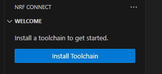
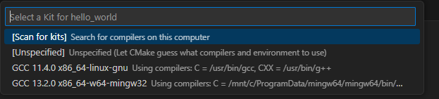

ncs でも単体テストがしたいと思いつつやり方が分からなかったが、ページがあることに気付いた。

[Testing with Unity and CMock](https://docs.nordicsemi.com/bundle/ncs-2.6.1/page/nrf/test_and_optimize/testing_unity_cmock.html)

サンプルは [nrf/tests/unity/example_test](https://github.com/nrfconnect/sdk-nrf/tree/main/tests/unity/example_test) なのでディレクトリごとコピーして作業場所に置き、とりあえず vscode の ncs でビルドした。  
MDBT53ボード設定を選んだのだが、当然のようにエラーになった。

```log
exit.c:(.text.exit+0x34): undefined reference to `_exit'
collect2.exe: error: ld returned 1 exit status
```

`arm-zephyr-eabi` が出しているのだが、ncs 用のプログラムではないので `exit()` は持っていないだろう。

てすとをうご貸すためのコマンドはこのページの下の方にちゃんと載っていた。

```console
west build -b native_posix -t run
```

これは`gcc`を使うのだが、vscode が動く環境にはインストールしていない。  
かといって WSL2 の環境に構築するのも面倒だ。

Chocolatey はインストールしていたので "Mingw-w64" をインストールした。
面倒なことに Chocolatey の `C:\ProgramData\mingw64\mingw64\bin\gcc.exe` だったので `PATH` に追加が必要だった。

ビルドすると`native_posix`はLinux用だというエラーになった。  
まあ、それはそうか。
ちなみに Windowsの場合は `west` などを使うために vscodeの TERMINAL として "nRF Connect" を使う(他の環境は知らない)。

```log
>west build -b native_posix -t run
...
...
-- Found assembler: C:/ProgramData/mingw64/mingw64/bin/gcc.exe
CMake Error at C:/ncs/v2.6.1/zephyr/arch/posix/CMakeLists.txt:4 (message):
  The POSIX architecture only works on Linux.  If on Windows or macOS
  consider using a virtual machine to run a Linux guest.
```

が、Windows用のボード定義はない。。。

VM立ててみたらどうかね、みたいな提案はされているのだが、WSL2 に ncs をインストールしたとしてもテスト以外で使うことはなさそうだし、悩ましい。

こちらは WSL2上で動いた報告。

[Perfect SDK setup in WSL (almost) - Nordic Q&A - Nordic DevZone - Nordic DevZone](https://devzone.nordicsemi.com/f/nordic-q-a/108035/perfect-sdk-setup-in-wsl-almost)

が、そこまでの熱意というか、面倒をやりたくない。  
[native_posix](https://docs.nordicsemi.com/bundle/ncs-2.6.1/page/zephyr/boards/posix/native_posix/doc/index.html) がダメなら、エミュレータ環境で Linux が動けばよいのではなかろうか。
などとも考えたが、Zephyr のボード定義にあるエミュレータで動くのは OS が入っていない素の環境で、そこにビルドした Zephyr OS とアプリをインストールして実行するだけのはずだ。

ならば native系のボードからなんとかすべきか。  
[native_sim](https://docs.nordicsemi.com/bundle/ncs-2.6.1/page/zephyr/boards/posix/native_sim/doc/index.html)は `native_posix`の後継っぽい。
文章中に `zephyr.exe` などと Windowsっぽいファイル名もあるのだが・・・これは単にそういうファイル名にしただけのようだ。
結局コレもビルド中の POSIXチェックでエラーになった。

----

違うアプローチとして、ncs の本体は Windows 側に置いたままで、Toolchain だけ WSL2 にインストールしてしまえば最小限の労力で済むんじゃなかろうか、と思った。  
WSL2からは `/mnt/<ドライブ名>`で参照できるので、ソースコードは Windows側に置いたのを参照したいのだ。

違うシステムからファイルシステムにアクセスするのはどうのこうのだったと思うが、「特殊な理由がない限り、複数のオペレーティング システム間でファイルを操作しないことをお勧めします」なので勧められないが使うことはできるようになっているはずだ。

[ファイル システム間での作業 - Microsoft Learn](https://learn.microsoft.com/ja-jp/windows/wsl/filesystems)

"nRF Connect for Visual Studio Code" は vscode からインストール(extension pack)する。

[Installing the nRF Connect SDK](https://docs.nordicsemi.com/bundle/ncs-2.6.1/page/nrf/installation/install_ncs.html)

Toolchain だけインストールすると、自動で `$HOME/ncs` が選ばれていた。



```console
$ ls ~/ncs
downloads  tmp  toolchains
```

`toolchain/` は複数 OS 環境をサポートするようには見えないので WSL2 の方にインストールされるのはよいだろう。  
問題は SDK の方だが、これは Windows 側のディレクトリ(私の場合は`c:\ncs\v2.6.1`)は nRF Connect for VS Code の設定で指定することにした。
もしかしたらなくても nRF Connect for VS Code が気合いで探してくれるかもしれない。

`"nrf-connect.topdir": "/mnt/c/ncs/v2.6.1"`

毎回 jlink や nrf のツールがないとメッセージが出てくるが、使う予定がないのでもうそれくらいはよい。  
vscode の設定ファイルがネイティブと WSL2 で共用になっているので Profile を別にするのもありだろう。

### hello_world

まずはシンプルな [hello_worldサンプル](https://github.com/nrfconnect/sdk-zephyr/tree/v3.5.99-ncs1-1/samples/hello_world) で試す。  
vscode を開き直すとどの gcc を使うのか聞かれた。
Windows 側で mingw64 をインストールしていたからである。



`native_sim` でビルドするとエラーになった。

```log
$ west build -b native_sim -t run --build-dir build-sim --pristine
...
In file included from /usr/lib/gcc/x86_64-linux-gnu/11/include/stdint.h:9,
                 from /mnt/c/ncs/v2.6.1/zephyr/include/zephyr/types.h:11,
                 from /mnt/c/ncs/v2.6.1/zephyr/include/zephyr/kernel_includes.h:21,
                 from /mnt/c/ncs/v2.6.1/zephyr/include/zephyr/kernel.h:17,
                 from /mnt/c/ncs/v2.6.1/zephyr/arch/posix/core/offsets/offsets.c:26:
/usr/include/stdint.h:26:10: fatal error: bits/libc-header-start.h: No such file or directory
   26 | #include <bits/libc-header-start.h>
      |          ^~~~~~~~~~~~~~~~~~~~~~~~~~
...
```

`native_sim_64` では動いた。

```log
$ time west build -b native_sim_64 -t run --build-dir build-sim --pristine
...
...
*** Booting nRF Connect SDK v3.5.99-ncs1-1 ***
Hello World! native_sim_64
```

ちなみに、ビルドには 5分近くかかっている。

### nrf/tests/unity/example_test

では unity を使ったサンプルを動かしてみよう。

[nrf/tests/unity/example_test](https://github.com/nrfconnect/sdk-nrf/tree/main/tests/unity/example_test)

最初 `ruby` がないということでエラーになったので`sudo snap ruby --classic`でインストールした。

```console
$ time west build -b native_sim_64 -t run --build-dir build-sim
...
*** Booting nRF Connect SDK v3.5.99-ncs1-1 ***
src/example_test.c:20:test_uut_init:PASS
src/example_test.c:31:test_uut_init_with_param_check:PASS

-----------------------
2 Tests 0 Failures 0 Ignored 
OK
PROJECT EXECUTION SUCCESSFUL

real    2m15.709s
user    0m15.012s
sys     0m26.878s
```

`native_posix_64`でもやってみたが、時間はそんなに変わらない。

```console
$ time west build -b native_posix_64 -t run --build-dir build-psx
...
*** Booting nRF Connect SDK v3.5.99-ncs1-1 ***
src/example_test.c:20:test_uut_init:PASS
src/example_test.c:31:test_uut_init_with_param_check:PASS

-----------------------
2 Tests 0 Failures 0 Ignored 
OK
PROJECT EXECUTION SUCCESSFUL

real    2m9.943s
user    0m15.108s
sys     0m27.524s
```
