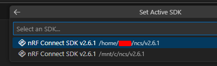

前回の続き。

nRF Connect SDK がサポートする [Testing with Unity and CMock](https://docs.nordicsemi.com/bundle/ncs-2.6.1/page/nrf/test_and_optimize/testing_unity_cmock.html) を試す。

## LED点滅サンプル

LED を点滅させるだけのプロジェクトで試す。  
`main.c` に全部入っているとテストできないので、LED 制御だけを切り出した。

[commit](https://github.com/hirokuma/ncs-blinky/tree/01969ab8d8cfb48e9655db278d54a021900cc1a3)

WSL2 側の nRF Connect ウィンドウ(vscode)からビルドするとエラーになった。

```console
$ west build -b native_posix_64 -t run --build-dir build-posix
...
/usr/bin/ld.bfd: app/libapp.a(led.c.obj): in function `z_impl_device_is_ready':
/mnt/c/ncs/v2.6.1/zephyr/include/zephyr/device.h:750: undefined reference to `__device_dts_ord_29'
/usr/bin/ld.bfd: app/libapp.a(led.c.obj): in function `z_impl_gpio_port_toggle_bits':
/mnt/c/ncs/v2.6.1/zephyr/include/zephyr/drivers/gpio.h:1426: undefined reference to `__device_dts_ord_29'
collect2: error: ld returned 1 exit status
ninja: build stopped: subcommand failed.
FATAL ERROR: command exited with status 1: /home/xxx/cmake --build /mnt/yyy/build-posix --target run
```

`__device_dts_ord_29`となっている行は[ここ](https://github.com/nrfconnect/sdk-zephyr/blob/v3.5.99-ncs1-1/include/zephyr/device.h#L750)なのだが`z_device_is_ready()`になっている。
`z_device_is_ready()`は宣言しかないので、`__device_dts_ord_29`は DTS ファイルのコンパイルか何かで生成されるもの？  
しかし DeviceTree の設定も何もないからリンクできてないということ？

"ord" は文字を文字コードに変換する関数というのが見つかる。
が、`0x29`なら "`)`" で 10進数の 29 だと `0x1d` などあんまり関係なさそうだ。  
Devicetree API の[Inter-node dependencies](https://docs.nordicsemi.com/bundle/ncs-2.6.1/page/zephyr/build/dts/api/api.html#inter-node_dependencies) に "ordering" だの "ordinal" だの `DT_INST_DEP_ORD()` だのとそれっぽいのがよく出てくる。  
nRF53 でビルドした mapファイルだと `_device_list_start`と`_device_list_end` の間にあるのが `__device_dts_ord_<数値>`

`build-posix/zephyr/include/generated/devicetree_generated.h`にこんな定義があった。
29 は GPIO なのでなんだかそれっぽい。

```c
/* Ordinals for what depends directly on this node: */
#define DT_N_SUPPORTS_ORDS \
	1, /* /adc */ \
	2, /* /aliases */ \
	3, /* /can */ \
	4, /* /can_loopback0 */ \
	5, /* /chosen */ \
	6, /* /counter */ \
	7, /* /eeprom */ \
	8, /* /espi@300 */ \
	9, /* /i2c@100 */ \
	10, /* /input-sdl-touch */ \
	11, /* /lvgl_pointer */ \
	12, /* /rng */ \
	13, /* /rtc */ \
	14, /* /sdl_dc */ \
	15, /* /spi@200 */ \
	16, /* /uart */ \
	17, /* /uart_1 */ \
	18, /* /udc0 */ \
	19, /* /cpus */ \
	21, /* /flash-controller@0 */ \
	29, /* /gpio@800 */ \
	30, /* /leds */
```

ということは、テスト環境であっても DeviceTree はそれっぽく作り込まないと動かないということ？

もしかして`CONFIG_UNITY=y`を指定したらうまいことやってくれたり・・・はしなかった。  
これは `-Wl,--wrap=foo` と書いておくと `foo()` を `__cmock_foo()` を呼ぶようにリンカのレベルで置き換えるようだ。  
これはつまり、本体で呼び出す関数を `foo()`、テストコードの中で呼び出す関数も `foo()` と書いていてもテストコードの方だけ置き換えてくれる？？  
そんな器用なことができるのだろうか。。。

`foo()`と`bar()`があって、`foo()`からは`bar()`を呼び出しているので `foo()`のテストでは`cmock_bar()`を使う。  
しかし `bar()`のテストには当然 `bar()`を使いたい。  
そうなるとテストファイル単位で `cmake_bar()` と `bar()` を使い分けることを期待することになる。
もし実行ファイルの単位がテストファイルごとに作られるのなら気にしなくてよいのだが、そういうテストを書いたサンプルが見つからないので

`main.c`では`unity_main()`を呼ぶだけなのだが、`unity_main()`のコメントがこうなっている。

```c
/* It is required to be added to each test. That is because unity's
 * main may return nonzero, while zephyr's main currently must
 * return 0 in all cases (other values are reserved).
 */
extern int unity_main(void);
```

"each test" とあるので、何かのたびに書かないといけないのだろう。  
そういえば、前回の[サンプル](https://github.com/hirokuma/ncs-unity-example-test/blob/b0394316fd6daf942d011300c9fe25a561838409/tests/example_test.c)でも各テスト関数は実装するものの呼び出しはコードに書いていない。  
`unity_main()`がある同一テストファイル内になにかするというしくみなんだろうか。  
少なくとも Unity や CMock の名前ではないようだ。  
が、[unity_cfg.yaml](https://github.com/nrfconnect/sdk-nrf/blob/v2.6.1/tests/unity/unity_cfg.yaml.template#L37)に名前があるので [UnityHelperScript](https://github.com/ThrowTheSwitch/Unity/blob/73237c5d224169c7b4d2ec8321f9ac92e8071708/docs/UnityHelperScriptsGuide.md#main_name) の一部で、`main_name`は`main()`の名前を置き換えるとのこと。  
サンプルだとこういうのが多いのだが、再帰呼び出しになってしまわないだろうか。そこもうまくやっているのか。

```c
extern int unity_main(void);

int main(void)
{
	(void)unity_main();

	return 0;
}
```

別のテストファイル作り、中身をコピーして `main()`などを書いたが、multiple defined になった。  
ただエラーが出たおかげで置き換えられたCソースが分かった。
置き換えたというよりは、テストファイルを呼び出すためのファイルを生成したというところか。
`setUp()`などを`static`にできないのは生成したファイルが`setUp()`などを呼び出しているためだろう。  
そして`main()`の定義は`unity_main()`に置き換えられ、`unity_main()`の呼び出しはテストの呼び出しに置き換えられる？  
ルールがよくわからんな。

```c
/*=======MAIN=====*/
 int unity_main(void);
int unity_main(void)
{
  UnityBegin("tests/example_test.c");
  run_test(test_uut_init, "test_uut_init", 20);
  run_test(test_uut_init_with_param_check, "test_uut_init_with_param_check", 31);

  CMock_Guts_MemFreeFinal();
  return suiteTearDown(UnityEnd());
}
```

ともかく、これ以上のしくみがないのであれば複数のモジュールをテストするためには、こんなのがいるだろう。

* `unity_main()`, `setUp()`, `tearDown()`を`static`なり別名なりで使えるようにする
* `unity_main()`の中で行われるようなことをなんとかする

いや、さすがにこんなに面倒なことはしないと思うのだが。  
この調べ方ではらちがあかん。他のサンプルが必要だ。

## ncs 内で Unity を使っているコード

ncs v2.6.1 を `cmock_handle` で grep したのだが、`nrf/` の中にしかない。  
grep 結果を目視しただけなので見落としはあるが、modem とか socket とか mqtt とか、なんとなく nRF91 向けな気がする。
[Example](https://docs.nordicsemi.com/bundle/ncs-2.7.0/page/nrf/test_and_optimize/test_framework/running_unit_tests.html#example_running_the_unit_tests_on_the_nrf9160_dk)もnRF9160だし。

そしてようやく複数モジュールのテストをやっているコードが見つかった。
Testing の Example にもなっている nRF91 の asset_tracker_v2 だ。

[nrf/applications/asset_tracker_v2](https://github.com/nrfconnect/sdk-nrf/tree/main/applications/asset_tracker_v2)

[TestingのExample](https://docs.nordicsemi.com/bundle/ncs-2.7.0/page/nrf/test_and_optimize/test_framework/running_unit_tests.html#example_running_the_unit_tests_on_the_nrf9160_dk)でやってみたが、すぐエラーになった。
このテストは「on the nRF9160 DK」だから実機上で動かす？

それに `tests/debug_module/` だけのテストを実行するだけのように見える。  
実機を使っているからなのか判断ができないが、そうでないなら Unity テストは 1回に 1モジュールしかテストできないように思えてしまう。

そうだとすると、テストの実行に非常に時間がかかってしまう。  
テストの実行というか、1コマンドが終わるのに 2分くらいかかっているので 10回実行したらもう 20分だ。
並行して実行できるのかもしれないが、2分だってかなり長いと思っているのだ。

しかし・・・自分で依存関係を解消してがんばる、というのはほぼ無理だ。  
となるとこの時間を受け入れるしかないのか。。。  
試すとしたら、WSL2 から Windows 側のファイルをビルドするのではなく、すべて WSL2 側に置いて実行するくらいしか思いつかない。
VirtualBox みたいに切り離した VM を立てるのもありかもしれないが、WSL2 と併用したくないのだよ。

WSL2 側に ncs v2.6.1 をインストールして、オリジナルの example_test を`west`で実行した。

```console
$ time west build -b native_sim_64 -t run -p
...
...
*** Booting nRF Connect SDK v3.5.99-ncs1-1 ***
src/example_test.c:20:test_uut_init:PASS
src/example_test.c:31:test_uut_init_with_param_check:PASS

-----------------------
2 Tests 0 Failures 0 Ignored
OK
PROJECT EXECUTION SUCCESSFUL

real    0m7.044s
user    0m4.615s
sys     0m1.108s
```

7秒！ 速いじゃないか！！  
WSL2 から Windows 側のファイルを読むことで遅くなるだろうとは思っていたがここまでとは。

`example_test` が Windows 側にあると、それだけで遅くなった。
ただ、ncs だか nRF Connect for VSCode が勝手にパスを探しているようなので、その影響もけっこうありそう。  
vscode を WSL側から開いたときも、WSL直下のディレクトリで開いた場合と、WSLからマウントしたディレクトリで開いた場合で違った。。。
と思ったが、今開くと同じになったし。



よくわからんが、テストのためと割り切って同じ環境を Windows と WSL の両方に作るか、Linux 系で USB が扱える環境を作ってまるまるそっちでやるかかなぁ。
勝手に探さずに`$NCS_HOME`みたいな変数の下だけ参照してくれれば良いのに。

## その他

* [Unit tesing with Unity and CMake in nrf connect SDK on windows - Nordic Q&A - Nordic DevZone - Nordic DevZone](https://devzone.nordicsemi.com/f/nordic-q-a/114687/unit-tesing-with-unity-and-cmake-in-nrf-connect-sdk-on-windows)
  * ネイティブの Windows では動かんが WSL では動かせる
	* Zephyr のテストで Unity などを使うなら手動で設定がいるだろう
	* Zephyr については ZTest を視野に入れても良いだろう
