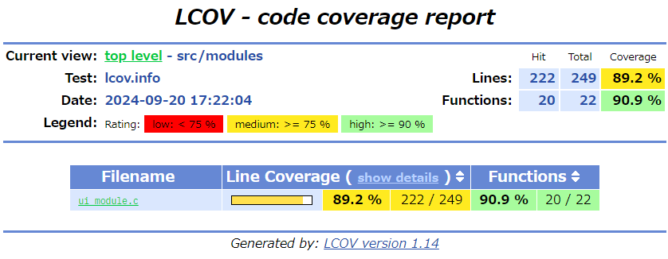

前回の続き。

nRF Connect SDK がサポートする [Testing with Unity and CMock](https://docs.nordicsemi.com/bundle/ncs-2.6.1/page/nrf/test_and_optimize/testing_unity_cmock.html) を試す。

## 前回まで

* Windows環境では Unity でのテストはできない
* WSL2 ではできる
* WSL2 から Windows 側に置いたコードを `west build` するととても遅いが WSL2 側に置くとそうでもない
* ncs で Unity を使う場合、たぶんだが 1回で 1モジュール分のテストしかできない
  * モックだけでなく`setUp()`なども`static`や別の名前になどができなさそう
* `nrf/applications/asset_tracker_v2` は `tests/` の下にテストの数だけフォルダを作っているようなので参考にできそう

## asset_tracker_v2 のテスト

`asset_tracker_v2` のテストを `native_posix_64` で動かしてみたが、`json_common`, `lwm2m_codec_helpers`, `lwm2m_integration` はビルド中エラーになった。
それ以外は動いたようなので、そちらを参考にしよう。  
ビルドできなかったものも `testcase.yaml` を見ると `extra_configs` に `CONFIG～=y` があるので、何かすれば動きそうな気はする。

### ui_moduleテスト

[ui_module](https://github.com/nrfconnect/sdk-nrf/tree/main/applications/asset_tracker_v2/tests/ui_module) を見ることにする。  

#### CMakeLists.txt

とりあえず思ったのは、cmake がある程度分かってないとダメだなということ。  
vscode で色が付かない `test_runner_generate` や `cmock_handle` は Unity の cmake関数だというのはなんとなく分かるが、
[set_property](https://cmake.org/cmake/help/latest/command/set_property.html#set-property)で何やってるのかなどが頭に入ってこない。

* `set(ASSET_TRACKER_V2_DIR ../..)`
  * プロジェクトの先頭を自動的に見つけるような機能はないので、自分で設定する
* `${ZEPHYR_NRF_MODULE_DIR}`
  * たぶん `ncs/vX.Y.Z/nrf/` のパスが入っている。
  * `${ZEPHYR_NRFXLIB_MODULE_DIR}`も似たようなものだろう。
  * どこで設定しているのか分からん。[west](https://docs.zephyrproject.org/latest/develop/modules.html)が設定するのか？
* `cmock_handle()`は4つ分
* `target_sources()`はテスト対象コードとテストコードの2つ分
* `target_include_directories()`は`gcc -I`相当だろう
* `target_compile_definitions()`
  * "definitions"なのに`-D`は書かないといかんのか？
    * [なくてもよさそう](https://cmake.org/cmake/help/latest/command/target_compile_definitions.html)
    * gcc系以外だと違うオプションのこともあるだろうから、そうせざるを得ないのか
* `set_property()`
  * [CONPILE_FLAGS](https://cmake.org/cmake/help/latest/prop_tgt/COMPILE_FLAGS.html#compile-flags)
  * `"-include ～"`: [gccのオプション](https://gcc.gnu.org/onlinedocs/gcc/Preprocessor-Options.html#index-include)
    * 対象のコードの先頭に`#include`を追加するものらしい
    * `ui_module.h` はテストコードの中では使われない。ここだけ。
    * `SYS_INIT`を`#undef`して空定義しなおしている
      * [SYS_INIT](https://docs.zephyrproject.org/latest/doxygen/html/group__sys__init.html#gaf507cc0613add8113c41896bd631254f)
      * kernel への初期化関数登録なのでテストでは不要だから空定義して消している
      * それだったら `static` と同じように `CONFIG_UNITY` で `#ifdef` してもいいんじゃないのかという気はする。

そう、テスト対象のモジュールに `static`関数を見えるようにするためのコードが既に入っているのだ。

```c
#if defined(CONFIG_UNITY)
#define STATIC
#else
#define STATIC static
#endif
```

複数モジュールをまとめてテストコードにするなら`static`関数名が重なる心配も出てくるが、少なくとも今回は気にしなくてよい。

既にテスト用かどうかでコードが切り替えられるようになってるなら `CMakeLists.txt` でがんばらなくていいんじゃないのかと思ったのだった。  
まあ、大したことではない。
それに`#include`のところまで見たわけではないので、こうじゃないとダメなのかもしれない。

#### vars_internal.h

なんでこれは別ファイルにしたのだろう？

といろいろ見たが、これはテスト対象のモジュール内で定義しているグローバル変数だった。  
普段は `static` でテストの時には参照できるようになるものの、`extern` している訳でもないからテスト関数で使うとコンパイルエラーになる。
なのでプロトタイプ宣言しておこう、という役割のようだ。

テスト対象のモジュールは 1つ、テストも 1ファイルに収めるならばいっそのことテスト対象のソースファイルを`#include`してしまってもよいかと思う。  
[fff](https://github.com/meekrosoft/fff)ではそうすることで `static` の置き換えもせずに済んだ。

まあ、ソースファイルを`#include`するのにちょっと抵抗はあるかもしれないが、なに、すぐ慣れる。  
実際に ui_module でやってみたが、多少の書き換えでテストが通ったので、そういうやり方でもいけそうだ。

`ui_module_test.h` をなくすために`SYS_INIT`は`#ifdef`で無効化すると`setup()`がテストされていないので unused の warning が出る。
テストしてもいいんじゃないかね。

```c
void test_setup(void)
{
	__cmock_dk_buttons_init_ExpectAnyArgsAndReturn(0);
	TEST_ASSERT_EQUAL_INT(0, setup());

	__cmock_dk_buttons_init_ExpectAnyArgsAndReturn(-EIO);
	TEST_ASSERT_EQUAL_INT(-EIO, setup());
}
```

#### Kconfig, prj.conf, testcase.yaml

`Kconfig`はほぼ空っぽ。

`prj.conf`は`CONFIG_UNITY=y`以外は本体の`prj.conf`からいるものだけ持ってきたのかな？

`testcase.yaml`はたぶん今回は未使用。

#### ui_module_test.c

あとはテストコードだけなのだが、これはちょっと見るのがつらい。

テスト関数の先頭で `resetTest()` を呼び出していることが気になった。
テストランナーが展開されたときに自動で作られるのだが、テストコードごとに違うことはおそらくなかろう。

```c
/*=======Test Reset Options=====*/
void resetTest(void);
void resetTest(void)
{
  tearDown();
  CMock_Verify();
  CMock_Destroy();
  CMock_Init();
  setUp();
}
void verifyTest(void);
void verifyTest(void)
{
  CMock_Verify();
}
```

ランナー本体はこうだった。

```c
static void run_test(UnityTestFunction func, const char* name, UNITY_LINE_TYPE line_num)
{
    Unity.CurrentTestName = name;
    Unity.CurrentTestLineNumber = line_num;
#ifdef UNITY_USE_COMMAND_LINE_ARGS
    if (!UnityTestMatches())
        return;
#endif
    Unity.NumberOfTests++;
    UNITY_CLR_DETAILS();
    UNITY_EXEC_TIME_START();
    CMock_Init();
    if (TEST_PROTECT())
    {
        setUp();
        func();
    }
    if (TEST_PROTECT())
    {
        tearDown();
        CMock_Verify();
    }
    CMock_Destroy();
    UNITY_EXEC_TIME_STOP();
    UnityConcludeTest();
}
```

`TEST_PROTECT()` が `false` なら `resetTest()`を呼び出しておかないと不都合がありそうだが、それだとテストコードも呼び出されないことになる。  
[Unityの説明](https://github.com/ThrowTheSwitch/Unity/blob/73237c5d224169c7b4d2ec8321f9ac92e8071708/docs/UnityGettingStartedGuide.md#aborting-tests)によると、無限ループしたりなどして終わらないのを何とかしてくれるらしい。
[setjmp/longjmpなど](https://github.com/ThrowTheSwitch/Unity/blob/73237c5d224169c7b4d2ec8321f9ac92e8071708/docs/UnityConfigurationGuide.md#unity_test_protect)をうまいこと使うようだ。

ということは、この`TEST_PROTECT()`で囲むのは「そういう書き方」なだけみたい。  
ならば、やはり`resetTest()`は毎回呼び出さなくてもよいのではと思う。
が、これは[CMock の方](https://github.com/ThrowTheSwitch/CMock/blob/master/docs/CMock_Summary.md#resettest)に書いてあった。
同じテスト関数内で`resetTest()`を呼び出してからテストすればいいよ、ということだろう。  
"Call it during a test to have CMock validate everything" っていってるけど、評価するのは CMock なのかね。
まあいいや。

テストの個数はテスト関数(`test_`)の数のようだ。  
グループなどもなさそうなので、1テスト関数で 1つの対象については全部のテストをやってしまった方が良いのか？  
いや、テスト結果には個数しか出てこないのでテスト関数名で何のテストをしているかわかるくらいの方がやりやすいか。

#### カバレッジ

Unit Test といえばカバレッジだろう(個人の感想です)。

実機などで動かすこともできるだろうが、わざわざ WSL2 まで使って動かし `native_posix_64` などでネイティブ環境を使っているのだ。
カバレッジを取らなくてはなるまい。

```console
$ sudo apt install lcov
```

```cmake
target_compile_options(app PRIVATE
	-fprofile-arcs
	-ftest-coverage
	-ggdb
)

target_link_libraries(app PRIVATE
	-lgcov
)
```

```console
$ west build -b native_posix_64 -t run -p
...
...
$ lcov --capture --directory build/CMakeFiles/app.dir/src/ --output-file lcov.info
$ genhtml lcov.info --output-directory lcov-output --show-details --legend
```



うむ。  
ちなみに CMock で作ったコードを通った分の`*.gcno`などは `build/CMakeFiles/app.dir/mocks/` にある。

### 今回のまとめ

Unity + CMock で ncs のテストがある程度はできることが分かった。
カバレッジも取れていると思う。

気になるのは `DT_ALIAS()` のような DeviceTree 関係のコードだ。  
今回の `asset_tracker_v2` では `src/ext_sensors/ext_sensors.c` が `DT_ALIAS()` を使っているのだがそのテストコードはなかった。
テストなのできれいに解決する必要はないので、適当にごまかせればよいか。

### example_test の書き換え

今回を参考に example_test を書き直した。  
`tests/` に移動して、その中に `uut` と `foo` のテストをそれぞれ置くようにした。

[example_test](https://github.com/hirokuma/ncs-unity-example-test/tree/51cd02e45ea9806caabf68875d08988e013a0caa)
