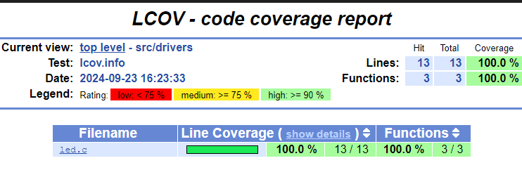

前回の続き。 

nRF Connect SDK がサポートする [Testing with Unity and CMock](https://docs.nordicsemi.com/bundle/ncs-2.6.1/page/nrf/test_and_optimize/testing_unity_cmock.html) を試す。

## ncs-blinky

以前作った [ncs-blinky](https://github.com/hirokuma/ncs-blinky/tree/01969ab8d8cfb48e9655db278d54a021900cc1a3) に Unity + CMock のテストを追加する。

### tests/led

#### ひな形

まず、テストのひな形を作る。

テスト用のプロジェクトファイルはだいたい同じようなファイルになるので、ありがちな構成を作ってから修正するのが楽だろう。  
中身は空っぽだが、Unityのテストは動くくらいのファイルを作るようにした。

[gist: ncs unity test template](https://gist.github.com/hirokuma/a6531bc9af79d8298cbb7e8c5920b082)

```console
$ ./mktest.sh led
$ cd tests/led
$ west build -b native_sim_64 -t run
```

### 第1弾

まずは力業でテストを通す。

* `DT_ALIAS()`, `GPIO_DT_SPEC_GET()`は`#undef`して空の構造体を返す。
* テスト対象の`led.c`は直接`#include`するようにした

[files](https://github.com/hirokuma/ncs-blinky/tree/0a197bb08bff5de34f10c2a09dbfaa944c4e28bc)

動く。



### 第2弾

少し見直そう。

* `DT_ALIAS()`は`GPIO_DT_SPEC_GET()`の引数にするだけなので気にしなくてよい
* 構造体の初期化にいちいち`NULL`や`0`を設定しているが `{}`だけでよかろう

[commit](https://github.com/hirokuma/ncs-blinky/commit/2f2cc45d7460315a786e113b7a569e5b5383f737)

`AnyArgs`は楽なのだが、なるべく評価した方がよいかも。  
ただ、本体のコードを見てテストコードにも書くくらいだったらいらないような気もする。
どうなんだろうね。
場合によりけりか。

### 終わりに

GPIO くらいだったらそこまで面倒ではなかった。  
ある程度はロジックがあって Zephyr とか BLE の API を呼び出すようなコードでもテストを作ってみないと分からんな。
