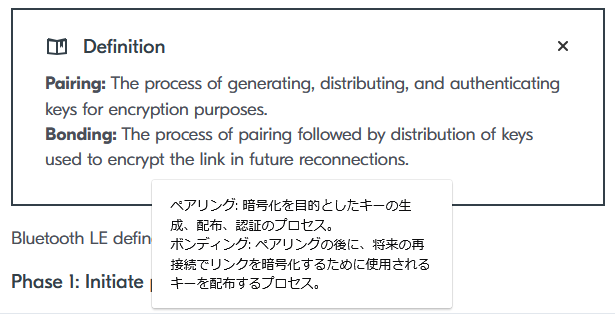
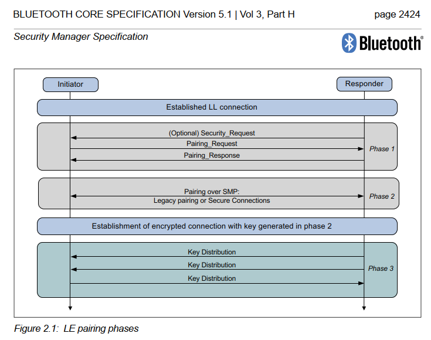
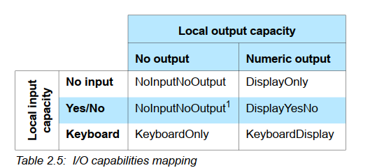
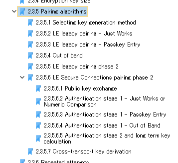
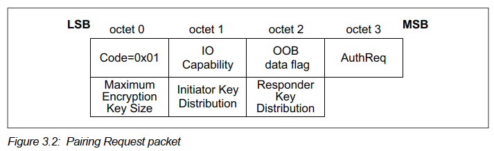
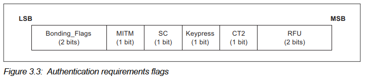
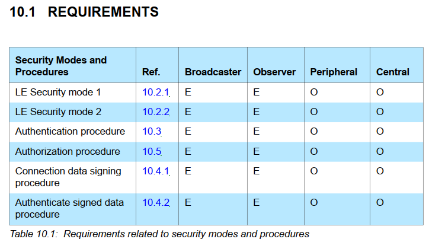
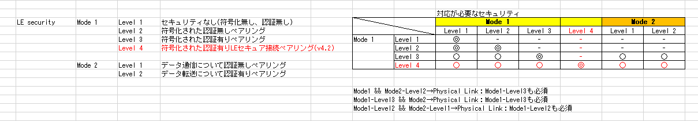

# BLE基礎 (14)

<i>2024/09/27</i>

DevAcademy の基礎編が終わり、ncs での単体テストについてもできそうな感じが職を得た。  
そういうわけで、また DevAcademy の BLEに戻ろう。
以前は Lesson 4 まで終わらせている。

[ble: BLE基礎 (13)](../08/20240829-ble.md)

## [BLE DevAcademy Lesson 5](https://academy.nordicsemi.com/courses/bluetooth-low-energy-fundamentals/lessons/lesson-5-bluetooth-le-security-fundamentals/)

通信のセキュリティについて。

BLE通信を何も対策せずに行うと、スニファなどで簡単に読み取ることができる。
実際、テストするときはそうやって動作確認している。  
ただそれだと他の人にも読み取られ放題になるので望ましくないので何とかしようという話だ。

bonding 周りだと思うが、以前の私はよく理解できないままやっていた。
ここ数年で多少は暗号の知識を身につけたので、今なら分かるかもしれないと期待している(自分に)。

### [Pairing process](https://academy.nordicsemi.com/courses/bluetooth-low-energy-fundamentals/lessons/lesson-5-bluetooth-le-security-fundamentals/topic/pairing-process/)

BLE といえばペアリングだ。  
Advertising するデータはフォーマットも決まっているし不特定多数にばらまくので暗号化する部分はなかったはずだ。
暗号化するのは通信する相手を決めた後になる。

まず、いつも悩む「ペアリング(pairing)とボンディング(bonding)の違いは何？」から。  
せっかく定義が載っていたので Google翻訳付きで貼り付けよう。

いわゆる「ペアリング」は "pairing" + "bonding" ということになる。

「暗号化」と書いたが、送信側が "encrypt" して受信側が "decrypt" するので「符号化」「復号化」と区別した方がよいシーンもあるだろう。
"encode", "decode"も「符号化」「復号化」になるので、いっそのこと encryptする、decryptする、の方が通じやすい気もする。

鍵が決まってしまえば共通鍵暗号でやりとりするとして、その鍵をどうやって安全に決めるかが課題になる。
決めるまでの間は encrypt していないので、直接鍵データを送り合うと第3者から見えてしまうからだ。
その辺はペアリング工程の中で行われるはずだ。

「BLE仕様書 V5.1 Vol.3, Part H: Security Manager, 2.1」にペアリングの工程図がある。
V4.0の頃から変わっていないようだ。  
この図の Phase 1-3 は DevAcademy の Phase 1-3 と一致している。

#### Phase 1: Initiate pairing

DevAcademy に書いてある「DisplayOnly」やら「KeyboardNoOutput」やらも BLE仕様書に載っている。
ペアリングする環境として何が使えるかの組み合わせだ。  
スマートウォッチは画面やタッチ操作ができるけどヘッドセットにはそういうのがない、というような組み合わせである。

#### Phase 2: Perform pairing

このフェーズで鍵生成を行う。

Phase 1 で Initiator(ほぼ Central)と Responder(ほぼ Peripheral)のできること(IO capabilities)が交換される。
その組み合わせかでペアリングで使用できるアルゴリズムの一覧が BLE仕様書に載っている。
ペアリングのアルゴリズムというのは、DevAcademy で "pairing methods" と書いてあるやつだ。

BLE仕様の v4.1 までは Short Term Key(STK)を生成するために Temporary Key(TK)を用いる方式だった。
しかしこれだとすぐ破られるよね、ということで v4.2 から方式が追加された。  
「LE Legacy pairing」というのが v4.1 までの方式で、v4.2 からの方式が「LE Secure Connections」という名前になっている。
ECDH と書いてあるから楕円曲線なんだろう。それぞれ`a`と`b`を作り、`aG`と`bG`を交換し、共通鍵は`abG`になるというやつだ。

お互いの鍵を直接見せずに共通鍵を作るなら DH を使うのはわかる。
では Legacy の場合はどうしているのだろう？ 
v5.1, Vol.3, Part H, "2.3.5.5 LE legacy pairing phase 2"を見るとわかるのかな？

* initiator
  * 128bit の乱数`Mrand`を作る
  * 関数`c1`を使って`Mrand`から`Mconfirm`を作る
* responder
  * 128bit の乱数`Srand`を作る
  * 関数`c1`を使って`Srand`から`Sconfirm`を作る
* initiator --> responder: `Mconfirm`
* responder --> initiator: `Sconfirm`
* initiator --> responder: `Mrand`
* responder
  * `Mrand`を使って`Mconfirm`を検証
  * 検証OK
* responder --> initiator: `Srand`
* initiator
  * `Srand`を使って`Sconfirm`を検証
  * 検証OK
  * 計算して STK を作る(`STK = s1(TK, Srand, Mrand)`)

これのどこがセキュアじゃないかは私では分からんかったので検索。  
最後に計算する STK 計算のパラメータ `TK` が ECDH の `aG` みたいに見えないことによって鍵を直接交換せずに済んでいるのだが、`TK` が小さいので総当たりでの攻撃がしやすい上、rand値 と conf値を検証することができるのでさらに便利(攻撃者にとって)だそうだ。

[Bluetooth通信実装のセキュリティ観点を4ステップ + 1で理解する - Flatt Security Blog](https://blog.flatt.tech/entry/ble_security#%E8%84%86%E5%BC%B1%E6%80%A7-2-Legacy-Pairing%E3%81%AB%E3%81%8A%E3%81%91%E3%82%8B%E6%9A%97%E5%8F%B7%E5%8C%96%E3%81%95%E3%82%8C%E3%81%9F%E9%80%9A%E4%BF%A1%E3%81%AE%E3%83%96%E3%83%AB%E3%83%BC%E3%83%88%E3%83%95%E3%82%A9%E3%83%BC%E3%82%B9)

pairing が Legacy か Secure Connections なのかは最初に交換する `Pairing Request` の `AuthReq` に入っている。

`AuthReq`の`SC`がそれで、サポートしていたら`1`を立てる。

LE Secure Connections の場合は LTK(Long Term Key)というものを作るそうだが、詳細は次の章でやってくれるようだ。

ペアリングのアルゴリズム(pairing methods)は 4つあるが、Legacy の場合は Numeric Comparison という方式に対応していないとのこと。

画面や操作の有無(IO capabilities)で使用できるペアリングアルゴリズムが決まると書いたが、その前に OOBフラグとMITMフラグ(とSCフラグ)で選別することになっている。
DevAcademy に[図](https://academy.nordicsemi.com/wp-content/uploads/2023/03/blefund_less5_pairing_method_1-1024x838.png)があるが、Legacy か Secure Connections かでフラグの見方が違うので注意しよう。  
BLE仕様書でも Table が別になっている。

Pairing だけの場合ここまでで終わりになる。
作った鍵は link の encrypt に使われる。
link というのは接続中の通信データ交換そのものを指しているのだろう。
次の Phase 3 では再接続に関する鍵交換をするように書かれているので、bonding しない場合は毎回 Phase 2 をやるのだろう。
ちょっとだけ BLE を使ってあとは WiFi でデータをやりとりするような使い方だと bonding はしないだろうな。

#### Phase 3: Key distribution

この部分が bonding になるようだ。

再接続のための LTK がいるのだが、Legary pairing ではこのフェーズで作成し、Secure Connections では前のフェーズで作成する。
詳しいことは書かれていないが、その程度で良いと信じよう。

#### ここまで

pairing と bonding の流れを見ていったが、問題はどこまで実装をしないといけないか、だ。  
まあ、しくみがわかっていないとセキュリティと手間の兼ね合いもわからないだろうから、全体の把握も必要なのだ。

実際のところどうしているのか、検索してみた。

[経験者が教えるBluetooth通信におけるセキュリティ対策3つのセオリー - 株式会社ムセンコネクト](https://www.musen-connect.co.jp/blog/course/planning/bluetooth-iot-security-theory/)

難しいねぇ。  
私も接続が切れるとかいう話が来たことがあったのだけどそういう問題だったのだろうか？  

自前で暗号化もパワーしだいなところがありそう。
nRF53 だと余裕だけど nRF51 だとちょっと、みたいな。
まあ、そういうことをいってられないから CPUパワーが高めになったりアプリとネットでコアを分けたりするようになってきたのか。

### [Legacy pairing vs LE Secure Connections](https://academy.nordicsemi.com/courses/bluetooth-low-energy-fundamentals/lessons/lesson-5-bluetooth-le-security-fundamentals/topic/legacy-pairing-vs-le-secure-connections/)

前章で省略されていた pairing の Legacy と Secure Connections について。

その前に。  
"Legacy pairing" はわかる。
"Legacy" とだけいわれてもわからないから。
正確には "LE Legacy pairing" のようだ。  
気になるのはもう片方の "LE Secure Connections" だ。
これは "LE Secure Connections pairing" とはならないのか？  
目次だけ見ているが、こんな感じだ。

* Legacy pairing
  * LE legacy pairing - Just Works
  * LE legacy pairing phase 2
  * LE legacy pairing key distribution
* Secure Connections
  * LE Secure Connections confirm value generation function f4
  * LE Secure Connections pairing phase 2
  * LE Secure Connections key distribution

"Legacy pairing" は "pairing" が付くが、"Secure Connections" の方は付かないことが多いのだ。
この章のタイトルもそうだし。

#### 概要

* v4.2 より前の LE legacy pairing は安全じゃない
  * Just Works は `TK` がオールゼロなのでほぼ保護されない
  * Passkey は `TK` を受け渡すので多少ましだが、`TK`を盗聴しやすいし、しなくてもブルートフォース攻撃できるくらいの組み合わせしかない。
  * OOB は `TK` の 128bit 分が使えるので、この中では一番まし
  * Bluetooth SIG は legacy pairing を推奨していないが、使わないといけないときは OOB を使うべき
* LE Secure Connections の方が安全
  * ECDH で共通鍵を作る
    * 楕円曲線は NIST P-256 だそうだ
      * Bitcoin は secp256k1 だが、あれは P-256K とも呼ぶらしい([曲線の種類](https://learn.microsoft.com/ja-jp/azure/key-vault/keys/about-keys-details#curve-types))
    * BR/EDR の Simple Pairing が P-192 か P-256 らしい(v5.1, Vol.2, Part H, "7.6 Elliptic curvedefinition")
  * Legacy pairing と違い、Just Works の方がより安全になるらしい。が、認証がないのでお勧めはしないそうだ。
    * どれをとっても Legacy pairing よりは安全ではある
  * "Numeric Comparison" という方式が加わった
    * Microsoft Authenticator で Microsoftアカウントにログインするときに数字が出て確認するような感じか
* 相手が Legacy pairing しかサポートしていないこともあるから両方サポートしておくのがお勧め

うちにある nRF51822 は nRF Connection SDK が使えないが、nRF5 SDK なら使える。  
[S110, S120, S130](https://docs.nordicsemi.com/bundle/ug_gsg_keil/page/UG/gsg/softdevices.html)なのだが、[v12.3.0](https://docs.nordicsemi.com/bundle/sdk_nrf5_v12.3.0/page/index.html)までは S130 が残っていたが [v14.0.0](https://docs.nordicsemi.com/bundle/sdk_nrf5_v14.0.0/page/index.html) からはなくなっているので、そこら辺までということだ。  
[S130](https://www.nordicsemi.com/Products/Development-software/s130) は BLE v4.2 に対応しているので、使うならそれがよかろう。  
入手が難しくなって今では現場では使われない、とかだとよいのだが。

### [Security models](https://academy.nordicsemi.com/courses/bluetooth-low-energy-fundamentals/lessons/lesson-5-bluetooth-le-security-fundamentals/topic/security-models/)

ペアリングの話をしてきたが、そもそものセキュリティモデルをどう考えるかについて。

* 般的な攻撃のタイプ
  * Identity tracking
  * Passive eavesdropping (sniffing)
  * Active eavesdropping (MITM)

"eavesdrop" は盗聴とか傍受とかの意味。

#### Identity tracking

Bluetoothアドレスを利用してデバイスを追跡すること。  
これはランダムアドレスにすればよいそうだ。
開発中のデバイスは特に指定していないがどうなってるんだっけ？  
[BLE基礎(4)](/2024/08/20240809-ble.html) を読むと、接続するタイプの場合は Random Static アドレス、接続しないタイプの場合は Non-Resolvable Random Private アドレスだそうだ。
どっちでも Random だから、ひとまずは大丈夫か。

#### Passive eavesdropping (sniffing)

スニファでのデバッグもこれに含まれるのだが、アクティブに接続しに行くのではなく流れている通信データを傍受して解析する。  
データが暗号化されていて、かつ暗号化されたデータの decrypt が困難であればよし、くらい。

そういった点で Legacy pairing は鍵が見つけやすいのでよろしくない。  
総当たりしても decrypt した結果がどうなるか想定できていないと正しく decrypt したかどうかを確認するのが大変になる。
なので、無線区間だけでなくデータ自体も encrypt するのがよいだろう。

よいだろうが、データを encrypt できるとしたら Characteristic Value 部分だけよね？  
パケットそのものには encrypt できないはずだ。
そうなると pairing 自体はやっぱりやっておきたいものだ。

#### Active eavesdropping (MITM)

ひっそり覗かれるのも嫌だが、私が本物ですよという顔をしてアクティブに接続しに来られるのも嫌だ。
MITM と書いているので、自分が間に入って中継するような接続をイメージしているのだろう。

これはつなごうとしている相手が本当にそうなのかを確認するしかない。  
NFC など物理的に近くないとできないと要素を使うのがよいだろうが、なかなか難しい。
うちにある Google Home の設定をするときも、リセットしてアクセスして反応して、くらいでしか見分けていない。
RSSI が閾値以上じゃないと動かないようにしているとかはありそうだが、アドレスが表示されているわけでもないし。
アドレスも、見た目では Public か Private かはわからないとかだったと思う(2024/09/29:`TxAdd`でPublicかRandomかの区別は付く)。  
本体に数字が書いたシールを貼っておくというのは案外有効なのか？

#### Security levels

急に "security mode 1" という言葉が出てくるが、これは BLE仕様書 v5.1, Vol.3, Part C, "10.2 LE security modes" に出てくる mode だろう。  
表の "E" は Excluded、"O" は Optional の意味らしい。
Broadcaster と Observer には関係ない(Advertisingだけだから)、Central と Peripheral 

まず LE security mode として mode 1 と mode 2 がある。
各mode にさらに level がある。mode 1 なら level 1-4、mode 2 なら level 1-2だ。  
Level は 1 から始まり、ペアリングによって上がる(＝より安全)になるとのこと。

* mode 1
  1. No security (No authentication and no encryption)
  2. Unauthenticated pairing with encryption
  3. Authenticated pairing with encryption
  4. Authenticated LE Secure Connections pairing with encryption using a 128-bit strength encryption key
* mode 2
  1. Unauthenticated paring with data signing
  2. Authenticated pairing with data signing

mode 2 に出てくる "data signing" は v5.1, Vol.3, Part C, "10.4 Data signing" に記載がある。  
データパケット(Data PDU)の後ろに署名(デジタル署名ではない)に相当するデータを載せる。
署名だから改ざんのチェックに使うことができるのだろう。  
普通は 20バイト程度だったと思うので、そこに署名が 12バイトも占めるかと思うとちょっと悩む。

昔の自分が書いた表が出てきた。  
たぶん v5.1, Vol.3, Part C, "10.2.3  Mixed security modes requirements" を表そうとした努力だろうか。

DevAcademy の方には mode 3 にも触れているが、これは Audio ってことでまだ早いな。

#### Filter Accept List

自分で書いていた資料に「whitelist」というシートがあったのだが、中身は何も書いてなかった。
ここの "Filter Accept List" というのがそれらしい。

私の資料は v5.1, Vol.6, Part B, "4.3.1 White List" を気にしていたようだが、それとは関係がないのだろうか？
BLE仕様書v5.1 を検索しても "accept list" が出てこないのだ。  
ncs での呼び方なのだろうか。

advertising と scaning の両方で使われるリストらしい。
この機能の使いどころは bonding した相手との再接続になるようだ。  
Exercise で実践するようなのでここまででよかろう。

## おわりに

DevAcademy BLE Lesson 5 の Exercise は次回にする。  
仕様書を読んでいるわけでもないのだが、情報をちょっと参照するだけでも時間がかかるものだ。
