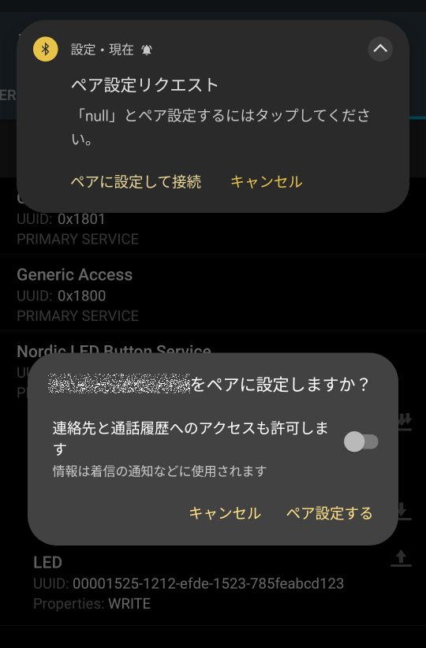
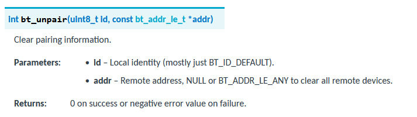

# BLE基礎 (15)

<i>2024/09/29</i>

前回の続き。  
BLE DevAcademy Lesson 5 の Exercise 

## [BLE DevAcademy Lesson 5](https://academy.nordicsemi.com/courses/bluetooth-low-energy-fundamentals/lessons/lesson-5-bluetooth-le-security-fundamentals/)

### [Exercise 1](https://academy.nordicsemi.com/courses/bluetooth-low-energy-fundamentals/lessons/lesson-5-bluetooth-le-security-fundamentals/topic/blefund-lesson-5-exercise-1/)

前回の、LBS サービスだけのプロジェクトに付け加えていく。

#### WRITE_ENCRYPT

* LED characteristic のパーミッションを WRITE から WRITE_ENCRYPT に変更
  * この状態で普通に接続して書込みをすると切断される
* `CONFIG_BT_SMP=y`
  * この状態で接続して書込みをすると、書込みをしたときにペアリングが要求される
  * 
  * ペアリングしたら書込みできる
  * [security_changed](https://docs.nordicsemi.com/bundle/ncs-2.6.1/page/zephyr/connectivity/bluetooth/api/connection_mgmt.html#c.bt_conn_cb.security_changed)で通知される
    * ここでは `%u` で出力しているが実際は[enum bt_security_t](https://docs.nordicsemi.com/bundle/ncs-2.6.1/page/zephyr/connectivity/bluetooth/api/connection_mgmt.html#c.bt_security_t)
      * `2` だったので `BT_SECURITY_L2`だったのだろう。
      * mode 1 しか出力しないということ？
        * v5.1, Vol.3, Part C, "10.2.1 LE security mode 1"
        * level 2 は "Unauthenticated pairing with encryption"

#### Authentication

* Authentication のコールバック登録
  * 今回使うのは `.passkey_display` と `.cancel` だけ
    * `.cancel` はパスキー系や`.pairing_confirm` コールバックを使う場合には設定が必要とのこと
     * 登録する `bt_conn_auth_cb_register()`がチェックしてくれるようだ
  * 他にも [いろいろある](https://docs.nordicsemi.com/bundle/ncs-2.6.1/page/zephyr/connectivity/bluetooth/api/connection_mgmt.html#c.bt_conn_auth_cb)
* 実験前に Central 側からペアリング情報を削除しておく
* LED characteristic に書き込むとペアリングを求められる
  * UART コンソールにパスキー用の数字6桁が出力される
  * スマホ側にペアリングを求める通知が出たので許可すると、パスキーの入力ができるようになっていた
  * もたもたしているとタイムアウトする
  * UART コンソールと同じ数字を入力すると書き込みした
  * 違う数値を打ち込むと切断され、スマホ側にもパスキーが異なると表示された
  * level 4 になった
    * v5.1, Vol.3, Part C, "10.2.1 LE security mode 1"
    * level 4 は "Authenticated LE Secure Connections pairing with encryption using a 128-bit strength encryption key"

自動で LE Secure Connections になったようだ。

### [Exercise 2](https://academy.nordicsemi.com/courses/bluetooth-low-energy-fundamentals/lessons/lesson-5-bluetooth-le-security-fundamentals/topic/blefund-lesson-5-exercise-2/)

bonding と Filter Accept List だそうな。  
Central 側に接続した Peripheral の情報が残っていたら bonding になるんじゃないかと思ったが、そちらではなく、Peripheral で保存する方らしい。
Phase 3 を実施したらお互いが勝手に保存するというわけではない？  
nRF Connect for Mobileに "BONDED" というタブがあるが、そちらには何もなかったので保存はしていないのかもしれない。

* `CONFIG_BT_SMP=y`は`CONFIG_BT_BONDABLE=y`を含んでいるため、一度ペアリングすると切断しても nRFの電源が入っている間であれば再接続したときにペアリングはしなくて良い。
  * つまり、RAM にしか持っていないということか
  * Flash に保存しないとそういうことはできんので、`CONFIG_BT_SETTINGS`などがいる
    * けっこう多い
      * `CONFIG_BT_SETTINGS`: Store Bluetooth state and configuration persistently
      * `CONFIG_SETTINGS`: The settings subsystem allows its users to serialize and deserialize state in memory into and from non-volatile memory.
      * `CONFIG_FLASH`: Enable support for the flash hardware.
      * `CONFIG_FLASH_PAGE_LAYOUT`: Enables API for retrieving the layout of flash memory pages.
      * `CONFIG_FLASH_MAP`: Enable support of flash map abstraction.
      * `CONFIG_NVS`: Enable support of Non-volatile Storage.
    * `CONFIG_BT_SETTINGS=y`である程度自動的に設定してもよさそうなものだが、そうしないところを見ると組み込みじゃない機器などのためか？
* [settings_load()](https://docs.nordicsemi.com/bundle/ncs-2.6.1/page/zephyr/services/settings/index.html#c.settings_load)で NV に保存していたデータを
  * APIの説明にはBLEについては書かれていないが、DevAcademy の説明では保存したペアリング鍵なども対象のようだ。
  * 裏でどうやってるかは知らないが Settings API を使っているからと思っておこう。
* これだけで、ペアリング後、Peripheral を再起動した後で接続して LEC characteristic に書込みしても何も問われずに操作できた。
  * nRF Connect for Moblie の "BONDED" には何もなかったから、あのタブは関係ないみたい

* Peripheral での bonding データ削除
  * ボタンを押して bonding したデータを削除できるようにする
    * Settings API を呼び出す必要はないみたい
  * 関係ないけど、うちのブラウザデミルと DevAcademy に貼ってある[bt_unpairの画像](https://academy.nordicsemi.com/wp-content/uploads/2023/03/image-161.png)みたいな見栄えにならない
    * 
    * 太字の小文字 `i` がつぶれて見づらい。。。
      * `void` は `vold` に見えるし、
    * [Carlito](https://fonts.google.com/specimen/Carlito)というフォントのようで、16px, weight 700 だとつぶれて見える。
    * Firefox でも Chrome でも同じに見える。Windowsだけ？

* Filter Accept List
  * リストを操作する API はあるのだが、自分で実装する箇所がそこそこある
    * Advertising の設定
      * 自動的に再接続のAdvertisingを流さないよう[BT_LE_ADV_OPT_ONE_TIME](https://docs.nordicsemi.com/bundle/ncs-2.6.1/page/zephyr/connectivity/bluetooth/api/gap.html#c.@38.BT_LE_ADV_OPT_ONE_TIME)フラグを付ける
      * Filter Accept Listを使うので[BT_LE_ADV_OPT_FILTER_CONN](https://docs.nordicsemi.com/bundle/ncs-2.6.1/page/zephyr/connectivity/bluetooth/api/gap.html#c.@38.BT_LE_ADV_OPT_FILTER_CONN)フラグを付ける
    * Advertising の開始は System [Workqueue thread](https://academy.nordicsemi.com/courses/nrf-connect-sdk-fundamentals/lessons/lesson-7-multithreaded-applications/topic/scheduler/) に任せる
      * いつもは `main()`で初期設定したあとに `bt_le_adv_start()` して切断後の Advertising なども全部お任せしていた
      * `BT_LE_ADV_OPT_ONE_TIME`設定したので、都度自分で Advertising をすることになる
        * Advertising 開始用の処理を関数にしておく(今回は`advertise_with_acceptlist()`という関数)
          * [bt_le_filter_accept_list_clear()](https://docs.nordicsemi.com/bundle/ncs-2.6.1/page/zephyr/connectivity/bluetooth/api/gap.html#c.bt_le_filter_accept_list_clear)で Filter Accept List をクリア
            * Filter Accept List を使って接続している間は Filter Accept List は変更できないとのこと
            * 今回はデバイスの開始時か切断後にしか呼び出さないので問題ない
          * [bt_foreach_bond()](https://docs.nordicsemi.com/bundle/ncs-2.6.1/page/zephyr/connectivity/bluetooth/api/gap.html#c.bt_foreach_bond)で存在する bond データをぐるぐる回す
            * ID値があるのだが、通常は`BT_ID_DEFAULT`らしい
            * Filter Accept List と bond は関係ないので `bt_le_filter_accept_list_clear()` しても bond データが消えるわけではない
          * bond データをぐるぐる回して Filter Accept List への追加と追加した数を数える
            * [bt_le_filter_accept_list_add()](https://docs.nordicsemi.com/bundle/ncs-2.6.1/page/zephyr/connectivity/bluetooth/api/gap.html#c.bt_le_filter_accept_list_add)で Filter Accept List に bond データのあるデバイスアドレスを追加
            * `bt_foreach_bond()`は呼び出すコールバック関数の戻り値を見ない(`void`)ので、コールバック関数でエラーが発生して以降は処理したくないような場合も自分で実装しないといけない
              * Nordic ではなく [Zephyrの関数](https://docs.zephyrproject.org/apidoc/latest/group__bt__gap.html#gaad380b7f8984f8522c1b79f9bdc04905)なので要望を上げるならそちらだな
              * ここでは`user_data`でリストに追加した総数を扱っているので、それをマイナス値にすると処理しないようにしてある
          * 追加した数がゼロかそれより大きいかで Advertising の仕方を変える(マイナス値の場合はエラーなので処理しない)
            * 1以上: `BT_LE_ADV_OPT_FILTER_CONN`フラグを立てて Advertising 開始する
            * ゼロ: `BT_LE_ADV_OPT_FILTER_CONN`フラグを立てずに Advertising 開始する
        * その関数を workqueue に登録する構造体 `struct k_work` に定義する(今回は`advertise_acceptlist_work`という変数名)
        * `main()` での `bt_le_adv_start()` の代わりに `k_work_submit(&advertise_acceptlist_work)` して Advertising 開始
        * 切断コールバック(`on_disconnected()`)で `k_work_submit(&advertise_acceptlist_work)` して Advertising 開始
      * 結局 `bt_le_adv_start()` を呼び出して終わりなら work queue じゃなくてもいいんじゃないの？と思った
        * と思ったら理由が説明してあった。`on_disconnected()`のタイミングで`bt_le_adv_start()`を直接呼び出すと`-ENOMEM`エラーが起きるのでタイミングをずらすとのこと
          * 3.5項に詳しく書いてある
        * 関係ないけど、検索しづらいので表記を "workqueue" か "work queue" か統一してほしい。。。
    * ここまで実装して一度動作確認(3.6項)だが、手順がめんどくさい。スマホが 2台いる
      * スマホ1台目を普通に接続して LED characteristic に書き込めるようにしておく
      * スマホ1台目を切断
      * スマホ2台目でSCANして接続→できない
      * スマホ1台目は接続できて操作もできる
        * 1台目の nRF Connect for Mobile で SCAN すると、現在ではなく bonding したとき(だと思う)のアドレス値が表示されている
    * "Pairing mode"というものを追加する
      * 今のままだと接続できる台数は 1つしかない
      * 複数台に対応することもできる
        * それが "pairing mode" らしい
        * "open advertising" ともいうそうだ
      * 実装
        * `CONFIG_BT_MAX_PAIRED`で最大台数を設定
        * "pairing mode" を開始(今回はボタン)
          * Advertising 停止
          * Filter Accept List のクリア
          * Advertising 開始
            * Filter Accept List を使用しない方の Advertising
        * これだけ？？
          * 普通に 1台目(bond済み)を切断した場合、Filter Accept List ありの Advertising をしている
          * その状態でボタンを押すと、bond したデバイスがないのと同じ状態で Advertising しはじめる
          * と、それだけのことだった。
          * `CONFIG_BT_MAX_PAIRED`は台数制限のためだけで、pairing mode とは直接関係はない(1台だと意味が無いが)
        * うちにあるワイヤレスヘッドセットは別のデバイスにつなぎ直すときにボタンを長押ししないといけないが、そういう場合は pairing mode とやらに対応していないのだろうか。
      * 実験
        * bond データをそれぞれ削除
        * 1台目を bond して LED characteristic に書き込めることを確認
        * 1台目を切断
        * 2台目から接続→失敗
        * ボタンを押して pairing mode にする
        * 2台目から接続→成功
        * 2台目から LED characteristic に書込み→スマホにペアリングを求めるダイアログ表示
          * UART に出力された数値を入力して成功
        * 2台目から LED characteristic に書込み→nRF Connect for Mobileがくるくる回ったままになる
        * よくわからんので一度切断して、再度接続したら書込みできた(pairing不要)。よくわからん。

## おわりに

大したことなさそうな名前の Filter Accept List 実装が一番面倒だった。
ただ bond 済みのデータから Filter Accept List を作るところも他にやりようがなさそうだし、やり方自体は書いてあるとおりにやればよさそうに思う。

Filter Accept List は相手のアドレスで見分けるのだろうが、Central は Random アドレスというものにはならないのだろうか？ 
あるいは、接続するときはそれぞれアドレスを作っているとか？ 
Central の仕様が全然わかってないな。

ともかく Lesson 5 も終わった。  
Kconfig やボタンなどは別として、実装する部品としてはテンプレートにできそうなものが結構あったと思う。
いま実装するとき、ncs for vscode で新規アプリを作って DevAcademy を読み返しながら追加しているのだけど、自分が使いそうなパターンを実装して使い回すようにしたいものだ。

BLE DevAcademy 最後になる Lesson 6 は [sniffer](https://academy.nordicsemi.com/courses/bluetooth-low-energy-fundamentals/lessons/lesson-6-bluetooth-le-sniffer/) である。  
作る方かな？　使う方かな？  
そのうちやることにしよう。

そろそろモバイル側もやらないといけないと思っている。  
昔は Bluetooth Developer Studio があったのでそれでコードを作っていたのだが、もうなくなったので自分でやらんといかん。
Nordicさんも [Kotlin-BLE-Library](https://github.com/NordicSemiconductor/Kotlin-BLE-Library) や [IOS-BLE-Library](https://github.com/NordicSemiconductor/IOS-BLE-Library) を出しているので、そういうのを使った方が楽なのか。  
Android はともかく iOS は実機で試すのにお金かかるからな。。。

[\[Xcode\]\[iOS\] 有料ライセンスなしでの実機インストール 全工程解説！ - DevelopersIO](https://dev.classmethod.jp/articles/run-on-devices-without-apple-developer-program-license/)

そうなの？？  
私が最後にやったのは Xcode 4 だか 5 だかだったと思うが、時代は変わったものだ。
