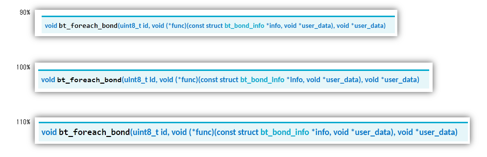

# Windows: ブラウザで表示されるフォント

<i>2024/09/29</i>

[前回](20240928-ble.md) の半ば辺りに、Windows で Nordic の API ページを見ていると `i` がつぶれて読みづらい話を書いた。

* サイトでフォントを設定している
  * [Carlito](https://fonts.google.com/specimen/Carlito), 16px, weight 700 の設定
  * Windows に同じフォントをインストールしてもつぶれない
  * Chrome でも同じようにつぶれて見える
  * M1 Mac の Chrome, Safari ではつぶれずに見える

Windows 全体の話ではあるが Windows 本体というわけでもなさそうというよくわからない状況。  
なんとかできるなら、なんとかしたい。

見た目という主観的なものなので、あくまで「私にとって見やすい」となればよい。

* Windows11
* 1920 x 1080、100%

もし Mac の話が出てくるなら、こういうやつ。

* M1 Sonoma
* 3024 x 1964

Safari は今回のために初めて使ったが、Chrome とはちょっとレンダリングが違うようだ。  
レンダリングが違うのか違うフォントを表示しているのかの見分けは付かんのだが、ともかく見た目が違った。

## rendering_mode

ネットで検索するとよく出てくるのが `gfx.font_rendering.cleartype_params.rendering_mode` を `5` に設定する、というもの。  
私にとっては見づらいし、今回の `i` がつぶれる件も直らないので違う対応を探す。

## フォントサイズを変更する

普段は 100% 表示なのだが、110% とかにすれば解決はする。  
ただ情報量が減って哀しい。

と思って 90% にしてみたら、こちらでも解決するではないか。  
100% のときだけダメって。。。

アドオンで Zoom Page WE というのをインストールしたためか、nordic のページはいつもズームするようになった。  
このくらいでよしとするか。
