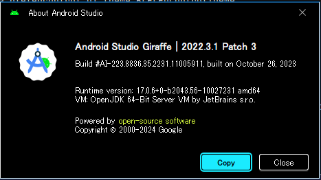
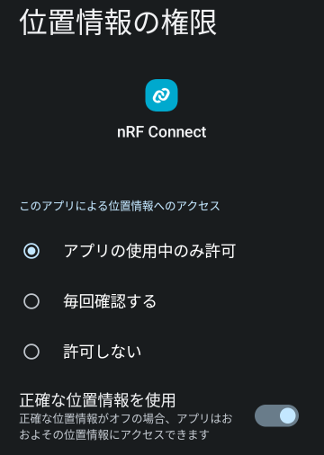
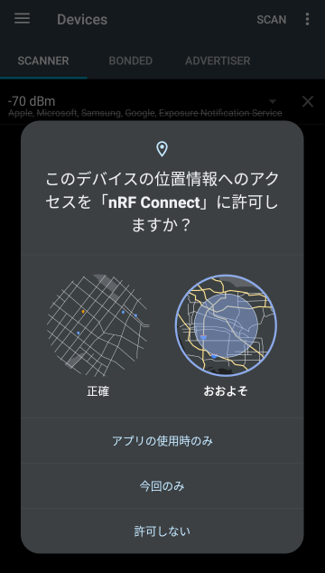

# android: LED characteristic を制御しよう (1)

<i>2024/09/30</i>

Androidアプリで LED characteristic の制御をしよう。

開発は Windows11 上で行う。  
Giraffe は最新ではないのでそのうち上げたい。新規プロジェクトを作った後に SDK バージョンなどの変更が必要なのが面倒なのだ。  
画面が黒っぽいのは High contrast テーマを使っているからである。



## 空プロジェクト作成

Windows でプロジェクトを作った場合だけだと思うが、設定で改行を`LF`にしていてもいくつかのファイルは`CR/LF`で作成されてしまう。

* `app/src/main/AndroidManifest.xml`
* `gradle/wrapper/gradle-wrapper.properties`
* `.idea/*.xml`の一部

Git で制御するのもなんだかなあと as-is にしているのだが、Android プロジェクトについては何か変えた方がよいのかもしれない。
よくわからんが。

## BT permissions

BLE を扱うにはいろいろと権限がいる。

[Bluetooth の権限  -  Connectivity  -  Android Developers](https://developer.android.com/develop/connectivity/bluetooth/bt-permissions?hl=ja)

アプリを使う Android が 12(API 31) 以降か 11 以前かで違いがある。  
こういうときは移行ガイドで[11から12に移行](https://developer.android.com/google/play/requirements/target-sdk?hl=ja#pre12)を見るとわかるかもしれない。

これを書いている時点で Pixel7a には OS 14(API 34) がインストールされていた。  
Android は[毎年8月31日](https://support.google.com/googleplay/android-developer/answer/11926878?hl=ja) Google Play アプリの対象 API レベル要件が更新されるので注意しよう。
Google Play に新規で公開するかアップデートを公開するかによってちょっと扱いが違うが、数字を変更するだけではダメなときもあるので[移行ガイド](https://developer.android.com/google/play/requirements/target-sdk?hl=ja)を見ながら対応しよう。
審査が殺到して公開まで時間がかかることがあるので、期間にも余裕を持たせた方がよい。

Central として使うならこんな感じになりそうだ(調査中)。

```xml
    <uses-permission android:name="android.permission.BLUETOOTH"
        android:maxSdkVersion="30" />
    <uses-permission android:name="android.permission.BLUETOOTH_ADMIN"
        android:maxSdkVersion="30" />
    <uses-permission android:name="android.permission.ACCESS_FINE_LOCATION"
        android:maxSdkVersion="30"
        tools:ignore="CoarseFineLocation" />

    <uses-permission android:name="android.permission.BLUETOOTH_SCAN"
        android:usesPermissionFlags="neverForLocation" />
    <uses-permission android:name="android.permission.BLUETOOTH_CONNECT" />
```

### 調査

Android Studio の新規プロジェクト作成ウィザードに名前だけ変更して作ると`minSdk`は`24`だったので、今回は API 30 以下にも対応するよう作ることにした。

物理的な位置情報 `ACCESS_FINE_LOCATION` が
nRF Connect for Mobile はこうなっていた。



試しに位置情報の許可を外してみると、SCAN ボタンを押したときに許可するよう言われた。



位置情報は許可しつつ「正確な位置情報」は無しにしたが、これもダメだった。
SCAN が始まらない。  

#### スキャン

まずはログにスキャンした結果を出力させようとサンプルを打ち込んだ。

[BLE デバイスを探す](https://developer.android.com/develop/connectivity/bluetooth/ble/find-ble-devices?hl=ja)

これがまあ、ビルドが通らないというか、ビルドが通るコードじゃなかった。  
いろいろ検索した情報から対応。

* `bluetoothAdapter`: `BluetoothAdapter.getDefaultAdapter()`などで取ってくる
* `Handler()`: 引数で`Looper`なるものを渡すようだ
* `SCAN_PERIOD`: なんでこれだけ名前がC風なんだ
  * そんなことをいったら `TAG` なんかもそうなるのだが
* `leScanCallback`: あとのサンプルコードで出てくる
* 許可を得ていない場合
  * インストール後に初めてスキャンする場合は`BLUETOOTH_SCAN`の許可を得ていないので、そのまま`startScan()`すると SecurityException が起きてしまう。
  * Android Studioが自動で`checkSelfPermission()`するコードを埋め込んでくれたが、許可を求めるダイアログなどは入っていないので実装がいるだろう
    * [実行時の権限をリクエストする](https://developer.android.com/training/permissions/requesting?hl=ja#kotlin)
    * `checkSelfPermission()`して許可状態を確認
      * `PERMISSION_GRANTED`なら既に許可があるので `startScan()`
      * そうでなかったら`shouldShowRequestPermissionRationale()`でユーザに対してその許可についての説明が必要かどうかチェック
        * `true` なら UI を出さないといけないようだ。これは `true` でも無視しても良いのか？
        * `false` なら `RequestPermission()` を使用して許可ダイアログの処理後に呼ばれるコールバックを設定する(のだと思う)
          * 許可を得たら`startScan()`。

#### BLUETOOTH_ADMIN はいるのか？

デバイスの検出をするには`BLUETOOTH_ADMIN`がいるようなことが書かれている。

[ローカルの Bluetooth デバイスを検出する](https://developer.android.com/develop/connectivity/bluetooth/bt-permissions?hl=ja#discover-local-devices)

API レベルによる違いの後ろに書いてあるので共通なのだと思うが、[API30 -> 31](https://developer.android.com/google/play/requirements/target-sdk?hl=ja#pre12) には `BLUETOOTH`と`BLUETOOTH_ADMIN` を `BLUETOOTH_SCAN`, `BLUETOOTH_CONNECT` などに書き換えるように書かれている。  
なので`BLUETOOTH_ADMIN`は API 30 以前の話だと思う。

#### ACCESS_FINE_LOCATION はいるのか？

この設定では `startScan()` 後にコールバックされなかった。

```xml
    <uses-permission android:name="android.permission.BLUETOOTH_SCAN" />
    <uses-permission android:name="android.permission.BLUETOOTH_CONNECT" />
```

これでもコールバックされたが、アプリに「位置情報」の許可が必要だった。
ただ「正確な位置情報を使用」をオフにするとコールバックされなくなった。

```xml
    <uses-permission android:name="android.permission.BLUETOOTH_SCAN" />
    <uses-permission android:name="android.permission.ACCESS_FINE_LOCATION" />
    <uses-permission android:name="android.permission.ACCESS_COARSE_LOCATION" />
    <uses-permission android:name="android.permission.BLUETOOTH_CONNECT" />
```

こうするとコールバックされてデバイスアドレスが取得できた。
「位置情報」の許可は不要。

```xml
    <uses-permission android:name="android.permission.BLUETOOTH_SCAN"
        android:usesPermissionFlags="neverForLocation"
        tools:targetApi="s" />
    <uses-permission android:name="android.permission.BLUETOOTH_CONNECT" />
```

`usesPermissionFlags`は API 31 以降なので `targetApi` を付けた。
が、なくてもよいようだ。  
どっちにせよ API 30 以前にも対応したいなら `ACCESS_FINE_LOCATION` はいるが、`maxSdkVersion="30"`にしておけばよいのかな。

```xml
    <uses-permission android:name="android.permission.BLUETOOTH"
        android:maxSdkVersion="30" />
    <uses-permission android:name="android.permission.BLUETOOTH_ADMIN"
        android:maxSdkVersion="30" />
    <uses-permission android:name="android.permission.ACCESS_FINE_LOCATION"
        android:maxSdkVersion="30" />
    <uses-permission android:name="android.permission.ACCESS_COARSE_LOCATION"
        android:maxSdkVersion="30" />

    <uses-permission android:name="android.permission.BLUETOOTH_SCAN"
        android:usesPermissionFlags="neverForLocation" />
    <uses-permission android:name="android.permission.BLUETOOTH_CONNECT" />
```

「正確な位置情報を使用」がオフだと使えないのであれば `ACCESS_COARSE_LOCATION` はいらないのかもしれない。

API 30 のエミュレータを作って試したところ、この設定で位置情報を許可するとスキャンできている。

```xml
    <uses-permission android:name="android.permission.BLUETOOTH"
        android:maxSdkVersion="30" />
    <uses-permission android:name="android.permission.BLUETOOTH_ADMIN"
        android:maxSdkVersion="30" />
    <uses-permission android:name="android.permission.ACCESS_FINE_LOCATION"
        android:maxSdkVersion="30"
        tools:ignore="CoarseFineLocation" />

    <uses-permission android:name="android.permission.BLUETOOTH_SCAN"
        android:usesPermissionFlags="neverForLocation" />
    <uses-permission android:name="android.permission.BLUETOOTH_CONNECT" />
```

ただ面倒なことに、アプリで `checkSelfPermission()` するものを API バージョンで切り分けないといけない。

それともう1つ。  
API 30, 31 では普通にアドレスが出力できたのだが、Pixel7a(API 34)ではこんな風に終わりの 2バイト分しか見えなくなっていた。

```log
onScanResult: XX:XX:XX:XX:12:34
```

`ScanResult.device` は [BluetoothDevice.toString()](https://developer.android.com/reference/android/bluetooth/BluetoothDevice#toString())になるから、API 34 以降での挙動になる。  
おそらく `toString()` のときだけやっているのだろうから、それほど心配することはなかろう。

ここまでのプロジェクト。

[commit](https://github.com/hirokuma/android-ble-led-control/tree/a70b8a6ad3edbeef9ac87118a8bf6f16dfb6ca1f)
