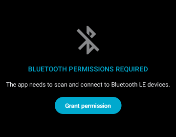

# android: LED characteristic を制御しよう (2)

<i>2024/09/30</i>

Androidアプリで LED characteristic の制御をしよう。

* 09/30 [android: LED characteristic を制御しよう (1)](20240930-and.md)

### 目標

格好の良い Android アプリを作るつもりはまったくない。  
とはいえ logcat に出すだけでは動作確認が面倒なので、最低限はなんとかしよう。

Android Studio の新規プロジェクト作成ウィザードで作ったのだが、Jetpack Compose とかいうものになっている。
以前の Layout やら View やらの方が見慣れてはいるものの、急いでいるわけでもないのでそのまま Compose UI でやっていく。

BLE機能については、スキャン、接続、Characteristic への書込み、切断ができればよい。  
できればライブラリとまではいかなくても、ファイルをコピーして使い回せるようになるとなおよし。

## BT permissions (つづき)

前回は主に `AndroidManifest.xml` に書くパーミッションを検討していた。

そういえば Nordic の BLE library があるので参考にできる。

[app_client/src/main/AndroidManifest.xml](https://github.com/NordicSemiconductor/Kotlin-BLE-Library/blob/a3ce8abcb173e28c4e5aaf55399afa621288d140/app_client/src/main/AndroidManifest.xml)

`ACCESS_COARSE_LOCATION` があったり `targetApi` があったりするが、概ね同じ感じだ。

```xml
    <uses-permission
        android:name="android.permission.ACCESS_COARSE_LOCATION"
        android:maxSdkVersion="30" />

    <uses-permission
        android:name="android.permission.ACCESS_FINE_LOCATION"
        android:maxSdkVersion="30" />

    <uses-permission
        android:name="android.permission.BLUETOOTH"
        android:maxSdkVersion="30"/>

    <uses-permission
        android:name="android.permission.BLUETOOTH_ADMIN"
        android:maxSdkVersion="30"/>

    <uses-permission
        android:name="android.permission.BLUETOOTH_SCAN"
        android:usesPermissionFlags="neverForLocation"
        tools:targetApi="s" />

    <uses-permission android:name="android.permission.BLUETOOTH_CONNECT" />
```

`AndroidManifest.xml` は他のディレクトリにいくつもあるが、[BLE Client](https://github.com/NordicSemiconductor/Kotlin-BLE-Library/tree/a3ce8abcb173e28c4e5aaf55399afa621288d140?tab=readme-ov-file#ble-client)がよく使う機能になりそうだからよいだろう。

設定はこれだけでよいだろうが、許可を得る方の実装がめんどくさい。

* Bluetooth機能がオフになっていたら、まずそれをオンにしてもらう
* アプリに許可がなかったら、それを有効にしてもらう
  * API 31 以降: `BLUETOOTH_SCAN`
  * それより前: `ACCESS_FINE_LOCATION`

Nordic の BLE library には `checkSelfPermission()` がないので、おそらく自分でやれってことなんだろう。

ちなみに [Android-nRF-Blinky](https://github.com/NordicSemiconductor/Android-nRF-Blinky) はテンプレートとして使えるそうだ。
ただ `implementation(libs.nordic.core)` などがあるので Nordic BLE library を使っているのだと思う。

## Android-nRF-Blinky を少し見る

ビルドして、Android に焼いて立ち上がる。  
が、プロジェクトの作りがさっぱり分からない。。。

[dependencies](https://github.com/NordicSemiconductor/Android-nRF-Blinky?tab=readme-ov-file#dependencies)を見るといろいろ使っていることがわかる。  
少し上に書いた `chaeckSelfPermission()` は [Android-Common-Libraries](https://github.com/NordicPlayground/Android-Common-Libraries)の方で実装しているなど、いろいろ用意済みだ。
ただこういうのはアプリによってデザインが違うだろうから、Nordic のアプリを作るときに使うものと思った方がよい？



よし、見るのは止めよう。
