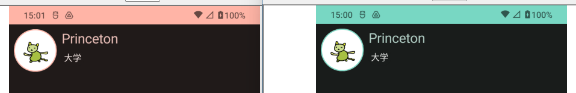

Androidアプリで LED characteristic の制御をしようとしているところだが、最近(2024年10月くらい)の状況を軽く調べておく。

### koala

あまり使っていない PC に新しい Android Studio をインストールしてみた。  
koala になっていた。

「New UI」と書いてあったのだが、確かに見た目が全然違った。  
メニューバーが隠れてるし、ツールバーもこざっぱりしている。

私は Excel がリボンになったときも慣れるのに時間がかかってアドオンなどで旧式に戻していたくらいだったので今度もそうなるかもしれない。  
ただ、Excel ほど使い慣れているわけではない。  
メニューバーで使う項目も多くなかったし、このくらいでも困らない気がしている。

### OS

OS は今のところ [14](https://www.android.com/intl/ja_jp/android-14/)だ。  
SDK では API [35](https://developer.android.com/tools/releases/platforms?hl=ja#15) が出ている。
API 35 は Android 15 向けで、15 はまだベータ版である。

### 開発言語

[Kotlin](https://developer.android.com/kotlin?hl=ja)から変わっていない。

NDK は C++ だったり、他の言語からアプリを作るしくみもいくつかあるが Android Developer としては Kotlin である。

### UI開発

ネイティブで UI を作るツールキットが[Jetpack Compose](https://developer.android.com/compose)というものが推奨になったようだ。

以前は GUIツールで大枠を作り、XML になったそれを手動で修正し、最後はコードでいろいろやっていた。  
Jetpack Compose を使った(という表現で良いのかわからんが) Compose UI は Kotlin で書いていく。
React Native を使ったことがあるが、そっちに近い感じがした(Flutterは使ったことが無い)。

お仕事で Android アプリを作ると、だいたい iPhone アプリも作ることになる。  
BLE の peripheral 機器なんて central と通信できれば良いだけなので Android でも iPhone でも大きな違いはないのだ(Android はメーカーの違いによる影響がたまにあるが)。
そうなると、それぞれのネイティブ言語で作る工数も人数も確保できないことが多い。
ならばなるべく共通で使えるプラットフォームを選びたい、となりそう。

React Nativeを使っていたときは「Flutterって最近有名になってきたし(当時)、いいんだろうなあ」と思ってたけど、よくわからんね。  
単に JavaScript/TypeScript が嫌になっていただけかもしれない。  
そういうフレームワークを使う場合、ネイティブの機能を使うときはライブラリを作ってうまいことつなぐことになるんじゃないかな。
React Native は [Native Module v0.75](https://reactnative.dev/docs/0.75/native-modules-android?android-language=kotlin)というのでガチャガチャやっていた。

何をゴチャゴチャ書いているかというと、ネイティブの UI開発を覚える必要があるだろうかを自問しているのだ。  
うん、軽く覚えよう。  
React Native をちゃんと使っていたわけでも無いし、他のプラットフォームに手を付ける元気もないし、ちょっとした動作確認のためにネイティブ UI を扱えるのは悪くない。

### Jetpack Compose チュートリアル

せっかくチュートリアルがあるからやっておこう。  
上から順にやっていくだけである。

[Jetpack Compose チュートリアル](https://developer.android.com/develop/ui/compose/tutorial?hl=ja)

#### Text

`onCreate()`の中に`setContent{}`を置いて`Text("文字")`とかするだけでテキストが表示される。
さっぱりしくみがわからん。  
`setContent{}`は`ComponentActivity.setContent()`らしいが、関数っぽく見えないよなあ。  
Kotlinの文法なのか、Composeコンパイラという言葉も出ていたのでそういうのがあるのか。

そういう部品を扱う関数は`@Composable`アノテーションを付けた関数にする。  
プレビュー機能用の関数にするアノテーションもある。

#### Column と Row

`LinearLayout`的なものは `Column{}`と`Row{}`で表現するようだ。

#### マテリアルデザイン

名前はよく聞くマテリアルデザイン。  
素材デザイン？ 原料デザイン？  
ネットで探せばいろいろ情報は出てくるだろう。

プロジェクトを作ったデフォルトでダイナミックテーマとかいうものに対応している。
Android のテーマ設定で色を変更すると同じアプリなのに色が変わるんだな。

themes.xml で `Theme.Material.Light.NoActionBar` となっていたためか `setContent{}` にテーマだけ追加すると実機ではカードの背景だけが黒、それ以外は白背景になった。  
最後の方までやるとちゃんと黒背景になったので、どれかが効いたのだろう。

#### remember関数

最後は外部からのイベントによってコンテンツを書き換える。

* 通常は 1行表示で、タップすると複数行表示になる。またタップすると 1行に戻る。
* 複数行表示になったとき、コンテンツの背景色も変更する。

React Native の `useEffect` と似たような感じなのか？

書いてある通りにやったら動作したが、何が行われているのかわからんかった。
