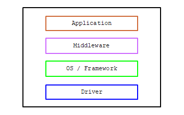

# android: アプリアーキテクチャ (1)

<i>2024/10/02</i>

LED を点滅させるようなアプリにアーキテクチャもなにもあったもんじゃないが、ある程度の規模のアプリを作ろうとすると全体のアーキテクチャというものを気にしないといけないだろう。  
そう、気にしないといけないのだよ。。。
私がアプリをあまり作らないのも、そういうのを気にしないせいかもしれない。

組み込み系でアーキテクチャを気にしていなかったのは非機能要件が強すぎたせいかもしれない。  
CPU の処理速度はそんなに出せないのに応答速度に上限があったり、通信中に処理が切れないようにアプリの処理が無視されたり。
そもそも RAM がそんなにないのでスタックメモリを減らすために関数呼び出しを減らしたり。  
そんなことやっていたら、きれいなアーキテクチャを作ってもそういう実装ができなくなってしまう。
それなら、実装のドキュメントを作ったり、ちゃんと動くのかテストをするのに時間を費やそう、となったのかもしれない。  
まあ、自分の経験しか分からんので何とも言えんがね。

OS が載ると、方向性が付くのでアーキテクチャも考えるようになるんじゃなかろうか。  
「晩ご飯なに食べたい？」「なんでもいい」というのは考えるのが大変なのだが「魚食べたい」だとじゃあその方向で考えるか、となりそうだ。
リソースが少ない環境だと「なに食べたい？」の質問がそもそもできなかったというところかな。

ともかく、私はアーキテクチャ慣れしていないので、Android アプリで推奨しているアーキテクチャというものを一通り見てみようと考えた次第である。

[アプリ アーキテクチャ ガイド](https://developer.android.com/topic/architecture?hl=ja)

知識がなかったり理解が難しかったところだけ書いていこう。

## Androidのアプリコンポーネント

これらなど、ということで上がっていた。  
日本語ページで読んでいるのだけど、英語にしてGoogle翻訳した方がわかりやすかった。

* [アクティビティ](https://developer.android.com/guide/components/activities/intro-activities?hl=ja)
  * 画面周りのことよね？
  * アプリとユーザの対話のエントリーポイント
* [フラグメント](https://developer.android.com/guide/fragments?hl=ja)
  * 昔はなかったよね？
  * UI の再利用可能な部分(reusable portion)
    * Activity の上に View のように載るが View ではない
    * Activity での遷移をせずに Fragment を切り替えて見栄えを変えたりできる
    * Activity とは別のライフサイクルを持つ
  * 私は使ったことが無い。
* [サービス](https://developer.android.com/develop/background-work/services?hl=ja)
  * Activity を陽とするなら Service は陰(個人のイメージです)
  * アプリのバックグラウンドで長時間作動するアプリコンポーネント
    * 種類
      * Foreground
      * Background
      * Bound(bindの過去形?)
  * BLE のように Activity とは別の状態を持つものは service にした方がよいのかな？
    * そうするなら、アーキテクチャの "Data source" に位置することになる？
* [コンテンツプロバイダ](https://developer.android.com/guide/topics/providers/content-providers?hl=ja)
  * 画像とかだっけ？
  * アプリ自体が保存するデータまたは他のアプリによって保存されたデータへのアクセスをアプリ側で管理し、他のアプリとデータを共有する方法を提供します
  * データベースも他とデータを共有するならこちら
* [ブロードキャストレシーバ](https://developer.android.com/develop/background-work/background-tasks/broadcasts?hl=ja)
  * 通知とかIntentを飛ばしたりだっけ？
  * Android システムとブロードキャスト メッセージを送受信できます。
  * 通知バーに表示を出してタップするとアプリが表に来るようにしたりするのに使った気がする。

今までテストアプリを作るときは、画面遷移したくないので Activity 1枚に詰め込めるだけ詰め込んでいた。  
1テストにラベルとボタンがあれば十分。パラメータを変えたテストにしたいなら増やすだけだ。

そこにフラグメントを使えば Activity 1枚でも画面がゴチャゴチャしなくなるだろう。  
BLE はサービスに突っ込んだ方がいいのかどうかは分からんが、Activity に突っ込むと画面遷移に引きずられるから別のところがよいと思う。

### データをアプリコンポーネントに持たせない

これらのアプリコンポーネントは OS などによって終了させられたりするので、データや状態はアプリコンポーネントが持たないようにする、という設計がいる。  
といっても、Activity が起動したサービスが勝手にサービスだけ終了させられたりするんだろうか？ 
やられるならアプリプロセスごとというイメージなのだが。

### データモデルで操作

わかるような、わからんような。。。

UI でデータを作って表示するのではなく、表示するためのデータは全部 UI の外側にあって、UI はそのデータを取ってきて表示用に加工するだけにとどめる、という意味だと思う。  
ビジネスロジックを UI に置かない、ということかな。  
UI でボタン操作などのイベントがあったら、それを下に伝えるだけにして、実際の処理は下の方でやる。  
処理は UI とは別で行うので、その指示だけ出したらすぐ UI の処理は終わる。  
あとは下の方で処理が終わるのを待つなり、待つ必要がなかったら次に進むなり。
処理を待つなら非同期で何かを監視して、終わったら UI が検知する方法があって、その通知で表示を変更する。

そんな感じかね？

### SSOT

初めて聞いた SSOT。  
Single Source Of Truth。
信頼できる唯一の情報源、というそうだ。

保存するならストレージだろうけど、そういう狭いものではないということか。  
データベースもそうだが、UI が信頼できる情報源にもなり得るそうなので概念的なものなのだろうか。

よくわからん。保留で。

### UDF

こちらも初めての UDF。  
Unidirection Data Flow。
単一データフローパターンだそうだ。

「状態(state)」が一方向に、「イベント(event)」はそれとは逆方向に流れるというのが UDF とのこと。  

* 状態またはデータは、上位スコープの階層の型(higher-scoped types of the hierarchy)から下位スコープの階層の型に流れます。
  * 例：アプリデータはデータソースから UI に流れます。
* イベントは、下位スコープの型からトリガーされ、対応するデータ型の SSOT に到達するまで流れます。
  * 例：ボタンの押下などのユーザー イベントは UI から SSOT に流れ、SSOT でアプリデータが変更されて、不変の型(immutable type)で公開されます。

不変といってるのは getter みたいな話？  
SSOT が唯一の情報源だから、変更するデータは必ずその SSOT に渡され、取得するのも SSOT からになる、というだけか。

スコープの上位や下位といってるのはそもそもどんな構成なんだろうか。  
アプリデータの例だと、データソースが上位、UI が下位になる。  
ボタンの押下の例だと、ユーザイベントが起きた UI が下位、SSOT が上位ということになるのか。

### アプリの推奨アーキテクチャ

ここに書いてあるのは「Androidの」「アプリの」アーキテクチャ推奨なので、Android 全般だったり、アプリ全般だったりというわけではない。  
そういうアーキテクチャというだけなので、他にもいろいろあるアーキテクチャの 1つということは忘れないようにしよう。  
でないと、最初に覚えたアーキテクチャを万能だと思い込んでしまったりしそうだし(私だけ？)。

図はこのページに載っているから省略だ。  
UIレイヤーとデータレイヤーがあり、UI レイヤーからデータレイヤーに矢印が出ている(ドメインレイヤーは今回見ないことにする)。  
UDF の例からすると、UIレイヤーが下位、データレイヤーが上位ということでよいのかな？ 
矢印の向きはイベントの向きなのか。

UI って画面に表示(output)したりボタンを押したり(input)なので、LED やブザー(output)とボタン(input)と同じ位置づけになる。  
LED やボタンはデバイスドライバで最後に扱うので、そういうレイヤー分けをすると一番下になる。

こういう図だとアプリケーションが一番上になる。  
ビジネスロジックなんかもそこになる。  
データレイヤーの説明でも、中は Repositories と Data Sources に分かれていて、ビジネスロジックは Repositories に配置するようになっている。  
なので「アプリ」という見方からするとデータレイヤーがそれになる。  
なんとなく、スマホのアプリというと見栄えの方が先に入ってくるのでそっちがメインのように思ってしまうが、組み込みソフトでの担当分けと同じようなものなのだった。

ただ組み込みの場合、UI への反映もアプリでやってしまうことがほとんどだと思う。  
間にミドルウェア層のようなものを置いて、LED制御が GPIO なのか駆動するチップがあるのかを隠蔽したりはするだろうが、それを直接呼び出すか、そういうのを制御するモジュールを作って呼び出すかではないかな。  
スレッドが使えるなら LED制御担当として立てるかもしれない。ただそれだけのためにスレッドを使うのはリソースがもったいないかもしれない。  
アプリの最適化は最初の方でやるものではないのだが、最初からリソースが足りなくなるようなアプリもよろしくないので難しいものだ。

### 依存関係の注入(DI)

なんかすごい言葉だな、DI。  
Dependency Injection。

文字だけ読んでもどういうものかがさっぱりわからん。  
`import` での依存関係とは別になにかあるのか？

これも後で出てくるようだから保留で。

### テンプレート

このアーキテクチャのテンプレートがある。

[architecture-templates](https://github.com/android/architecture-templates)

ブランチ `base` と `multimodule` が本体なので GitHub で fork するときは「mainブランチのみ」にはチェックしないようにしよう(cloneしてからあれ？ってなった)。

インストール済みの Android Studio Giraffe でこのプロジェクトを開いたが、プロジェクトの AGP(Android Gradle Plugin)バージョン(8.5.1) と Giraffe でのバージョン(8.1.3)があわないと怒られた。  
[互換性の表](https://developer.android.com/studio/releases?hl=ja#android_gradle_plugin_and_android_studio_compatibility)からすると、8.5 ということは Koala になるようだ。  
えー。  
Project Structure でも設定できないし、これはもう Android Studio を上げるしかないのか。

## おわりに

たった 1ページ読んだだけなのにえらく時間がかかってしまった。
