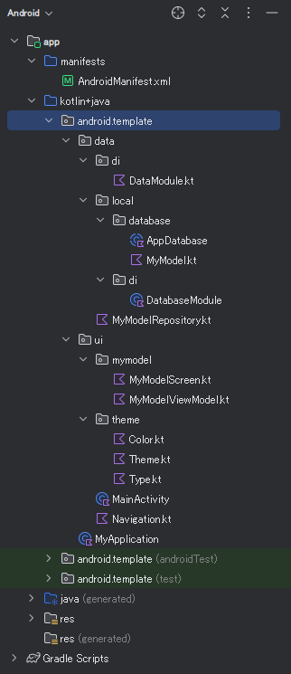

# android: アプリアーキテクチャ (2)

<i>2024/10/03</i>

前回の続き。

* 10/02 [android: アプリアーキテクチャ (1)](20241002-and.md)

## テンプレートのプロジェクト

[サンプル](https://developer.android.com/topic/architecture?hl=ja#samples) として Android のプロジェクトが提供してある。

スクリプト`customizer.sh`が付属していて、これを使ってプロジェクト名を変更できるようだ。  
fork してみたのだが、それよりは clone して名前を変えた後のプロジェクトを使った方がよいだろう。

とりあえず Android Studio で開く。

"`kotlin+java/`" となっているが、実際には "`java/`"だった。

そういえば、いつか忘れたが「Kotlin なんだから `java/` じゃないやろう」と思ってがんばってリネームしていったのだが、Android Studio は `kotlin/` をうまいこと扱ってくれなかったのを覚えている。
IntelliJ だと `kotlin/` だったのでやってみたんじゃなかったか。  
すまぬ、昔話じゃった。

### Features

推奨アーキテクチャに沿った UI や Data source だけでなく、DB や Coroutine、DI や UI test なんかも一通り揃っている。
このプロジェクトを眺めてからアーキテクチャの説明を読むのが良いか、その逆が良いのかはわからん。  
説明を読んで、実装と対応できそうだったらコードを読めばよいか。

## [UIレイヤー](https://developer.android.com/topic/architecture/ui-layer?hl=ja)

「データレイヤから取得されたアプリの状態を視覚的に表したもの」という表現はわかりやすいと思う。  
表示しようと思って取得したデータが部品に収まらなかったら省略したり複数行にしたり、あるいはタップしたときだけ複数行にしたりなんていうことは UI でやることだけど、長いときは1文字おきに表示する、みたいな加工の仕方はちょっと違うということだと思う(弱気)。

