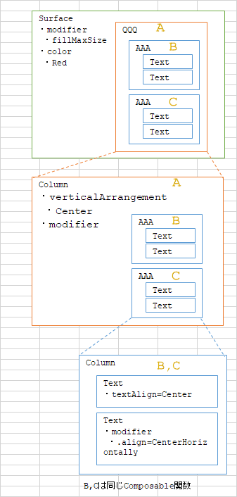
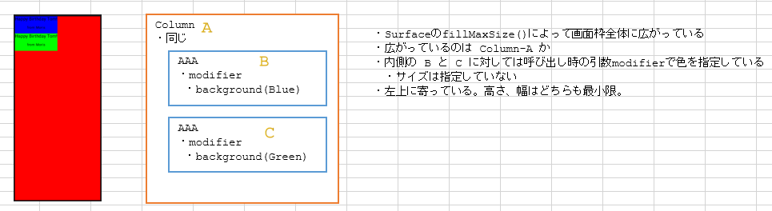
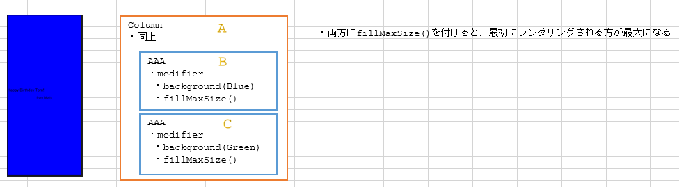
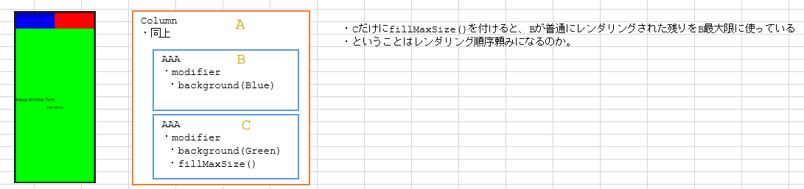
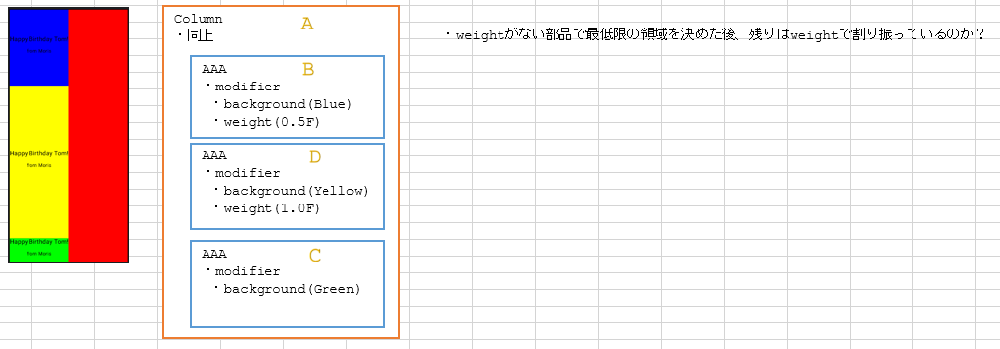
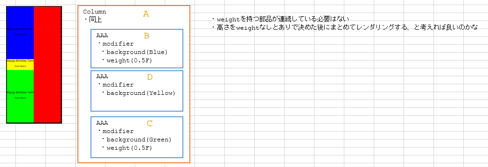
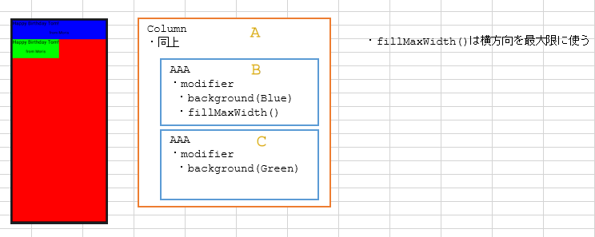
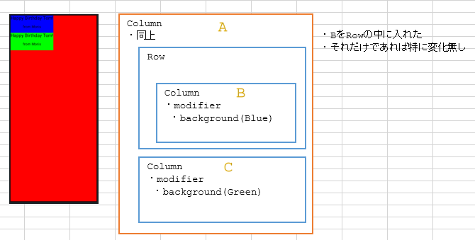
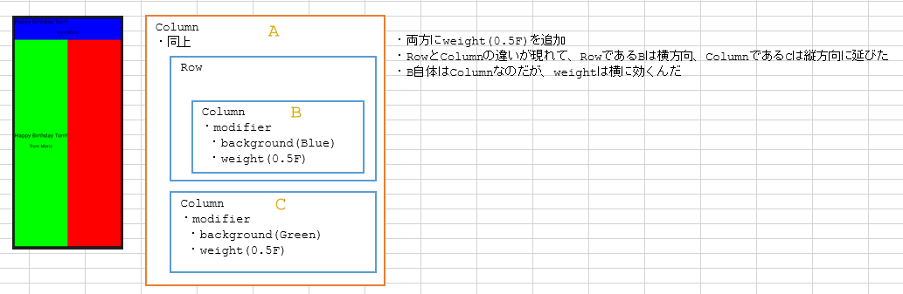
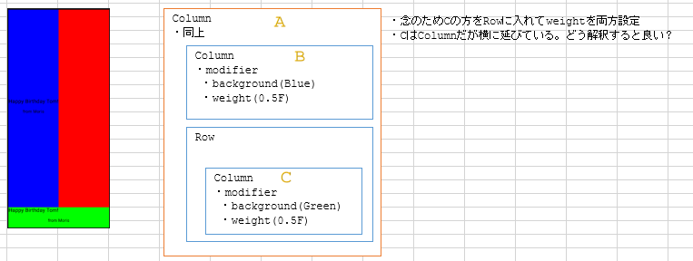

# android: Composableのレイアウト

<i>2024/10/04</i>

Android Codelabs の Compose UIに関する最初のコースをやっている。  
そして、やってみましょう的なところで詰まってしまった。

[4. Compose 象限](https://developer.android.com/codelabs/basic-android-kotlin-compose-composables-practice-problems?hl=ja&continue=https%3A%2F%2Fdeveloper.android.com%2Fcourses%2Fpathways%2Fandroid-basics-compose-unit-1-pathway-3%3Fhl%3Dja%23codelab-https%3A%2F%2Fdeveloper.android.com%2Fcodelabs%2Fbasic-android-kotlin-compose-composables-practice-problems#3)というページで、同じ構成のカードを文言だけ変更して4枚並べるというだけ。  
ただそれだけだというのに。。。

ヒントとして `Weight modifier` を使うことが書かれているので、どういう動作をするか簡単に見ておく。

このコースの途中にあった HappyBirthday サンプルにプレビューだけ突っ込んだ。  
テーマ名が`HappyBirthdayTheme`なところ以外は他でも使えるだろう。

```kotlin
@Preview(
    name = "sample",
    showBackground = true,
)
@Composable
fun SamplePreview() {
    @Composable
    fun innerCard(modifier: Modifier = Modifier) {
        Column(modifier = modifier) {
            Text(text = "Happy Birthday Tom!")
            Text(text = "from Jerry")
        }
    }
    HappyBirthdayTheme {
        Surface(
            modifier = Modifier.fillMaxSize(),
            color = Color.Red,
        ) {
            Column {
                innerCard(
                    modifier = Modifier
                        .background(Color.Blue)
                        .weight(0.5F)
                )
                Row {
                    innerCard(
                        modifier = Modifier
                            .background(Color.Green)
                            .weight(0.5F)
                    )
                }
            }
        }
    }
}
```

構成はこんな感じ。  
HappyBirthday をベースにしていたので modifier などがちょっと違うが、今回見てみる内容と関係なさそうだったので気にしなくてよかろう。



図の `AAA` が↑の `innerCard` に当たる。  
`Column`で`Text`が2つ並んでいるだけである。

それをさらに`Column`で2つ並べている。  
画面全体が見えないと分かりづらいので`Surface`で`fillMaxSize()`している。
背景色は赤。

### modifierとくになし

レイアウトに関する設定を特に行わないと、`Text`はそれぞれ最初の領域を確保して左上に寄るようにレンダリングされた。



### 両方に`fillMaxSize()`をつける

`innerCard()`の`modifier`に`fillMaxSize()`を付けて呼び出すと `Column`の`modifier`として与えられる。  
単に指定するだけだと、最初にレンダリングする部品が全部奪ってしまうようだ。



### 下だけ`fillMaxSize()`を付ける

先ほどは両方付けて先にレンダリングされる方？だけしか見えなかったので、今度は下の方にだけ付けてみた。  
そうすると、先に上をレンダリングしたあとに下を最大にレンダリングしたのかこうなった。



### 両方に`weight`を付ける

では両方に同じ重さの`weight`を付けてみる。  
横方向はそのままで縦の方向に`weight`で指定した比率のレンダリングが行われた。


### 上だけ`weight`を付ける

先ほどの`fillMaxSize()`は片方だけ設定するとレンダリングされる順番のような感じだった。  
`weight`はどうなのかと上にだけ付けたが、こちらは下の方も描画された。


なんとなく、誰かが`weight`を付けるとそれ以外の付けていない部品は最小限の大きさになるように見える。  
間にもう1つ部品を入れて上2つに`weight`を設定したが、一番下もレンダリングされた。



### `weight`が連続しない

`weight`設定した部品に設定していない部品が挟まるとどうなるか。  
特に関係なく、`weight`での比率になりつつも`weight`無しについてもレンダリングされる。



### `fillMaxWidth()`

`Column`だからか縦方向にしか調整されない。  
横に広げたい場合は`fillMaxWidth()`か。



### ColumnとRowが混ざる

`Column`の中に`Column`を2つ入れていたが、その片方が`Row`になったらどうなるのか。

まず、`Row`に入れ込むだけだと特に変わりない。



両方に`weight`を設定。  
`innerCard()`の引数なので、`Row`に入れ込んだ方も最終的には`Column`の`modifier`に`weight`を設定していることになる。



これはどう解釈すると良いのか。  
まず、`weight`は直接設定した`Column`に対してではないというか、その`Column`そのものに影響するわけではないことになる。

ありそうなのは、部品を配置しようとする上側の部品が配下の部品が持つ`weight`を見ている、という考え方だ。  
先ほどは一番上の`Column`がその中に持つ`Column`たちの`weight`を見てサイズを決めていたのだ。  
今回は`Row`がその中の`Column`が持つ`weight`を見て、他に部品がないので横方向に目一杯引き延ばした、というわけだ。  
そしてその上の`Column`は配下に`Row`と`Column`を持っていて、`weight`を設定していない`Row`は最低限の大きさ、設定してある`Column`は残りの領域を縦方向に目一杯引き延ばした、とすればつじつまがあう。

逆に下を`Row`で囲むと、やはりそういうレンダリングになった。



## おわりに

あってるかどうかわからんが、自分なりに解釈してみた。

しかしこれ、数個しかないからなんとかなるものの難しいな。  
テストアプリくらいだったら何とかなる！と思いたい。
